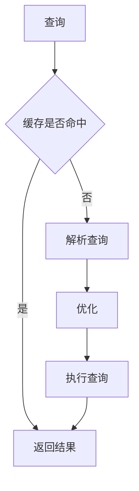

[TOC]

# 国内镜像

- 搜狐

http://mirrors.sohu.com/mysql/MySQL-8.0/

# 数据类型

## int

- 显示长度

  ``` mysql
  create table test_int_n (a int(4) zeorfill);
  insert into test_int_n values(1);
  insert into test_int_n values(123456);
  ```

  其中`a int(4)`中的`4`是该字段的显示长度。

  例如插入1，则显示0001，以0补充。

  当存储数字超过n位时，按照实际存储的数字显示。

| type      | 字节 | 最小值 | 最大值 |
| --------- | ---- | ------ | ------ |
| tinyint   | 1    | -128   | 128    |
| smallint  | 2    |        |        |
| mediumint | 3    |        |        |
| int       | 4    |        |        |
| bigint    | 8    |        |        |

## 浮点数

| type    | 存储空间                            | 是否精确 |
| ------- | ----------------------------------- | -------- |
| float   | 4byte                               | N        |
| double  | 8byte                               | N        |
| decimal | 每4个字节占9个数字，小数点占1个数字 | Y        |

- 金额相关尽量用decimal

## char

| type    | 说明     | N的含义 | 是否有字符集 | 最大长度 |
| ------- | -------- | ------- | ------------ | -------- |
| char    | 定长字符 | 字符    | 是           | 255      |
| varchar | 变长字符 | 字符    | 是           | 16384    |

## text

| type     | size      |      |
| -------- | --------- | ---- |
| TINYTEXT | 256 bytes |      |
| TEXT | 65,535 bytes | ~64kb |
| MEDIUMTEXT | 16,777,215 bytes | ~16MB  |
| LONGTEXT | 4,294,967,295 bytes | ~4GB   |

## 时间类型

| type      | 占用空间 | 表示范围                                        |
| --------- | -------- | ----------------------------------------------- |
| datetime  | 8        | 1000-01-01 00:00:00 ~ 9999-12-31 23:59:59       |
| date      | 3        | 1000-01-01 ~ 9999-12-31                         |
| timestamp | 4        | 1970-01-01 00:00:00UTC ~ 2038-01-19 03:14:07UTC |
| year      | 1        | YEAR(2):1970-2070, YEAR(4):1901-2155            |
| time      | 3        | -838:59:59 ~ 838:59:59                          |

- datetime与timestamp的区别

  datetime没有时区概念，而timestamp则有时区概念。
  
- datetime在5.6与5.7的区别

  在5.6中占用5个字节，在5.7中占用8个字节。

## Json类型

5.7后支持。

``` mysql
create table json_user ( uid int auto_increment, data json, primary key(uid) );

insert into json_user values ( null, '{ "name":"lison", "age":18, "address":"enjoy" }' ); 
insert into json_user values ( null, '{"name":"james", "age":28, "mail":"james@163.com" }');

# json_extract函数
select json_extract(data, '$.name'), json_extract(data, '$.address')
from json_user;

# json_object函数
insert into json_user values ( null, json_object("name", "enjoy", "email", "enjoy.com", "age",35) );

# json_inser函数
set @json = '{ "a": 1, "b": [2, 3]}'; 
# 由于@json中已存在a字段, 故json_insert仅追加c字段
select json_insert(@json, '$.a', 10, '$.c', '[true, false]'); 
update json_user set data = json_insert(data, "$.address_2", "xiangxue") where uid = 1;

# json_merge
select json_merge('{"name": "enjoy"}', '{"id": 47}');
```

> @json与@@json的区别:
>
> @json用于局部变量，@@json用于系统变量，例如`select @@datadir;`等价于`SHOW VARIABLES LIKE '%datadir%';`

### Json索引

JSON类型数据本身无法直接创建索引，需要将需要索引的JSON数据重新生成虚拟列 (Virtual Columns) 之后，对该列进行索引。

``` mysql
create table test_inex_1( 
    data json, 
    # 创建虚拟列
    gen_col varchar(10) generated always as (json_extract(data, '$.name')), 
    index idx (gen_col) 
); 

insert into test_inex_1(data) values ('{"name":"king", "age":18, "address":"cs"}'); 
insert into test_inex_1(data) values ('{"name":"peter", "age":28, "address":"zz"}'); 

########## 注意: 这里查询时需要带双引号 ##########
select * from test_inex_1 where gen_col='"king"';
```

- 查询序列时毋须双引号

``` mysql
########## json_unquote ##########
CREATE TABLE test_index_2 (
 DATA json
 , gen_col VARCHAR ( 10 ) generated always AS ( json_unquote( json_extract( DATA, "$.name" ) ))
 , KEY idx ( gen_col ) 
);
```

# character与collation

`字符编码`与`比对方法`

``` mysq
show collation;
```

- [MySQL中character set与collation的理解](https://www.cnblogs.com/EasonJim/p/8128196.html)

# MySQL架构

## 体系


### 连接层

``` mysql
SHOW VARIABLES LIKE '%max_connections%';
```

### SQL处理层



#### 缓存

``` mysql
# 查询缓存是否开启
# InnoDB默认不开启
SHOW VARIABLES LIKE '%query_cahce_type%';
# 缓存默认值
SHOW VARIABLES LIKE '%query_cache_size%'
```

生产环境下不建议开启，由于命中条件比较苛刻，要求两次查询请求完全一样，包括SQL语句、连接的数据库、协议版本、字符集等因素。

#### 解析查询


#### 优化

`SQL解析器`会通过优化器来优化程序员的SQL语句。

``` mysql
# 展示下面sql语句优化后的结果
#
explain select * from account t where t.id in (select t2.id from account t2);
show warnings;

# show warnings输出结果
SELECT
	`mall`.`t`.`id` AS `id`,
	`mall`.`t`.`name` AS `name`,
	`mall`.`t`.`balance` AS `balance` 
FROM
	`mall`.`account` `t2`
	JOIN `mall`.`account` `t` 
WHERE
	(
	`mall`.`t`.`id` = `mall`.`t2`.`id`)
```

## 逻辑结构

> 在 mysql 中 database 和 schema 是等价的 。

## 物理存储结构

### DataDir

指定所有建立的数据库存放位置。

``` mysql
SHOW VARIABLES LIKE 'datadir';
```

### 数据库

### 表文件

- **frm**

  表结构文件。

  ``` mysql
  mysqlfrm --diagnostic /usr/local/mysql/data/mall/account.frm;
  ```

- **ibd**

### mysql utilities

查看`*.frm`中的表结构。

``` mysql
# 等价show create table account
mysqlfrm --diagnostic /usr/local/mysql/data/mall/account.frm;
```

- **安装**

  ``` shell
  tar -zxvf mysql-utilities-1.6.5.tar.gz 
  cd mysql-utilities-1.6.5 
  python ./setup.py build 
  python ./setup.py install
  ```

# 存储引擎

``` mysql
# 查看数据库支持存储引擎
SHOW ENGINES;
# 查看默认存储引擎
SHOW VARIABLES LIKE '%storage_engine%';
```

## MyISAM

- 不支持事务
- 仅支持表锁

MySQL5.5之前的默认存储引擎。

``` mysql
create table testmysam (
    id int PRIMARY key
) ENGINE=myisam;
insert into testmysam VALUES(1),(2),(3);
```

创建后，会在数据库文件中出现三个文件`testmysam.frm`、`testmysam.myi`、`testmysam.myd`。

- **myi**	index
- **myd**	data

`myisam`又名`堆表`，使用非聚集索引。

### 表压缩

``` mysql
# 表压缩
myisampack -b -f /usr/local/mysql/data/mall/testmysam.MYI
```

通常情况下，表压缩后不允许插入记录。

### 适用场景

- 非事务型应用
- 只读类应用
- 空间类应用

由于`InnoDB`功能越来越强大，`MyISAM`绝大多数场景都不适合，因此`MyISAM`已停止维护。

## InnoDB

- 事务性存储引擎
- 完全支持事务
- 支持行级锁(并发程度更高)
- Redo Log与Undo Log

MySQL5.5 之后默认支持`InnoDB`。

``` mysql
# 查看日志buffer
SHOW VARIABLES LIKE 'innodb_log_buffer_size'
# 查看当前数据文件是否独立
SHOW VARIABLES LIKE '%innodb_file_per_table%';
```

## CSV

- 以`csv`格式存储数据

### 数据文件

- **.csv**	数据
- **.csm**	表的元数据，例如表状态和数据量
- **.frm**	表结构

## Archive

- **组成**
  - 以`zlib`对表数据进行压缩
  - 磁盘I/O更少
  - 以`ARZ`格式存储数据
- **特点**
  - 只支持insert和select操作
  - 只允许在自增ID列上加索引

### 适用场景

- 日志
- 数据采集

## Memory

- 又称HEAP存储引擎，数据保存在内存中
- 支持HASH索引和BTree索引
- 所有字段固定长度varchar(10) = char(10)
- 不支持BLOB和Text等大字段
- 使用表锁
- 最大由`max_heap_table_size`参数决定

### 与临时表区别

- 临时表
  - 系统使用临时表
    - 超过限制使用MyISAM
    - 未超过使用Memory
  - CREATE TEMPORARY TABLE 创建临时表

### 适用场景

- hash索引用于查找或者映射表
  - 例如邮政编码与地区的对应表
- 用于保存数据分析中产生的中间表
- 用于缓存周期性聚合数据的结果表

## Ferderated

- 提供访问远程MySQL服务器上表的方法
- 本地不提供存储，数据全部放到远程服务器上
- 本地需要保存表结构和远程服务器的连接信息

``` mysql
# 默认禁止
[mysqld]
sql_mode="STRICT_TRANS_TABLES,NO_ENGINE_SUBSTITUTION,NO_ZERO_DATE,NO_ZERO_IN_DATE,ERROR_FOR_DIVISION_BY_ZERO,NO_AUTO_CREATE_USER" 
# 开启Ferderated存储引擎
ferderated

create database local;
create database remote;

create table remote_fed(
    id auto_increament not null
, c1 varchar(10) not null default ''
, c2 char(10) not null default ''
, primary key(id)) engine=INNODB;

insert into remote_fed(c1,c2) values('aaa', 'bbb'),('ccc', 'ddd');

create TABLE 'local_fed'(
        id auto_increament not null
, c1 varchar(10) not null default ''
, c2 char(10) not null default ''
, primary key(id)) engine=INNODB;
) ENGINE=federated;
```

### 适用场景

- 偶尔的统计分析及手工查询（某游戏行业）

# FAQ

## MySQL乱码

### 注意

- `mysql`启动时的字符集,在`my.ini`文件中配置 `default-character-set=字符集` ,放在,[WinMySQLadmin]之上; 

- 数据库建表的过程中设置字符集,在`CREATE语句最后的 CHARSET=字符集` 语句中设置; 

- 在驱动url中的选项中设置字符集,`jdbc:mysql://localhost:3306/test?useUnicode=true&characterEncoding=字符集; `

- 在web显示页中设置显示的字符集, 
- `<%@ page contentType="text/html; charset=字符集" language="java" import="java.sql.*" errorPage="" %>`在servelt中则是`response.setContentType("text/html;charset=字符集");`

> 问题描述
>
> `Server`中显示正常，在将数据插入数据库后中文显示为??

### 解决

使用`注意`中第三点

- [mysql中插入表数据中文乱码问题的解决方法](https://www.jb51.net/article/147131.htm)

# 性能

首先，程序性能和硬件存在一定的正相关关系。

另外，在番禺某客户现场有张表，保存了4784869条记录。对该表增加字段耗费了1087秒。平均每秒更新4393条记录，每条记录耗时0.00022秒。

## 为什么不要问我DB极限QPS/TPS

- [为什么不要问我DB极限QPS/TPS](https://www.cnblogs.com/zhiqian-ali/p/6336521.html)
