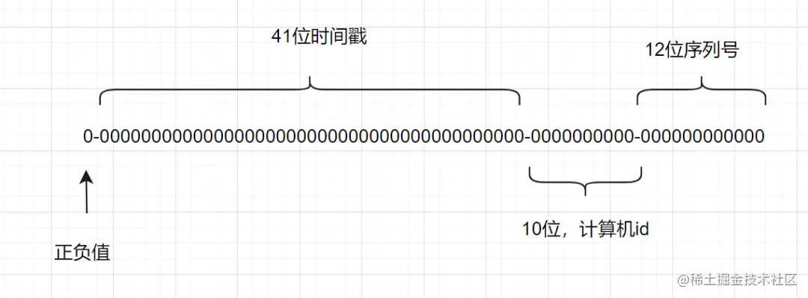

[toc]

# 基础

## MySQL Engine

- MyISAM
- InnoDB
- CSV
- Archive
- Memory
- Ferderated

可以通过`show engines`命令查看MySQL支持的引擎。

## MyISAM与InnoDB的区别

- 行级锁

  MyISAM不支持

- 事务

- 外键

  MyISAM不支持

- 恢复

  MyISAM不支持

- MVVC

  MyISAM不支持

- 索引实现

  InnoDB数据文件本身是索引文件；MyISAM的索引和数据文件是分开的；

- 性能

  MyISAM由于读写不支持并发，所以随CPU核心数增加，InnoDB的读写能力呈线性增强

## MyISAM适用场景

- 非事务性场景
- 只读场景

# 事务

## 什么是事务

- 崩溃场景
- 并发场景

在崩溃场景或并发场景下，为了保证数据的完整性，***要求数据的一组操作要么完全执行，要么完全不执行。***

## 事务的特点

- 原子性
- 持久性
- 隔离性
- 一致性

## MySQL事务有哪些隔离级别

- read uncommited
- read commited
- repeatable read
- serializable

## MySQL隔离由什么实现

`serializable`的隔离由锁实现，`repeatable read`与`read commited`由锁与MVVC实现。

## MVVC是什么

`Multi-Version Concurrency Control`，多版本并发控制。

## MVVC实现原理

MVVC由`undo log`与`read view`共同实现。

`undo_log`中有一个`trx_id`字段，记录修改该记录的事务id;

`read_view`中则有：

- **m_ids**	当前活跃事务id
- **min_id**	m_ids中的最小事务id
- **max_id**	m_ids的下一事务id
- **creator_id**	当前事务id

| 场景                                        | 可用 | 备注 |
| ------------------------------------------- | ---- | ---- |
| trx_id ∈ (-∞，min_id)                       | √    |      |
| trx_id = min_id                             | ×    |      |
| trx_id ∈ {m_ids} ∩ [min_id, max_id]         | ×    |      |
| trx_id ∈ [min_id, max_id]且trx_id ∉ {m_ids} | √    |      |
| trx_id ∈[max_id, +∞)                        | ×    |      |
| trx_id = creator_id                         | √    | 优先 |

# 锁

## InnoDB由哪些锁

- 行锁
- 表锁
- 间隙锁

# 索引

# 优化

## SQL连接

- left join
- right join
- inner join	仅显示符合条件的内容
- ouuter join

## in与exists的区别

in先进行内表查询，exists先进行外表查询。

所以在外表较大而内表较小时，in查询效率会更高；

而在外表较小而内表较大时，exists查询效率会更高；

# 分表分库

## 为什么分库

业务量增大，数据库可能出现性能瓶颈，这主要由以下两个原因限制：

- 磁盘存储

  当业务量剧增，单机磁盘容量撑爆时，我们分库可以降低磁盘的使用率

- 并发连接

  系统的并发连接数时有限制的，在高并发场景下可能会出现`too many connections`报错，这个时候将单个数据库拆分成多个不同功能模块的数据库，以分摊读写压力。

## 为什么分表

单表数据量非常大时，存储和查询性能会大大降低。

## 分表算法

- range

  根据id、时间或者其他业务键将表划分区域

- hash

- 一致性hash

> 一致性hash算法：
>
> ​	将记录使用hash算法算出对应的hash后，将hash映射到环上，同时顺时针查找第一台服务器，遇到的第一台服务器就是处理服务器。
>
> ​	所以当增加或者删除一台服务器时，受影响的数据仅仅是变动服务器的下一台服务器。

## 全局id生成算法

- uuid

  简单唯一，太长无序

- 雪花算法

  

## 分表分库中间件

- Sharding-JDBC
- Mycat
