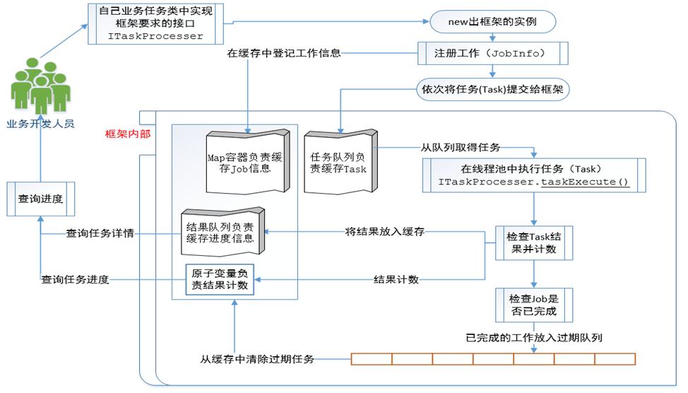

[toc]

# 需求背景

- **User**	学生、老师及其他考试人员
- **What**	将错题生成离线文档（`PDF`)并下载

``` sequence
participant User
participant Server
participant Database
participant 题库

User - Server : 点击生成错题
Server - Database : 查询错题
Database -- Server : 返回错题
Server - 题库 : 下载错题
题库 -- Server : 返回错题
Note right of 题库 : 每个题库采用类html格式保存
Server - Server : 解析题目文本
Server - Server : 下载题目图片
Note right of Server : 每道题目中含有大量或大型图片需要下载
Server - Server : 生成PDF
Server - 云空间 : 上传
Server - User : PDF云空间地址
User - Server : 下载PDF
Server - User : PDF

```

在这个项目中，系统会根据学员的错题从容量约为10万左右的题库中抽取题目，为每个学员生成一套定制离线练习册。

因此每次考试后，将生成大量的离线文档。尤其是在大型考试中，一次考试约2000人，就要求生成2000多份文档。

其中系统第一次上线后，问题反馈最多的即离线文档生成非常慢：一份离线文档平均时长为50~55秒，部分错题较多的学生甚至需要3分钟。如果有2000个考生，2000 * 30 =110000秒，约30个小时。

- 离线文档的生成过程
  1. 分离出需要处理的题目(60~120个，平均大约80个题目左右)
  2. 解析处理题目文本，对题目中的图片下载到本地，然后调用第三方工具生成PDF文档（耗时大约40~45秒）
  3. 将PDF文档上传到云空间进行存储（耗时大约9、10秒）
  4. 提供文档地址让用户去下载打印

## 业务痛点

- 速度慢
- 实际开发人员并发编程经验少

# 目标

因此，需要开发一个并发任务执行框架以解决用户与业务开发人员的痛点：

- **提高速度**

  通过并发编程，提高用户体验

- **用户要求**

  1. 可以查询批量任务的执行进度

     自动清除已完成和过期任务

- **对业务开发人员友好**

  1. 对批量任务提供同一的开发接口

  2. 业务开发人员使用友好

     我们需要对该框架合理封装，屏蔽并发编程实现细节

# 优化思路

## 基本

经过分析后，首先我们需要实现的是针对业务开发人员的并发框架：



我们结合业务来分析：

- **提高速度**

  自然是采用并发编程无疑，问题在于我们需要如何优雅地使用？

- **可以查询批量任务的执行进度**

  那么每一个任务就需要拥有一个自己的`上下文`来存储自己的相关属性，并且任务会将自己的实时状态更新至`上下文`中。

- **自动清除过期任务**

  除了最简单的思路外——专门开启线程遍历任务队列清理，我们可以更优雅地使用`JDK`自带的`DelayQueue`

- **合理抽象与封装**

  为业务开发人员友好使用，我们需要对并发任务进行合理的封装。我想可以参考许多市面上的`ETL工具`或者`ETL框架`，尽管这些`ETL工具`任务类型是抽取转换传送，并没有我们需要开发的并发框架功能单一。

## 其他

公司来了个十年工作经验的开发大叔，他提到优化需要从业务出发，实际很多大神都有类似的说法。

从上面这个需求来分析：

- **题目处理**

  原来`分离错题`、`解析文本`、`下载图片`、`生成PDF`或是`上传`都是一个同步的过程，我们可以对这个过程异步化，交给不同的线程去处理，以提高效率。

  此外，在处理单个任务时，由于需要得到任务执行的返回结果，结合业务场景，线程池返回的应该是`CompletionService`而不是`Future`，令先完成任务的先执行下一步，提高执行效率同时减少时间片的轮转。

- **热点数据**

  每次考试都有固定的考试范围，以及错题可能会集中在某几道上。

  > 上帝原理——局部性原理。

- **线程数调整**

  比如存在`处理文档线程`与`上传文档线程`，将两者任务耗时按照比例及`CPU核心数`设置线程池大小，也会提升系统的运行效率。

## 架构

- 架构分离

  把单体应用分离，拆分成`Web服务`、`文档处理服务`、`数据库`、`缓存`等多个模块共同工作。

  比如原来在生成文档后将结果缓存本地并让用户来下载，此时将结果缓存到其他服务器上，减少`Web服务`所在服务器的压力，提高用户响应速度。

- 缓存

  使用缓存时需要考虑数据结构，在大多场景下使用`ConcurrentHashMap`非常方便，但`HashMap`时一种以空间换时间的数据结构，在数据量这么大情况下很容易引发OOM问题。

  同时在检查缓存是否过期时，我们可以比较缓存与题库中的`摘要`。

  > - **ConcurrentLinkedHashMap**
  >
  >   这是谷歌开源的线程安全的`HashMap`，本身是对`ConcurrentHashMap`的封装，可以限定最大容量，并采用`LRU`算法更新缓存。