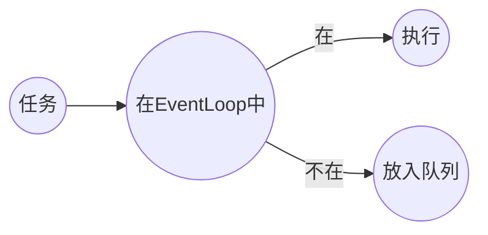

[toc]

- 参考
- [Chapter 2. Architectural Overview](https://netty.io/3.8/guide/#architecture)

# Reactor

反应器模式，是一种事件驱动[^event handling]的设计模式。


上图是一个简易的开发流程，相信很多程序员有所感悟。那么什么是`Reactor Pattern`呢？同样也很简单，我们将上图中的客户换成客户端，PM换成Reactor线程，需求分析完毕后，交给食物链底端的程序员去完成。


所以，在最简单的Reactor模式实现I/O多路复用模型中，通常包含以下几个角色：

- Client
- **Reactor**	负责accept、read、write以及connect
- **Handler**	负责非I/O操作

> Handle采用`责任链模式`，来完成对客户端请求的处理。

其中，服务端的Reactor是一个线程对象，通过轮询来监听所有ACCEPT事件——即NIO编程中的`select()`。

接下来Reactor将监听与该连接相关的读写事件，通过`dispatch`将任务交给合适的`handler`。

- 反应器模式与观察者模式的区别

  观察者模式也可以称为`发布-订阅`模式。适用于多个对象依赖一个对象的场景，是一种一对多的关系。

出于诸多目的，比如解耦、降低响应时间等，我们可以对这种实现进一步拆分。

## Worker Thread Pool

以反应器模式设计服务器时，可以将处理请求的步骤以是否I/O操作分离——Socket的读写任务与其他任务。

并定义线程池专门处理非I/O操作，令Reactor线程“专心致志”地负责网络连接通信。


但这种实现在高并发、高负载或大数据量的场景下依然存在问题：

- 一个NIO线程不足以支撑成百上千的连接
- NIO线程负载过重后处理速度将变慢，导致大量客户端连接超时，超时之后重发，又加重了NIO线程的负载，最终导致大量消息积压和处理超时，成为系统性能瓶颈

## Using Multiple Reactors

在处理高并发时，单个Reactor线程当然是不够用的。这时我们对Reactor进行拓展：将Reactor划分为：

- mainReactor

  仅有一个，负责接收客户端请求，并将客户端请求（Socket）传递给subReactor。

- subReactor

  一般会有多个，负责与客户端的通信。


# Netty

由JBoss提供的异步、事件驱动的网络应用程序框架工具。

## Netty 5

- 使用ForkJoin
- 使用AIO

### Netty 5不流行的原因

- 使用ForkJoin引入了编程复杂度
- 多个分支代码同步工作量很大
- 作者仍在考虑部分问题
  - 是否废弃`ExceptionCaught`
  - 是否暴露`EventExecutorChooser`

## Netty不使用AIO

- Windows
  - Netty不看重Windows场景
- Linux
  - Linux上的AIO还不成熟
    - Linux的AIO底层实现仍然是epoll，因此性能上没有明显优势
    - AIO接收数据需要预先分配缓存，对连接数大流量小的情况非常浪费内存

# Netty核心组件

## Channel

Channel是对Socket的抽象(封装)。

### Channel的生命周期

| 生命周期            | 描述                                                         |
| ------------------- | ------------------------------------------------------------ |
| ChannelUnregistered | Channel已创建，但还未注册到EventLoop                         |
| ChannelRegistered   | Channel已注册到EventLoop                                     |
| ChannelActive       | Channel处于活动状态，已经连接到remote endpoint，可以接收和发送数据 |
| ChannelInactive     | Channel没有连接到remote endpoint                             |

当状态发送改变时，将会生成对应的事件，这些事件将转发给ChannelPipeline的ChannelHandler，随后对它们做出响应。

### Channel API

| method              | description                                            |
| ------------------- | ------------------------------------------------------ |
| eventLoop           | 返回注册该Channel的EventLoop对象                       |
| pipeline[^pipeline] | 返回分配的Pipeline对象                                 |
| isActive            | 当前Channel是否活跃的                                  |
| localAddress        | 返回本地SocketAddress                                  |
| remoteAddress       | 返回远程SocketAddress                                  |
| write               | 写入数据，该数据将传递给ChannelPipeline，直到其被flush |
| flush               | 刷新至内核                                             |
| writeAndFlush       |                                                        |

[^pipeline]:管道

## EventLoop

EventLoop是对多路复用I/O模型中`select()`的封装，或者说是反应器模式中reactor线程的封装，<u>用于监听网络连接生命周期中发生的事件</u>。

如果从Java的角度来看，EventLoop则是`ScheduledExecutorService`的派生类——是一个仅有一个线程的线程池。

回忆一下Reactor中的`Using Multiple Reactors`，Netty支持程序员可以根据配置和CPU核心数不同，创建多个EventLoop实例用以优化资源的使用。

> 通常EventLoop和Channel是一对多的关系。

### 线程管理

``` java
// 提交任务给eventLoop线程
channel.evnetLoop().execute(task);
```

在Netty内部，若任务直接交给EventLoop线程，该任务将直接由EventLoop执行。否则EventLoop将该任务放入队列中，将调度该任务以稍后执行。



### 线程分配


EventLoopGroup负责为每个新创建的Channel分配一个EventLoop。一旦Channel被分配一个EventLoop，在该Channel的生命周期中都将使用该EventLoop及关联线程。

- ThreadLocal

  由于Channel共享同一个EventLoop线程完成I/O与事件监听，我们无法使用ThreadLocal来对Channel进行状态追踪。

### EventLoopGroup

线程池的线程组，包含多个`EventLoop`。

## ChannelFuture

在Netty中所有I/O都是异步的。

为此，Netty提供ChannelFuture接口，以便在某个操作完成时得到通知。

# Netty重要组件

## ChannelHandler

在使用Netty过程中，打交道最多的就是ChannelHandler。见名知意，ChannelHandler负责对通信数据的业务处理。

### ChannelHandler生命周期

| 生命周期        | 描述                                  |
| --------------- | ------------------------------------- |
| handlerAdded    | 当ChannelHandler添加到ChannelPipeline |
| handlerRemoved  | 当ChannelHandler移除ChannelPipeline   |
| exceptionCaught | 由错误产生时被调用                    |

### ChannelHandler子接口

| 接口                   | 描述                           |
| ---------------------- | ------------------------------ |
| ChannelInboundHandler  | 处理入站数据及各种状态变化     |
| ChannelOutboundHandler | 处理出站数据并允许拦截所有操作 |

### 入站处理器 

ChannelInboundHandler

#### 生命周期

以下生命周期方法会在数据被接收时或者对应Channel状态发生改变时被调用。

| 生命周期                  | 描述                                                         |
| ------------------------- | ------------------------------------------------------------ |
| channelRegistered         | 当Channel注册到EventLoop并且能处理I/O时被调用                |
| channelUnregistered       | 当Channel从EventLoop注销并且无法处理I/O时被调用              |
| channelInactive           | 当Channel离开Active状态并且不再连接remote endpoint时被调用   |
| channelReadComplete       | 当Channel上一个读操作完成时被调用                            |
| channelRead               | 当Channel读取数据时被调用                                    |
| channelWritabilityChanged | 当Channel可写状态发生改变时被调用                            |
| userEventTriggered        | 当ChannelInboundHandler.fireUserEventTriggered()被调用时被调用 |

> channelRead()与channelReadComplete()回调事件的区别：
>
> - **channelRead()**
>
>   从peer[^peer]读取到数据时被调用；
>
> - **channelReadComplete()**
>
>   从缓冲区中完成读取时被调用;
>
> 在netty中，各种内置的Handler(例如:SimpleChannelInboundHandler与ChannelInboundHandlerAdapter)处理数据的行为均不太一致。

[^peer]: 对端。

### 出站处理器

ChannelOutboundHandler

ChannelOutboundHandler API

出站操作和数据将由ChannelOutboundHandler处理。它的方法将被Channel、Pipeline、ChannelHandlerContext调用。

| method     | 描述                                              |
| ---------- | ------------------------------------------------- |
| bind       | 当请求将Channel绑定到本地地址时被调用             |
| connect    | 当请求将Channel连接到远程节点时被调用             |
| disconnect | 当请求将Channel从远程节点断开时被调用             |
| close      | 当请求关闭Channel时被调用                         |
| deregister | 当请求将Channel从EventLoop注销时被调用            |
| read       | 当请求从Channel读取更多数据时被调用               |
| flush      | 当请求通过Channel将入队数据冲刷到远程节点时被调用 |
| write      | 当请求通过Channel将数据写到远程节点时被调用       |

### @Sharable

该注解用于标记ChannelHandler，可以重复将同一个ChannelHandler实例添加到ChannelPipeline上。如果没有使用@Shareable注解标记ChannelHandler，那么在每次建立通道时，需要实例化一个ChannelHandler。

``` java
ServerBootstrap b = new ServerBootstrap();
b.group(parentGroup, workGroup)
    .channel(NioServerSocketChannel.class)
    .option(ChannelOption.SO_BACKLOG, 100)
    .childHandler(new ChannelInitializer<SocketChannel>() {
        @Override
        protected void initChannel(SocketChannel ch) throws Exception {
            ChannelPipeline p = ch.pipeline();
            p.addLast(new EchoSimpleChannelInboundHandler()); // 实例化ChannelHandler
        }
    });
```

使用了@Sharable，那么ChannelHandler则可以被通道复用，减少内存开销。

``` java
ChannelHandler channelHandler = new EchoSimpleChannelInboundHandler(); // 在匿名内部类外声明ChannelHandler
ServerBootstrap b = new ServerBootstrap();
b.group(parentGroup, workGroup)
    .channel(NioServerSocketChannel.class)
    .option(ChannelOption.SO_BACKLOG, 100)
    .childHandler(new ChannelInitializer<SocketChannel>() {
        @Override
        protected void initChannel(SocketChannel ch) throws Exception {
            ChannelPipeline p = ch.pipeline();
            p.addLast(channelHandler); // 通道创建时，每次在pipeline上添加相同的channelHandler对象
        }
    });
```

## ChannelPipeline

当Channel被创建时，将会关联一个新的ChannelPipeline。<u>Channel既不能附加另外一个ChannelPipeline，也不能分离其当前的</u>

- 责任链模式

  ChannelInboundHandler与ChannelOutboundHandler将被安装到一个ChannelPipeline上，它们的执行顺序由添加顺序决定。

  - 入站

    如果一个消息或者其他入站事件被读取，那么它会从ChannelPipeline头部开始流动，最终到达ChannelPipeline尾端。

  - 出站

    如果是出站事件，那么从ChannelOutboundHandler链的尾部开始流动，直到它到达链的头部为止。

    之后，数据将会到达网络传输层，通常触发一个写事件。

## ChannelHandlerContext

- 注意

  作为处理器的上下文对象，其API与Channel、ChannelPipeline相同，但是这些同名方法若是被ChannelHandlerContext调用，则只会从当前关联的ChannelHandler开始，并且只会传播给下一个入站/上一个出站处理器。

  而通过Channel、ChannelPipeline则会在整个责任链上起作用。

## Bootstrap

## ChannelInitializer

## ChannelOption

配置网络连接属性。

- 常用属性

  | 属性         | 作用                                                         |
  | ------------ | ------------------------------------------------------------ |
  | SO_BACKLOG   | 设置半连接队列[^半连接]与已连接队列大小，Linux缺省5。        |
  | SO_REUSEADDR | 是否允许地址复用。主要用于原本监听端口的进程挂了之后，在没有完全释放该端口资源前，内核允许另一个进程使用。 |
  | SO_KEEPALIVE | 保活。                                                       |
  | SO_SNDBUF    | 发送缓冲区大小。                                             |
  | SO_RCVBUF    | 接收缓冲区大小。                                             |
  | TCP_NODELAY  | 关闭Nagle算法。                                              |
  
  > SO_*：TCP相关参数，作用范围跨越编程语言。

[^半连接]:半连接队列，未完全完成三次握手的连接。

## ByteBuf

Netty对ByteBuff的包装，内部维护读与写两个索引，移除切换读写模式带来的代码复杂度。

### 空间分配 ByteBufAllocator

Netty提供了两种ByteBufAllocator的实现：

- **PooledByteBufAllocator**

  Netty 4缺省使用的缓冲区分配方式。

- **UnpooledByteBufAllocator**

  Netty 3缺省使用的缓冲区分配方式。


前者池化ByteBuf的实例，以提高性能并最大限度的减少内存碎片；而后者则在每次调用时返回一个新实例。


- **Unpooled**

  Netty提供的工具类，用于创建未池化的ByteBuf。

  ``` java
  // 基于堆
  Unpooled.buffer(1024);
  // 基于直接内存
  Unpooled.directBuffer(1024);
  ```


- **ByteBufUtil**

  Netty提供的工具类，用于操作ByteBuf。

  

### 资源释放

当某个ChannelInboundHandler的实现重写channelRead()方法时，它要负责显式释放与池化ByteBuf实例相关的内存。

为此Netty提供ReferenceCountUtil.release(msg)。

- ReferenceCountUtil.release()

  引用计数-1。

> 使用SimpleChannelInboundHandler、SimpleChannelInboundHandler会自动释放资源。

- **入站请求**

  Netty的EventLoop在处理Channel的读操作时，进行分配ByteBuf。

  对于这类ByteBuf，需要程序员显式释放，有三种方式

  1. 使用SimpleChannelInboundHandler;
  2. 重新channelRead()使用ReferenceCountUtil.release();
  3. 使用ctx.fireChannelRead()向后传递。

- **出站请求**

  对于出站请求，不论ByteBuf是否由我们的业务创建，当调用了write()或者writeAndFlush()后，Netty会自动替我们释放。

# Netty内置通信方式

- N I/O

  使用java.nio.channels作为基础，基于选择器的方式。

- Epoll

  由JNI驱动的`epoll()`和非阻塞I/O，这个传输只有在Linux上可用多种特性，比NI/O传输更快。

- O I/O

  使用java.net作为基础，使用阻塞流。

- Local

  VM内部通过管道进行通信的本地传输。

- Embedded

  允许使用ChannelHandler而又需要真正的网络传输，用于开发/测试阶段。

# 粘包/半包

- 现象

  假设客户端分别发送了D1、D2两个数据包，由于服务器一次读取到的字节数不确定的，所以可能存在以下4种情况：

  1. 正常：服务器两次读取到两个独立的数据包；
  2. 粘包：服务器一次接受两个数据包；
  3. 半包：服务器第一次读取到完整的D1和部分的D2，第二次读取到剩余的D2；
  4. 半包：服务器第一次读取到部分D1，第二次读取到剩余的D1和完整的D2；

- 粘包原因

  TCP启用Nagle算法时，会将较小的数据包合并，然后再发送。

  那么服务器在接收到消息时无法区分哪些数据包是客户端自己分开发送的，这样就产生了**粘包**。

- 半包原因

  1. IP分片；
  2. 网络不稳定，导致在传输过程中丢失；
  3. 接受缓冲区的大小；

- 解决方式
  1. 包尾增加分隔符；
  2. 消息定长，如果不够空位补空格；
  3. 消息分为消息头和消息头，消息头包含消息总长度(HTTP)；

# 解码器

- 作用

  解码器负责将入站数据从一种格式转换到另一种格式。

- 作用时机

  需要为ChannelPipeline的下一个ChannelInboundHandler转换入站数据时使用。

- 实现

  ByteToMessageDecoder

  MessageToMessageDecoder

## ByteToMessageDecoder

- decode(ChannelHandlerContext ctx, ByteBuf in, List<Object> out);

  decode()将被重复调用，知道没有新的元素添加到out对象或ByteBuf中没有更多可读取字节时为止。

## LengthFieldBasedFrameDecoder

基于Length字段的数据帧解析器。

``` java
 new LengthFieldBasedFrameDecoder(65535,0,2,0,2);
```

该构造方法有5个构造参数：

- maxFrameLength

  包的最大长度

- lengthFieldOffset

  Length的偏移量

- lengthFieldLength

  Length占用大小

- lengthAdjustment

  Length字段值调整，总长度-数据实际长度=调整值。

- initialBytesToStrip

  初始数据位置

## TooLongFrameException

Netty应用在数据解码之前，会将字节数组缓冲在内存中。因此，如果数据量过大会导致内存溢出。为避免这个问题，Netty在帧超出指定大小限制时排除TooLongFrameException。

# 编码器

- 实现

  MessageToByteEncoder

  MessageToMessageEncoder

# Netty内置编解码器和ChannelHandler

## SSL/TLS

JDK通过javax.net.ssl提供Java应用支持SSL/TLS，而Netty内置SslHandler则以该API实现，为我们在开发SSL/TLS网络应用时提供便利。

此外，Netty提供OpenSSL工具包，该工具性能比JDK原生SSL工具性能更好。

如果OpenSSL可以，Netty应用使用OpenSslEngine[^OpenSslEngine]，否则使用JDK提供的SSLEngine。

> OpenSslEngine和SSLEngine分别是OpenSSL和javax.net.ssl的“引擎”。

在大多数情况下，SslHandler是ChannelPipeline的第一个ChannelHandler。

## HTTP

- HttpRequestEncoder

- HttpResponseEncoder

- HttpRequestDecoder

- HttpResponseDecoder

- HttpObjectAggregator

  聚合HTTP消息。

- HttpContentCompressor

  压缩。

# 序列化

## JDK序列化

- **缺点**
- 无法跨语言
- 码流太大
- 性能太低

## 内置

Netty内置JBoss Marshalling和Protocol Buffers。

### Protocol Buffers

谷歌开源项目。

- **使用步骤**

1. 引入依赖

``` xml
<dependency>
    <groupId>com.google.protobuf</groupId>
    <artifactId>protobuf-java</artifactId>
    <version>2.6.1</version>
</dependency>
```

2. 生成protoc文件
3. 编写代码

<hr>

- 参考
- [ProtoBuf介绍](https://www.cnblogs.com/rivers-all/p/17376252.html)

## MessagePack

MsgPack是一个简单高效的序列化框架。

- maven

  ``` xml
  <dependency>
      <groupId>org.msgpack</groupId>
      <artifactId>msgpack</artifactId>
      <version>0.6.12</version>
  </dependency>
  ```

# FAQ

- [netty 堆外内存泄露排查盛宴](https://www.jianshu.com/p/4e96beb37935)
