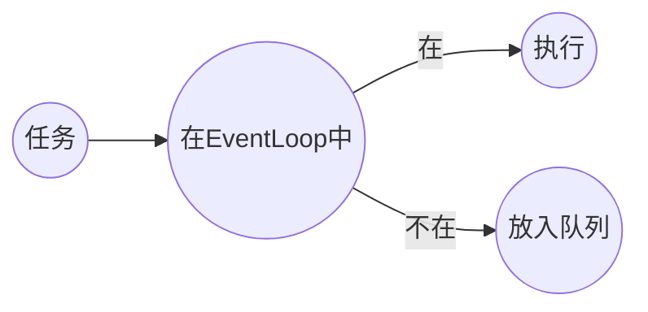

[toc]

- 参考
- [Chapter 2. Architectural Overview](https://netty.io/3.8/guide/#architecture)

# Reactor

反应器模式，是一种事件驱动[^event handling]的设计模式。


上图是一个简易的开发流程，相信很多程序员有所感悟。那么什么是`Reactor Pattern`呢？同样也很简单，我们将上图中的客户换成客户端，PM换成Reactor线程，需求分析完毕后，交给食物链底端的程序员去完成。


所以，在最简单的Reactor模式实现I/O多路复用模型中，通常包含以下几个角色：

- Client
- **Reactor**	负责accept、read、write以及connect
- **Handler**	负责非I/O操作

> Handle采用`责任链模式`，来完成对客户端请求的处理。

其中，服务端的Reactor是一个线程对象，通过轮询来监听所有ACCEPT事件——即NIO编程中的`select()`。

接下来Reactor将监听与该连接相关的读写事件，通过`dispatch`将任务交给合适的`handler`。

- 反应器模式与观察者模式的区别

  观察者模式也可以称为`发布-订阅`模式。适用于多个对象依赖一个对象的场景，是一种一对多的关系。

出于诸多目的，比如解耦、降低响应时间等，我们可以对这种实现进一步拆分。

## Worker Thread Pool

以反应器模式设计服务器时，可以将处理请求的步骤以是否I/O操作分离——Socket的读写任务与其他任务。

并定义线程池专门处理非I/O操作，令Reactor线程“专心致志”地负责网络连接通信。


但这种实现在高并发、高负载或大数据量的场景下依然存在问题：

- 一个NIO线程不足以支撑成百上千的连接
- NIO线程负载过重后处理速度将变慢，导致大量客户端连接超时，超时之后重发，又加重了NIO线程的负载，最终导致大量消息积压和处理超时，成为系统性能瓶颈

## Using Multiple Reactors

在处理高并发时，单个Reactor线程当然是不够用的。这时我们对Reactor进行拓展：将Reactor划分为：

- mainReactor

  仅有一个，负责接收客户端请求，并将客户端请求（Socket）传递给subReactor。

- subReactor

  一般会有多个，负责与客户端的通信。


# Netty

由JBoss提供的异步、事件驱动的网络应用程序框架工具。

## Netty 5

- 使用ForkJoin
- 使用AIO

### Netty 5不流行的原因

- 使用ForkJoin引入了编程复杂度
- 多个分支代码同步工作量很大
- 作者仍在考虑部分问题
  - 是否废弃`ExceptionCaught`
  - 是否暴露`EventExecutorChooser`

## Netty不使用AIO

- Windows
  - Netty不看重Windows场景
- Linux
  - Linux上的AIO还不成熟
    - Linux的AIO底层实现仍然是epoll，因此性能上没有明显优势
    - AIO接收数据需要预先分配缓存，对连接数大流量小的情况非常浪费内存

# Netty component

## Netty核心组件

### Channel

Channel是对Socket的抽象(封装)。

- **Channel的生命周期**

  | 生命周期            | 描述                                                         |
  | ------------------- | ------------------------------------------------------------ |
  | ChannelUnregistered | Channel已创建，但还未注册到EventLoop                         |
  | ChannelRegistered   | Channel已注册到EventLoop                                     |
  | ChannelActive       | Channel处于活动状态，已经连接到remote endpoint，可以接收和发送数据 |
  | ChannelInactive     | Channel没有连接到remote endpoint                             |

  当状态发送改变时，将会生成对应的事件，这些事件将转发给ChannelPipeline的ChannelHandler，随后对它们做出响应。

- **Channel API**

  | method              | description                                            |
  | ------------------- | ------------------------------------------------------ |
  | eventLoop           | 返回注册该Channel的EventLoop对象                       |
  | pipeline[^pipeline] | 返回分配的Pipeline对象                                 |
  | isActive            | 当前Channel是否活跃的                                  |
  | localAddress        | 返回本地SocketAddress                                  |
  | remoteAddress       | 返回远程SocketAddress                                  |
  | write               | 写入数据，该数据将传递给ChannelPipeline，直到其被flush |
  | flush               | 刷新至内核                                             |
  | writeAndFlush       |                                                        |

  [^pipeline]: 管道

### EventLoop

EventLoop是对多路复用I/O模型中`select()`的封装，或者说是反应器模式中reactor线程的封装，<u>用于监听网络连接生命周期中发生的事件</u>。

如果从Java的角度来看，EventLoop则是`ScheduledExecutorService`的派生类——是一个仅有一个线程的线程池。

回忆一下Reactor中的`Using Multiple Reactors`，Netty支持程序员可以根据配置和CPU核心数不同，创建多个EventLoop实例用以优化资源的使用。

> 通常EventLoop和Channel是一对多的关系。

#### 线程管理

``` java
// 提交任务给eventLoop线程
channel.evnetLoop().execute(task);
```

在Netty内部，若任务直接交给EventLoop线程，该任务将直接由EventLoop执行。否则EventLoop将该任务放入队列中，将调度该任务以稍后执行。




#### 线程分配


EventLoopGroup负责为每个新创建的Channel分配一个EventLoop。一旦Channel被分配一个EventLoop，在该Channel的生命周期中都将使用该EventLoop及关联线程。

- ThreadLocal

  由于Channel共享同一个EventLoop线程完成I/O与事件监听，我们无法使用ThreadLocal来对Channel进行状态追踪。

  

#### EventLoopGroup

线程池的线程组，包含多个`EventLoop`。

### ChannelFuture

在Netty中所有I/O都是异步的。

为此，Netty提供ChannelFuture接口，以便在某个操作完成时得到通知。


## Bootstrap

## ChannelInitializer

## ChannelOption

配置网络连接属性。

- 常用属性

  | 属性         | 作用                                                         |
  | ------------ | ------------------------------------------------------------ |
  | SO_BACKLOG   | 设置半连接队列与已连接队列大小，Linux缺省5。                 |
  | SO_REUSEADDR | 是否允许地址复用。主要用于原本监听端口的进程挂了之后，在没有完全释放该端口资源前，内核允许另一个进程使用。 |
  | SO_KEEPALIVE | 保活。                                                       |
  | SO_SNDBUF    | 发送缓冲区大小。                                             |
  | SO_RCVBUF    | 接收缓冲区大小。                                             |
  | TCP_NODELAY  | 关闭Nagle算法。                                              |

``` java
// TODO
```

## ChannelHandler

### ChannelInboundHandler


### ChannelOutboundHandler

### ChannelHandlerAdapter

#### ChannelHandler

## ChannelHandlerContext

## ChannelPipeline

- 责任链模式

## ByteBuf

Netty对ByteBuff的包装，内部维护读与写两个索引，移除切换读写模式带来的代码复杂度。

``` java
// 堆缓冲区
// 直接缓冲区
// 复合缓冲区
```

### ByteBufAllocator

- **UnpooledByteBufAllocator**

  Netty 3缺省使用的缓冲区分配方式。

  ``` java
  // 基于堆
  Unpooled.buffer(1024);
  // 基于直接内存
  Unpooled.directBuffer(1024);
  ```

- **PooledByteBufAllocator**

  Netty 4缺省使用的缓冲区分配方式。

  ``` java
  
  ```

### ByteBufUtil

### 资源释放

#### 入站请求

``` java
// 引用计数减1
ReferenceCountUtil.release();
```

#### 出站请求

不用显式释放。

# Netty内置通信方式

# 粘包/半包

## TCP粘包/半包原因

## 解决方式

# FAQ

- [netty 堆外内存泄露排查盛宴](https://www.jianshu.com/p/4e96beb37935)
