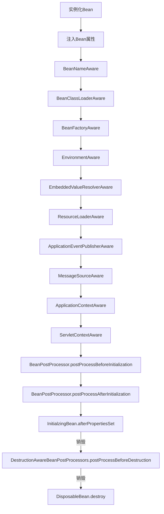

[TOC]

# 官网文档

https://docs.spring.io/spring/docs/4.3.28.RELEASE/spring-framework-reference/htmlsingle/#scheduling

# Spring简史

- 第一阶段：xml配置；

- 第二阶段：注解配置；

- 第三阶段：Java配置；（Spring 4.x 与 Spring Boot都推荐Java配置）

# Spring体系

## 核心容器

- **Spring-core核心工具类**:	Spring其他模块大量使用Spring-core
- **Spring-Beans**:	Spring定义Bean的支持；

- **Spring-Context**:	运行时Spring容器；

- **Spring-Context-Support**:	Spring容器对第三方包的集成支持；

- **Spring-Expression**:	使用表达式语言在运行时查询和操作对象；

## AOP

- **SpringAOP**:	基于代理的AOP支持；

- **Spring-Aspects**:	基于 AspectJ的AOP支持；

可参考《架构探险》

## 消息 Messaging

- **Spring-Messaging**:	对消息架构和协议的支持；

## Web

- **Spring-Web**:	提供基础的Web集成的功能，在Web项目中提供Spring容器；
- **Spring-Webmvc**:	提供基于Servlet的SpringMVC；
- **Spring-WebSocket**:	提供WebSocket功能；

- **Spring-Webmvc-Portlet**:	提供Portlet环境支持；

## 数据访问/集成 Data Access / Integration

- **Spring-JDBC**:	 提供以JDBC访问数据库的支持；
- **Spring-TX**:	提供编程式和声明式的事务支持；

- **Spring-ORM**:	提供对 对象/关系 映射技术的支持；

- **Spring-OXM**:	 提供对 对象/xml 映射技术的支持；

- **Spring-JMS**:	提供对JMS的支持；

> Spring框架部份内容笔者亦未学习过，但为日后需要时留有印象，故作笔记。

## **衍生生态**

- **Spring Boot**:	遵循“约定优先配置”实现快速开发；
- **Spring XD**:	简化大数据应用开发；
- **Spring Cloud**:	为分布式系统开发提供工具集；
- **Spring Data**:	对主流的关系型和NoSql数据库的支持；
- **Spring Integration**:	通过消息机制对企业集成模式（EIP）的支持；
- **Spring Batch**:	简化及优化大量数据的批处理操作；
- **Spring Security**:	通过认证和授权保护应用；
- **Spring HATEOAS**:	基于HATEOAS原则简化REST服务开发；
- **Spring Social**:	与社交网络API（如FackBook、新浪微博等）的集成；
- **Spring AMQP**:	对基于AMQP的消息的支持；
- **SPring Mobile**:	提供对手机设备检测的功能，给不同的设备返回不同的页面支持；
- **Spring for Android**：
- **Spring Web Flow**:	基于Spring MVC提供基于向导流程式的Web应用开发；
- **Spring LDAP**:	简化使用LDAP开发；
- **Spring Session**:	提供一个API及实现来管理用户会话信息；

# IOC

> 20180826
>
> 学习Spring以来，一直在思考为什么要使用IOC容器？常常没感受到IOC的具体便利之处，我们直接使用一个配置类，类中存放public静态变量是否能<==> IOC呢？
>
> 我想答案是否定的，原因如下：
>
> 1、在实际开发过程中，类的结构相当复杂，在实例化同时需要实例化其子类，若直接使用代码配置，可读性较差，即类与类之间的关系无法清楚描述。
>
> 2、Spring并非单纯的IOC框架或AOP框架，Spring是一个一站式框架（一站式框架还号称狗屁的轻量级）。其中有许多常见的功能Spring均有所涉猎。而对使用其他功能时，最熟悉的当然是Spring的开发人员，而不是我们。为了简化对Spring的运用，设计该IOC再合理不过。交给IOC容器，我们使用时直接找容器而非形形色色的类。
>
> 3、对单例对象可读性的优化。

## Bean

### 生命周期




1. <font color='red'>**实例化Bean**</font>

   顾名思义对应了我们最常用的`new`关键字，只是这部分的工作交给了`Spring`。代码量其实并没有减少，但最重要的是我们把这些对象交给了`Spring`管理，`Spring`就像一个幼儿园一样，给每一位小朋友安排桌位(开辟内存空间)。

2. <font color='red'>**`BeanNameAware.setBeanName(String)`**</font>

   **Spring将Bean的id传递给Bean**，就像是学校把学号告诉学生。在xml配置时代，最终也是将`id`保存在`IOC容器`中。

3. `BeanClassLoaderAware.setBeanClassLoader(ClassLoader)`

4. <font color='red'>**`BeanFactoryAware.setBeanFactory(BeanFactory)`**</font>

5. `EnvironmentAware.setEnvironment(Environment)`

6. `EmbeddedValueResolverAware.setEmbeddedValueResolver(StringValueResolver)`

7. `ResourceLoaderAware.setResourceLoader(ResourceLoader)`

8. `ApplicationEventPublisherAware.setApplicationEventPublisher(ApplicationEventPublisher)`

9. `MessageSourceAware.setMessageSource(MessageSource)`

10. <font color='red'>**`ApplicationContextAware.setApplicationContext(ApplicationContext)`**</font>

11. `ServletContext.setServletContext(ServletContext)`

    仅在应用在一个`WebApplicationContext`中运行时可以使用。

12. <font color='red'>**`BeanPostProcessors.postProcessBeforeInitialization()`**</font>

13. <font color='red'>**`BeanPostProcessors.postProcessAfterInitialization()`**</font>

14. <font color='red'>**`InitializingBean.afterPropertiesSet()`**</font>

    如果bean实现了`InitializingBean`接口，Spring将调用`afterPropertiesSet()`。同理，如果bean使用了`init-method`声明初始化方法，该方法也会被调用。

15. `DestructionAwareBeanPostProcessors.postProcessBeforeDestruction()`

16. <font color='red'>**`DisposableBean.destroy()`**</font>

    如果bean实现了`DisposableBean`接口，`Spring`将调用`destroy()`。同理，如果bean使用了`destroy-method`声明销毁方法，该方法也会被调用。

在`BeanFactory`接口的注释里详细地说明了Bean的生命周期。

> Bean factory的实现应该尽可能支持标准的Bean生命周期。（渣翻译）

### Aware接口

> - **aware**
>
>   意识到、察觉到、对...有感受

`Aware`是一个标记性接口，表明其子类接口的作用。

``` java
public interface Aware {}
```

比如比较通俗易懂的`BeanNameAware`，这里的`Name`理解成幼儿园小朋友的学号或者花名更好。

``` java
public interfacce BeanNameAware extends Aware{
   void setBeanName(String name);
}
```

它的作用差不多是让幼儿园的小朋友们对自己的部分属性产生意识。比如老师是谁，爸爸妈妈是谁，我是谁，我来自哪里，我来这里干什么......

> IOC最大亮点是bean对Spring容器的存在是没有意识的。如果使用了`Aware`系列接口，`Bean`将会和`Spring`容器耦合。

- **参考**
- <a href='https://www.cnblogs.com/javazhiyin/p/10905294.html'>深究Spring中Bean的生命周期</a>
- <a href='https://www.cnblogs.com/zrtqsk/p/3735273.html'>Spring Bean的生命周期（非常详细）</a>
- <a href='https://zhuanlan.zhihu.com/p/74260806'>Spring Aware 到底是什么？ - 日拱一兵的文章 - 知乎</a>

## BeanFactory


### Implements

- **XmlWebApplication**

- **AbstractXmlApplicationContext**

- **ClassPathXmlApplicationContext**

- **FileSystemXmlApplicationContext**

- **AnnotationConfigApplicationContext**

>- 2018.8.26
>
>  今天又认识一个`AnnotationConfigApplicationContext`
>
>  头部还有一个`SimpleJndiBeanFactory`，直觉告诉我只有和`Jndi`有关都要重视。
>
>- 2020.7.31
>
>   两年过去了，还是没看到这儿。甚是遗憾。
>
>- 2021.1.25
>
>  两年半过去了，感觉以前跟着书本做的笔记真乱（PS:虽然这本书还是没读完）。

## FAQ

### Bean中id与name的区别

在2020年1月25日，`Spring boot`的应用越来越多。历史中通过`xml`配置的方式已渐渐淘汰，所以这个知识点应用得也越来越少。

如果不温习一下的话，我也不太容易把握`id`和`name`的区别。这逐渐变成一个较冷的知识点。

打个比方，在幼儿园的花名册上是出现学号一样的同学是不妥的，但是姓名重复缺失无法避免。这里的花名册就是指我们的xml配置文件，学号即bean的id，姓名则是bean的name。

实际上不配置id或者name的话，Spring会按照类全名给我们的bean分配一个id，若是重复会加上序号以区分。比如：张家的小孩子我们叫他张大，张二，张三。

再比如：

``` xml
<!-- name重复的情况 -->
<!-- 实际id com.hello.UserInfo -->
<bean class="com.hello.UserInfo">  
    <property name="accountName"></property>  
</bean>  
<!-- 实际id com.hello.UserInfo#1 -->
<bean class="com.hello.UserInfo">  
    <property name="accountName"></property>  
</bean>  
<!-- 实际id com.hello.UserInfo#2 -->
<bean class="com.hello.UserInfo">  
    <property name="accountName"></property>  
</bean> 
```

而且在`@Bean`注解中仅`name`与`value`属性，这说明Spring实际上并没有像id与name的区分bean。

- **参考**
- <a href='http://blog.sina.com.cn/s/blog_5c68ccb80100yte3.html'>Spring中bean的id属性和name属性（转载）</a>

### BeanFactory与ApplicationContext的区别

`BeanFactory`是`Spring`中比较原始的组件，从命名上来看功能比较纯粹。所以它无法支持其他组件的功能，比如`AOP`、`Web`等。

而`ApplicationContext`则是`BeanFactory`的子类，支持更多功能。应用上下文，从命名来看就明白它的功能比较一言难尽。

- **参考**
- <a href='https://blog.csdn.net/pseudonym_/article/details/72826059'>Spring中BeanFactory和ApplicationContext的区别</a>

# **Spring基础**

## 四大原则

- 使用`POJO`进行轻量级和最小侵入式开发

- 通过`依赖注入`和基于接口编程实现松耦合；

- 通过AOP和默认习惯进行声明式编程；

- 使用AOP和默认模版（template）减少模式化代码；

## 依赖注入

### 声明Bean的注解

**@Component**:	没有明确的角色；

**@Service**:	在业务逻辑层（service）使用；

**@Repository**:	在数据访问层（dao）使用；

**@Controller**:	在展现层使用；

### **注入Bean的注解**

**@Autowired**:	Spring提供注解；

**@Inject**:	JSR-330提供的注解；

**@Resource**:	JSR-250 提供的注解；

### Java配置

Java配置主要通过`@Configuration`和`@Bean`实现

#### **@Configuration**

声明当前类为配置类

> spring文档说明：
>
> @Configuration is a class-level annotation indicating that an object is a source of bean definitions. @Configuration classes declare beans via public @Bean annotated methods.
>
> @Configuration 是一个类级注释，指示对象是一个bean定义的源。@Configuration 类通过 @bean 注解的公共方法声明bean。
>
> The @Bean annotation is used to indicate that a method instantiates, configures and initializes a new object to be managed by the Spring IoC container.

通俗的讲`@Configuration`一般与`@Bean`注解配合使用，

用`@Configuration`注解类等价与`XML`中配置`beans`，

用`@Bean`注解方法等价于`XML`中配置 `bean`。

何一个标注了`@Bean`的方法，其返回值将作为一个`bean`定义注册到Spring的IoC容器，方法名将默认成该bean定义的id。

*-----20180821*

#### **@Bean**

将方法返回值 放置到 IOC容器

## **AOP**

### **简介**

早期AOP开源项目：`AspectJ`

在大型项目中，存在很多非功能性需求，比如：日志、安全、事务、性能统计。如果将这些代码与业务代码放置一处，导致我们的代码不够简洁大气（单一性原则），或者说代码可读性不够好。

*特别是在一些旧系统中，没有需求文档且缺乏注释。真正的业务代码与程序员自身的逻辑代码（即程序员自身的实现逻辑）揉在一处，在维护时难以从中区分真正的业务代码，维护难度之大可想而知。*

**设计模式：模版方法**

为了解决这个问题，过去的前辈们先采用“模版方法”解决。通过抽象类定义模版，业务层继承该 抽象模版类。但产生的问题是，若业务层的代码只需要部份的非功能性代码，比如不需要事务控制，子类没有选择的权利。一点也不民主，真是“君要臣死，臣不得不死。父要子亡，子不得不亡。”

**设计模式：装饰者模式**

然而完美主义的精益求精的程序员依然认为这样子可读性依然不够好

1、为了确定顺序层层嵌套装饰类；

例如： new ADirector( new BDirector( new CDirector(...) ) );

2、非功能性类继承 Command接口导致语义不明确。正如古人常说：优雅的代码宛如优雅的文章，字字珠玑。


传说中的前辈大概为表胸腹中纵横天下之心气，设计出了“正交编程”——**AOP**。依这个形势来看，将来会不会还有三维编程、四维编程、空间编程.....

### 概念

1、前置增强：实现`org.springframework.aop.MethodBeforeAdvice`接口

2、后置增强：实现`org.springframework.aop.AfterReturningAdvice`接口

3、环绕增强（编程式） 1+2 = 3

4、**引入增强**：

实现`org.springframework.aop.support.DelegatingIntroductionInterceptor`类

此外还有 异常型建言（实现`ThrowAdvice`接口）

 

使用`@Before`、`@After`、`@Around`、`@AfterThrowing`等注解定义建言( 建言又名增强 )

建言或者增强本身是一种概念，笔者功力有限描绘不清，读者自行体会。

 

**@PointCut(切点)**

参数的拦截规则为切点@PointCut ,为使切点复用，使用@PointCut专门来定义拦截规则	`@JoinPoint`（连接点)

`Advice`(增强)

`Advisor`(切面)

`Weaving`(织入)

`Introduction`(引入)

在SpringAop中的思想中即：

`代理对象` 管理`切面对象`

`切面对象`管理`增强对象`

亦可以用`代理对象`直接管理`增强对象`

> 在《架构探险》一书中，增强与切面概念存在重复之处，加大学习者压力。以及Spring的编写者自己也发现若只使用Spring Aop则配置将会变得相当复杂，这可就背离任何框架初衷了。
>

于是目前比较常用解决方案为`SpringAop` + `AspectJ`

### 示例代码 SpringAop + AspectJ

- Spring-Boot 添加依赖：

``` xml
<dependency>

		<groupId>org.springframework.boot</groupId>

		<artifactId>spring-boot-starter-aop</artifactId>

</dependency>
```

- Without Spring-Boot 添加依赖

``` xml
<!-- spring aop 支持 -->

<dependency>

	<groupId>org.springframework</groupId>

 	<artifactId>spring-aop</artifactId>

</dependency>
    

<!-- aspectj 支持 -->

<dependency>

	<groupId>org.aspectj</groupId>

 	<artifactId>aspectjrt</artifactId>

<version>1.8.9</version>

</dependency>

<dependency>

	<groupId>org.aspectj</groupId>

	<artifactId>aspectjweaver</artifactId>

	<version>1.8.9</version>

</dependency>
```

- 主方法

``` java
public class Main {

public static void main(String[] args) {
	AnnotationConfigApplicationContext context = 
    new AnnotationConfigApplicationContext(AopConfig.class);	
	DemoAnnotationService annotationService = context.getBean(DemoAnnotationService.class);
	DemoMethodService methodService = context.getBean(DemoMethodService.class);
	annotationService.add();
	methodService.add();	
	context.close();
	}

}
```

少不更事，还是第一次见到`AnnotationConfigApplicationContext`

- 配置类：

``` java
@EnableAspectJAutoProxy	//开启 Spring 对 AspectJ的支持 
@Configuration
@ComponentScan("org.hc.learning.spring.aop")
@EnableAspectJAutoProxy	//开启 Spring 对 AspectJ的支持
public class AopConfig {

}
```

- 切面类（定义AOP职责的类）：

将`AspectJ`作为`Bean`交给`IOC容器`管理

并 对需要处理 的类、方法、标签进行定义

``` java
/**
 \* 切面
 \* @author Administrator
 *
 */
@Component	
@Aspect		//声明为一个切面
public class LogAspect {

	@Pointcut("@annotation(org.hc.learning.spring.aop.Action)")
	public void annontationPointCut(){}

	@After("annontationPointCut()")
	public void after(JoinPoint joinPoint){
		MethodSignature signature = (MethodSignature)joinPoint.getSignature();
		Method method = signature.getMethod();
		Action action = method.getAnnotation(Action.class);
		System.out.println("注解式拦截:"+action.name());
	}

	@Before("execution(* org.hc.learning.spring.aop.DemoMethodService.*(..))")
	public void before(JoinPoint joinPoint){
		MethodSignature signature = (MethodSignature)joinPoint.getSignature();
		Method method = signature.getMethod();
		System.out.println("方法式拦截:"+method.getName());
	}
}
/**
 \* 注解的被拦截类
 \* @author Administrator
 *
 */
@Service
public class DemoAnnotationService {	

	@Action(name="注解式拦截的add()操作")

	public void add(){
		System.out.println(" Annotation.add()");
	}

}

/**
 \* 关于方法的被拦截类
 \* @author Administrator
 *
 */
@Service
public class DemoMethodService {

	public void add(){
		System.out.println(" Method.add()");
	}

}
```

### SpringAop常用类

#### ProxyFactoryBean

ProxyFactoryBean:			#

Interfaces: 			#需要动态实现的接口

Target：				#目标类

InterceptorNames: 		# 添加一个或者多个 切面 或者 增强

ProxyTargetClass:		#代理目标类：默认为false使用JDK动态代理，否则使用						#CGLib代理

#### SpringAOP:自动代理(扫描Bean生成代理对象)

org.springframework.aop.framework.autoproxy.BeanNameAutoProxyCreator：

beanNames:			#bean名称，例如 ： *Impl

interceptorNames:		#

Optimize:				#是否对代理生成策略进行优化

\#如果 该类存在接口，使用JDK代理，否则使用CGLib

 

DefaultPointAdvisor —— 默认切面

NameMatchMethodPointcutAdvisor —— 根据方法名称进行匹配的切面

StaticMatchMethodPointcutAdvisor —— 匹配静态方法的切面

# Spring常用配置

## **Bean的Scope**

- Singleton单例

- Prototype 每次调用新建实例

- Request 	Web项目中对每个HttpRequest新建实例

- Session	Web项目中对每个HttpSession新建实例

- GlobalSession  运用于 Portal(入口)应用

在Spring Batch 中还有个Scope为StepScope

## Spring EL 和资源调运

- **@Value**

见`helloWorld\code\Java\hc\hc-learning\src\main\java\org\hc\learning\spring\el`

## Profile

-  **用途**:	在不同环境下使用不同的配置文件；（比如开发环境使用`windows` + `tomcat`，而生产环境往往是更高大上的`Linux`+` WebSphere`...）

> 20190218在搭配大丰银行退税系统中遇见过，当时使用ant设置参数再进行打包编译

设定`Environment`的`ActiveProfiles`来设定当前`context`需要使用的配制环境。开发中使用`@Profile`注解类或者方法，达到在不同情况下选择实例化不同的`Bean`；

- 启动`Java进程`时添加`spring.profiles.active`参数；

- `Web`项目设置在`Servlet`的`context parameter`中；
- Servlet 2.5及以下

  ``` xml
  <servlet>
  ```

​    <servlet-name>dispatcherServlet</servlet-name>
​    <servlet-class>org.springframework.web.servlet.DispatcherServlet</servlet-class>

​    <init-param>
​      <param-name>contextConfigLocation</param-name>
​      <param-value>classpath:config/applicationContext-mvc.xml</param-value>
​    </init-param>

​    <init-param>
​     <param-name>spring.profiles.active</param-name>
​     <param-value>production</param-value>
​    </init-param>
  </servlet>

  <servlet-mapping>
​    <servlet-name>dispatcherServlet</servlet-name>
​    <url-pattern>/</url-pattern>
  </servlet-mapping>
  ```

- Servlet 3.0

​``` java
public class WebInit implements WebApplicationInitializer {

@Override

Public void onStartup(ServletContext container) {
	Container.setInitParameter(“spring,.profiles.default”, “dev”);
}

}
  ```

代码示例

``` java
package org.hc.learning.spring.profile;

import org.springframework.context.annotation.Bean;
import org.springframework.context.annotation.Configuration;
import org.springframework.context.annotation.Profile;

@Configuration
public class ProfileConfig {

​	@Bean
​	@Profile("dev")
​	public DemoBean devDemoBean() {
​		return new DemoBean("dev");
​	}
​	
​	@Bean
​	@Profile("prod")
​	public DemoBean prodDemoBean() {
​		return new DemoBean("prod");
​	}
}
class DemoBean {

​	private String context;

​	public String getContext() {
​		return context;
​	}

​	public void setContext(String context) {
​		this.context = context;
​	}
​	public DemoBean(String context) {
​		this.context = context;
​	}
}

​	public static void main(String[] args) {
​		AnnotationConfigApplicationContext context = new AnnotationConfigApplicationContext();
​		context.getEnvironment().setActiveProfiles("dev");
​		context.register(ProfileConfig.class);
​		context.refresh();
​		DemoBean bean = context.getBean(DemoBean.class);
​		System.out.println(bean.getContext());
​		context.close();
​	}
```

# **事件（Application Event）**

# Spring Event事件通知机制 源码学习

<https://www.jianshu.com/p/21984b08875c>

用于Bean之间消息通信。当一个Bean处理完一个任务后，希望另外一个Bean知道并能做相应处理。

 

- 流程：

（1）自定义事件，继承ApplicationEvent

（2）定义事件监听器，实现ApplicationListener

（3）使用容器发布事件

见`helloWorld\code\Java\hc\hc-learning\src\main\java\org\hc\learning\spring\event`

# Spring Aware

Spring容器本身功能，若使用了Spring Aware,Bean将会和Spring耦合。


- Aware接口
  - BeanNameAware 当前Bean的name

  - BeanFactoryAware 当前bean factory

  - ApplicationContextAware 当前application context

  - MessageSourceAware 获得message resource,这样可以获得文本信息

  - ApplicationEventPublisherAware 应用事件发布器，可以发布事件

  - ResourceLoaderAware 获得资源加载器，可以获得外部资源文件

# 多线程 TaskExecutor

`Spring`通过任务执行器（`TaskExecutor`）来实现多线程和并发编程。使用`ThreadPoolTaskExecutor`可实现一个基于线程池的`TaskExecutor`。而实际开发中任务一般是非阻碍的，异步的。

 

`@EnableAsync`开启对异步任务的支持 

`@Async`声明一个任务为异步任务

见`helloWorld\code\Java\hc\hc-learning\src\main\java\org\hc\learning\spring\taskexecutor`

# 定时任务 scheduled

见`helloWorld\code\Java\hc\hc-learning\src\main\java\org\hc\learning\spring\scheduled`

# 条件 @Conditional

`@Conditional`根据满足的某一特定条件创建一个特定的Bean。比方说，当某一个jar包在一个类路径下的时候，自动配置一个或多个Bean；或只有某个Bean被创建才会创建另外一个Bean。

即根据特定条件来控制Bean的创建行为，进行一些自动配置。

## **组合注解与元注解**

随着注解大量使用（配置、注入、AOP等等）会相当繁琐。这就是所谓模版代码（boilerplate code），Spring设计原则中消除的代码。

 

代码地址:org.hc.learning.spring.annotation

 

## @Enable\*注解的工作原理

- **@EnableAspectJAutoProxy** 开启对AspectJ自动代理的支持

- **@EnableAsync** 开启异步方法支持

- **@EnableScheduling** 开启计划任务的支持

- **@EnableWebMvc** 开启WebMvc 支持

- **@EnableConfigurationProperties** 开启对@ConfigurationProperties 注解配置Bean的支持

- **@EnableJpaRepositiories** 开启对SpringData JPARepository支持

- **@EnableTransactionManagerment** 开启注解式事务支持

- **@EnableCacheing** 开启注解式的缓存支持

以上注解均有`@Import`注解来导入配置类，即导入自动配置Bean

 

以此导入的配置方式分为三种:

### **直接导入配置类**

``` java
@Target(ElementType.TYPE)
@Retention(RetentionPolicy.RUNTIME)
@Import(SchedulingConfiguration.class)
@Documented
public @interface EnableScheduling {
}
@Configuration
@Role(BeanDefinition.ROLE_INFRASTRUCTURE)
public class SchedulingConfiguration {

@Bean(name = TaskManagementConfigUtils.SCHEDULED_ANNOTATION_PROCESSOR_BEAN_NAME)
	@Role(BeanDefinition.ROLE_INFRASTRUCTURE)
	public ScheduledAnnotationBeanPostProcessor scheduledAnnotationProcessor() {
		return new ScheduledAnnotationBeanPostProcessor();
	}
}
```

### 依据条件选择配置类

``` java
@Target(ElementType.TYPE)
@Retention(RetentionPolicy.RUNTIME)
@Documented
@Import(AsyncConfigurationSelector.class)
public @interface EnableAsync { 
    	Class<? extends Annotation> annotation() default Annotation.class;

boolean proxyTargetClass() default false;
	AdviceMode mode() default AdviceMode.PROXY;
	int order() default Ordered.LOWEST_PRECEDENCE;
}
```

`AsyncConfigurationSelector`通过条件来选择需要导入的配置类，`AsyncConfigurationSelector`的根接口为`ImportSelector`，这个接口需重写`selectImports`方法，在此方法内进行事先条件判断。

此例中，若`adviceMode`为`PROXY`，则返回`ProxyAsyncConfiguration`这个配置类；

若`activeMode`为`ASPECTJ`，则返回值`AspectJAsyncConfiguration`配置类。

 ``` java
public class AsyncConfigurationSelector extends AdviceModeImportSelector<EnableAsync> {

	/**
	 * {@inheritDoc}
	 * @return {@link ProxyAsyncConfiguration} or {@code AspectJAsyncConfiguration} for
	 * {@code PROXY} and {@code ASPECTJ} values of {@link EnableAsync#mode()}, respectively
	 */
	@Override
	public String[] selectImports(AdviceMode adviceMode) {

		switch (adviceMode) {
			case PROXY:
				return new String[] { ProxyAsyncConfiguration.class.getName() };
			case ASPECTJ:
				return new String[] { AnnotationConfigUtils.ASYNC_EXECUTION_ASPECT_CONFIGURATION_CLASS_NAME };
			default:
				return null;
		}
	}
}
 ```

### **动态注册Bean**

``` java
@Target(ElementType.TYPE)
@Retention(RetentionPolicy.RUNTIME)
@Documented
@Import(AspectJAutoProxyRegistrar.class)
public @interface EnableAspectJAutoProxy {
    
/**
* Indicate whether subclass-based (CGLIB) proxies are to be created as opposed
* to standard Java interface-based proxies. The default is {@code false}.
*/
boolean proxyTargetClass() default false;
}
```

`AspectJAutoProxyRegistrar`实现了 `ImportBeanDefinitionRegistrar`接口，其作用是在运行时自动添加Bean到已有的配置类，通过重写方法**registerBeanDefinitions**

``` java
class AspectJAutoProxyRegistrar implements ImportBeanDefinitionRegistrar {

	/**
	 * Register, escalate, and configure the AspectJ auto proxy creator based on the value
	 * of the @{@link EnableAspectJAutoProxy#proxyTargetClass()} attribute on the importing
	 * {@code @Configuration} class.
	 */
	@Override
	public void **registerBeanDefinitions**(
			AnnotationMetadata importingClassMetadata, BeanDefinitionRegistry registry) {
		AopConfigUtils.registerAspectJAnnotationAutoProxyCreatorIfNecessary(registry);
		AnnotationAttributes enableAJAutoProxy =
				AnnotationConfigUtils.attributesFor(importingClassMetadata, EnableAspectJAutoProxy.class);
		if (enableAJAutoProxy.getBoolean("proxyTargetClass")) {
			AopConfigUtils.forceAutoProxyCreatorToUseClassProxying(registry);
		}
	}
}
```

其中 

`AnnotationMetadata`参数用来获得当前配置类上的注解

`BeanDefinitionRegistry`参数用来注册`Bean`

# 测试

> 20190222之前做项目看了很多测试不得要领。想不到本书中有介绍，真的是“众里寻他千百度。蓦然回首，那人却在，灯火阑珊处。”

单元测试只针对当前开发的类和方法进行测试，可以简单通过模拟依赖来实现，对运行环境没有依赖；但是仅仅进行单元测试是不够的，它只能证明当前类或方法能否正常工作，而我们需要指定系统的各个部分组合在一起是否能正常工作，这就是集成测试的意义。

 

单元测试 -> 继承测试

继承测试为我们提供了一种无须部署或运行程序来完成验证系统各部分是否能正常协同工作。

`Spring`通过`Spring TextContextFramework` 对集成测试提供了顶级支持，它不依赖特定测试框架，既可使用`Junit`，也可使用`TestNG`。

`Spring`提供了一个`SpringJUnit4ClassRunner`类，它提供了`Spring TestContext Framework`功能。通过`@ContextConfiguration`来配置`Application Context`，通过`@ActiveProfiles`确定使用的`profile`。

 

代码见：

`/hc-learning/src/test/java/org/hc/learning/DemoBeabIntegerationTests.java`

`org.hc.learning.spring.fortest`

# Spring MVC

## **ViewResolver**

`ViewResolver`是`Spring MVC`视图渲染核心机制；

`Spring MVC`里有一个接口叫`ViewResolver`，实现这个接口重写方法`resiveViewName()`，这个接口的返回值是接口`View`，而`View`的职责就是使用`model`、`request`、`response`对象，并将渲染的视图返回给浏览器。

``` java
@Configuration
@EnableWebMvc
@ComponentScan(“”)
Public class MyMvcConfig {
    
@Bean
Public InternalResourceViewResolver viewResolver() {
		InternalResourceViewResolver viewResolver = new InternalResourceViewResolver();
		viewResolver.setPrefix(“/WEB-INF/classes/views/”);
		viewResolver.setSuffix(“.jsp”);
		viewResolver.setViewClass(JstlView.class);
		Return viewResolver;
	}
}
```

## WebApplicationInitializer接口

  是`Spring`提供用来配置`Servlet3.0 +`配置的接口，从而实现了替代`web.xml`位置

  ``` java
public class WebInitializer implements WebApplicationInitializer {

@Override
Public void onStartup(ServletContext servletContext) throws ServletException {
    AnnotationConfigWebApplicationContext ctx = new AnnotationConfigWebApplicationContext();
    Ctx.register(MyMvcConfig.class);
	Ctx.setServletContext(servletContext);
	Dynamic servlet = servletContext.addServlet(“dispatcherServlet”, new DispatcherServlet(ctx));
	Servlet.addMapping(“/”);
	Servlet.setLoadOnStartup(1);
}

}
  ```


## @RestController

``` java
@RestController = @ResponseBody + @Controller
@Request(value = “/getjson”, produces=”application/json;charset=UTF-8”)
@Request(value = “/getxml”, produces=”application/xml;charset=UTF-8”)
```

## 静态资源映射

``` java
@Configuration
@EnableWebMvc
@ComponentScan(“”)
Public class MyMvcConfig extends WebMvcConfigurerAdapter{

@Bean
Public InternalResourceViewResolver viewResolver() {
	InternalResourceViewResolver viewResolver = new InternalResourceViewResolver();
	viewResolver.setPrefix(“/WEB-INF/classes/views/”);
	viewResolver.setSuffix(“.jsp”);
	viewResolver.setViewClass(JstlView.class);
	Return viewResolver;
}
```

``` java
@Override
Public void addResourceHandlers(ResourceHandlerRegistry registry) {
        Registry.addResourceHandler("/static/**").addResourceLocations("classpath");
}
```


addResourceHandler 对外暴露路径

addResourceLocations 文件放置位置

EnableWebMvc开启SpringMVC支持 否则重写WebMvcConfigurerAdapter方法无效 

## **Interceptor拦截器**

## **ControllerAdvice控制器****建言**

将控制器全局配置放置于一处，例如对异常的处理@ControllerAdvice + @ExceptionHandler

### **MVC常用注解**

@ExceptionHandler 用于全局处理控制器的异常

@InitBinder 用来设置WebDataBinder，WebDataBinder用来自动绑定前台请求参数到Model

@ModelAttribute 绑定键值对到Model，此处让全局的RequestMapping都能获得此处设置的键值

 

## **HttpMessageConverter**

`HttpMessageConverter`用来处理`request`和`response`里的数据。

`Spring`为我们内置了大量的`HttpMessageConverte`：

`MappingJackson2HttpMessageConverter`

`StringHttpMessageConverter`

 

``` java
public class MyMessageConverter extends AbstractHttpMessageConverter<DemoObj>{

	public MyMessageConverter() {
		super(new MediaType("application","x-wisely",Charset.forName("UTF-8")));
	}

	// 该Converter支持类型
	@Override
	protected boolean supports(Class<?> clazz) {
		return DemoObj.class.isAssignableFrom(clazz);
	}

	// 处理请求数据
	@Override
	protected DemoObj readInternal(Class<? extends DemoObj> clazz, HttpInputMessage inputMessage)
			throws IOException, HttpMessageNotReadableException {
		// TODO Auto-generated method stub
		return null;
	}

	// 处理如何输出数据到response
	@Override
	protected void writeInternal(DemoObj t, HttpOutputMessage outputMessage)
			throws IOException, HttpMessageNotWritableException {
		
	}
}
```

## 服务器推送

### ajax轮询 

### 持有请求 

客户端发送请求给服务器，服务抓住请求不放当有数据方返回，返回后客户端再向服务器发送请求；

方式1基于sse(Server Send Event 服务端发送事件)

方式2基于Sevlet3.0+异步方法特性

### Websocket

## @InitBinder

 <https://www.cnblogs.com/heyonggang/p/6186633.html>

　在使用SpingMVC框架的项目中，经常会遇到页面某些数据类型是Date、Integer、Double等的数据要绑定到控制器的实体，或者控制器需要接受这些数据，如果这类数据类型不做处理的话将无法绑定。

​      这里我们可以使用注解@InitBinder来解决这些问题，这样SpingMVC在绑定表单之前，都会先注册这些编辑器。一般会将这些方法些在**BaseController**中，需要进行这类转换的控制器只需继承BaseController即可。其实Spring提供了很多的实现类，如CustomDateEditor、CustomBooleanEditor、CustomNumberEditor等，基本上是够用的。
