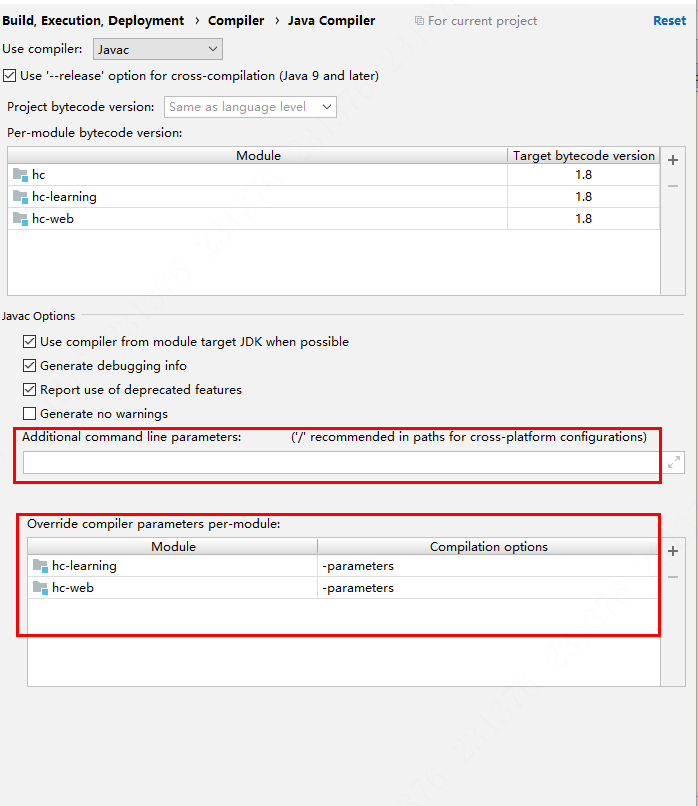

[toc]

# RPC

## Feign

- **参考**
- [Spring Boot 进阶 | 01 使用Feign作为HTTP客户端调用远程HTTP服务](https://blog.csdn.net/u010541670/article/details/80068575)
- [Spring Boot 2下导入依赖后使用Feign找不到@EnableFeignClients的解决办法](https://blog.csdn.net/u010728594/article/details/103295796)

### FAQ

#### Spring Boot 2下导入依赖后使用Feign找不到@EnableFeignClients的解决办法

需要在`pom.xml`中增加如下配置:

``` xml
<!--导入-->
<dependencyManagement>
    <dependencies>
        <dependency>
            <groupId>org.springframework.cloud</groupId>
            <artifactId>spring-cloud-dependencies</artifactId>
            <version>Greenwich.SR3</version>
            <type>pom</type>
            <scope>import</scope>
        </dependency>
    </dependencies>
</dependencyManagement>
```

其实这是因为在`spring boot`项目中引入了`spring cloud`依赖，但是没有显式的声明版本号导致依赖没有正确引入。只要增加一个<version>标签及版本号，`Feign`的依赖即可正常引入。

``` xml
<dependency>
    <groupId>org.springframework.cloud</groupId>
    <artifactId>spring-cloud-starter-openfeign</artifactId>
    <!-- <version>2.1.3.RELEASE</version> -->
</dependency>

<dependency>
    <groupId>com.netflix.feign</groupId>
    <artifactId>feign-httpclient</artifactId>
    <!--<version>${feign-httpclient}</version>-->
</dependency>
```

#### Feign Client with Spring Boot: RequestParam.value() was empty on parameter 0

使用`Feign Client`时，程序员将声明接口来定义RPC客户端中的`stub`，并借助了`Spring MVC`中的`@RequestParam`注解声明请求参数。

不论是`Feign Client`还是`Spring MVC`，都使用了`DefaultParameterNameDiscover`来查找参数名称：

1. 首先，它使用`StandardReflectionParameterNameDiscover`试图通过反射查找变量名称。
2. 当第一步找不到时，将使用`LocalVaraibleTableParameterDiscover`试图使用`ASM`从类文件的**调试信息**中找到变量名称。

其中`Feign Client`与`Spring MVC`的区别在于：

`Feign Client`中`@FeignClien`修饰的是接口，而`Spring MVC`中`@Controller`修饰的是类。如果在编译时没有显式使用`-parameters`参数，那么编译后的字节码将忽略方法中的参数名称。

``` shell
# 生成元数据以用于方法参数的反射
javac -parameters <source files>
```

于是，`Feign Client`在这种条件下，在使用`@RequestParam`必须指定其`value`，否则将找不到请求参数。

- **IDEA开启parameters**

  `File > Settings > Build, Execution, Deployment > Compiler > Java Compiler`

  

在上图红框任意一处配置`-parameters`即可。