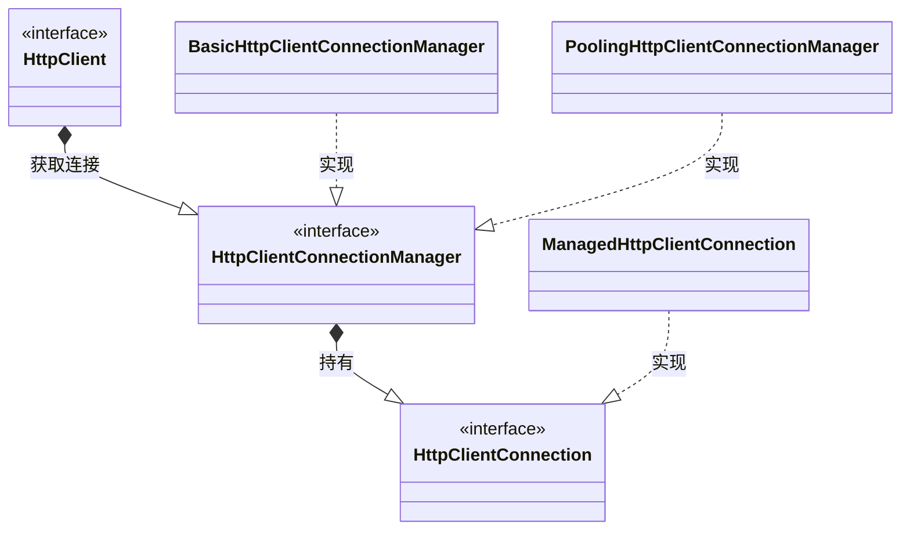
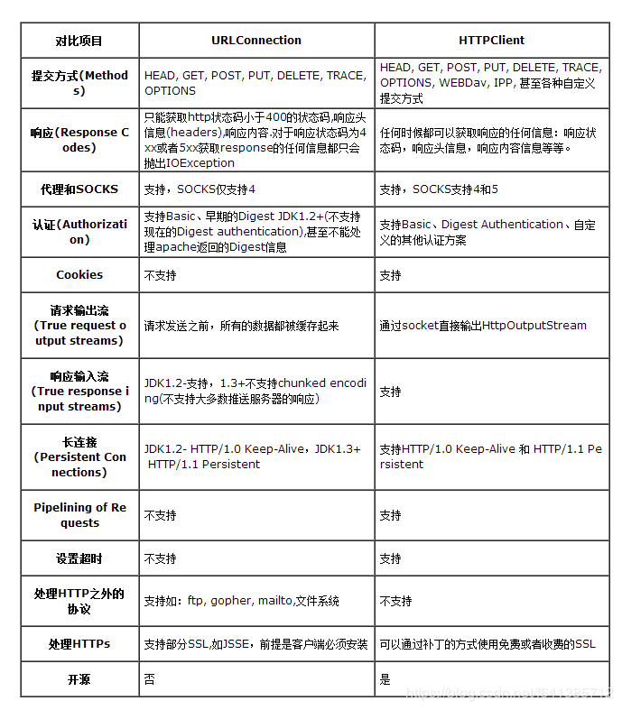

[toc]

# 服务器推送

## pushlet

# 池

## GenericObjectPool

- **参考**
- [Apache Commons Pool](http://commons.apache.org/proper/commons-pool/index.html)

# JSON

## alibaba/fastjson

- **参考**
- [fastjson这么快老外为啥还是热衷 jackson?](https://www.zhihu.com/question/44199956)

- [再见，FastJson...](https://zhuanlan.zhihu.com/p/146540159)

是阿里巴巴的开源JSON解析库。

> 其作者温绍锦还是`Druid`的创始人。

- **特点**

  同类型下最快的，比起`jackson`、`Gson`。

但是功能与`jackson`相比并没有那么丰富，而且`issue`也很多。

[alibaba/fastjson/issue](https://github.com/alibaba/fastjson/issues)

另外，它的代码质量与文档水平也被很多国内同行吐槽。

> 与国外大牛的作品相比确实不足，但也是国内领先了。

### 生成字符串

生成为字符串有三种方式：

- **JSON.toJSONString(Object)**
- **JSONObject.toJSONString(Object)**
- **JSONObject.toJSONString()**

前两种方法时静态方法，对字段按照字典序打印。

### 处理缺省

``` java
Group group = new Group();
group.setMemberList(new ArrayList<>());
String text = JSON.toJSONString(group
	, SerializerFeature.WriteNullStringAsEmpty
	, SerializerFeature.WriteNullNumberAsZero);
```

- **SerializerFeature**

  | 类型                     | 作用                   |
  | ------------------------ | ---------------------- |
  | `WriteNullNumberAsZero`  | 将`null`处理为零       |
  | `WriteNullStringAsEmpty` | 将`null`处理为空字符串 |
  | `WriteNullListAsEmpty`   | 将`null`处理为空字符串 |

以上仅是举例，还有更多用法待挖掘。

## Jackson


# hutool

- **参考**
- [官网](https://www.hutool.cn/docs/#/)

- **引入依赖**

``` xml
<dependency>
    <groupId>cn.hutool</groupId>
    <artifactId>hutool-all</artifactId>
    <version>5.7.20</version>
</dependency>
```

# HTTP

## Apache HttpClient

- **参考**
- [官网](http://hc.apache.org/httpcomponents-client-4.5.x/index.html)

- [HttpClient详细使用示例_JustryDeng-CSDN博客_httpclient](https://blog.csdn.net/justry_deng/article/details/81042379)

一个`Http`通信库，是`Apache Jakarta Common`的子项目。

### Maven依赖

``` xml
<!-- https://mvnrepository.com/artifact/org.apache.httpcomponents/httpclient -->
<dependency>
    <groupId>org.apache.httpcomponents</groupId>
    <artifactId>httpclient</artifactId>
    <version>4.5.3</version>
</dependency>
```

#### 与commons-httpclient区别

`HttpClient`还可以搜索到以下这个依赖，这是`HttpClient`的老版本项目，已经废弃不再更新。

```xml
<dependency>
    <groupId>commons-httpclient</groupId>
    <artifactId>commons-httpclient</artifactId>
    <version>3.1</version>
</dependency>
```

### 基本使用

- 建立`HttpClient`

  `HttpClient`中有多种方法获得实例

  ``` java
  // 最常用的方法 创建一个实现Closeable接口的HttpClient
  CloseableHttpClient client = HttpsClient.createDefault();
  // 
  HttpClient client = HttpClientBuilder.create().build();
  // 通过custom()我们可以定制一些功能多元的HttpClient, 比如设置代理或者SSL证书(https)
  HttpClient client = HttpClients.custom().create().build();
  ```

- 创建`HttpGet`和`HttpPost`

  通常我们对请求体的设置主要针对这两种对象。

  ``` java
  HttpGet get = new HttpGet("http://127.0.0.1", 8080);
  HttpPost post = new HttpPost("http://127.0.0.1", 8080);
  /* 
  通常HttpClient已经将我们常用的Http请求属性封装好
  所以我尽量使用别人已经定义好的常量, 而非“魔数”
  */
  post.setHeader(HTTP.CONTENT_TYPE, ContentType.APPLICATION_FORM_URLENCODED.getMimeType());
  ```

- 设置`HttpEntity`

  我们的请求参数使用`HttpEntity`进行封装，以下以模拟表单为例：

  ``` java
  List<NameValuePair> list = new ArrayList<>();
  list.add(new BasicNameValuePair("name", "houchengisnull"));
  HttpEntity entity = new UrlEncodedFormEntity(list, "UTF-8");
  // post对象是一个HttpPost对象
  post.setEntity(entity);
  ```

  除表单以外，参数还常常以`application/json`的形式，

  ``` java
  // message 是一个JSON对象
  HttpEntity entity = new StringEntity(JSON.toJSONString(message), "UTF-8");
  ```

### 设置请求

`RequestConfig`是`HttpClient`提供给我们用以设置请求诸多属性的类。

比如设置`超时时间`、`是否允许(自动)重定向`：

``` java
long minTime = 1000;
RequestConfig config = RequestConfig.custom()
    .setConnectionTimeout(minTime)
    .setConnectionRequestTimeout(minTime)
    .setSocketTimeout(minTime)
    .setRedirectsEnable(true)
    .build();

post.setConfig(config);
```

其中包含了一个默认的`RequestConfig`，

``` java
RequestConfig defaultConfig = RequestConfig.DEFAULTE;
```

我们可以看看生成默认请求配置`RequestConfig.DEFAULT`的实现

``` java
public static final RequestConfig DEFAULT = new Builder().build();
```

如果我们需要复制一个相同的`RequestConfig`对象，我们可以如下做：

``` java
RequestConfig config = RequestConfig.copy(RequestConfig.DEFAULT);
```

**如果我们需要设置代理进行请求**

``` java
RequestConfig config = RequestConfig.copy(RequestConfig.DEFAULT).setProxy(new HttpHost("192.168.1.x",9090));
```

#### 代理

> 由于一台测试服务器我需要通过代理服务器才能访问，在网上测试了诸多方法后，发现只有最简单的一种方法能有效切中我的问题。
>
> 我已经写在上面了。

``` java
RequestConfig config = RequestConfig.copy(RequestConfig.DEFAULT).setProxy(new HttpHost("192.168.1.x",9090));
```

此外，仍然有一种已经过时的方法：

``` java
HttpHost proxy = new HttpHost("192.168.1.x", 9090)
DefaultHttpClient client = new DefaultHttpClient();
client.getParams().setParameter(ConnRoutePNames.DEFAULT_PROXY, proxy); // setParameter已过时
CloseableHttpResponse response = client.execute(post);
```

另外再列举两种无效的方法，第一种如下所示：

``` java
HttpHost proxy = new HttpHost("192.168.1.x", 9090)
DefaultProxyRoutePlanner routePlanner = new DefaultProxyRoutePlanner(proxy);
HttpClients.custom().setRoutePlanner(routePlanner).create().build();
```

在这种方法失败后，我尝试获取系统的`RoutePlanner`对象：

``` java
SystemDefaultRoutePlanner planner = new SystemDefaultRoutePlanner(ProxySelector.getDefault());
```

意外地，没有成功。

> 此外，我还曾想过通过设置JVM参数Java进程直接调用系统代理，同样是失败了。
>
> 拳头最有力，简单即高效。

- **参考**
- <a href='www.cocoachina.com/articles/496139'>HttpRoutePlanner-如何与HTTPS代理一起使用</a>
- <a href='www.itranslater.com/qa/details/2112792934100763648'>如何设置JVM使用的代理</a>

### HTTPS

[^HTTPS]:见[网络协议.md](https://github.com/Houchengisnull/helloWorld/blob/master/documents/网络协议.md)。
[^X509]:X.509 是密码学里公钥证书的格式标准。

- **参考**
- [HttpClient实现https的简单例子](https://blog.csdn.net/weixin_41785310/article/details/103424694)
- [javax.net.ssl.SSLHandshakeException:](https://blog.csdn.net/u010248330/article/details/70161899)
- [忽略校验过程的调用HTTPS接口](https://www.cnblogs.com/luchangyou/p/6375166.html)

#### SSLHandshakeException

在以下两种情况均会出现：

1. 直接使用`HttpClient`访问https站点，且`schema`为`https`

如果`schema`为`http`，服务器返回`301 永久重定向`的响应码。

2. 错误设置证书或者`SSLSocket`工厂的属性

建立基于`SSL`的连接，我们用`SSLSocket`。

过去通常使用使用`org.apache.http.conn.ssl.SSLSocketFactory`或者`org.apache.http.conn.ssl.SSLConnectionSocketFactory`创建：

``` java
/**
* 获得算法实例
*/
SSLContext context = SSLContext.getInstance("TLS");
X509TrustManager tm = new X509TrustManager() {
    @Override
    public void checkClientTrusted(X509Certificate[] x509Certificates, String s) throws CertificateExcetpion {}
    
    @Override
    public void checkServerTrusted(X509Certificate[] x509Certificates, String s) throws CertificateException {}
    
    @Override
    public X509Certificate[] getAcceptedIssuers() { return null;}
};
/**
* 初始化SSLContext
* keyManagers
* trustManager
* secureRandom
*/ 
context.init(null, new TrustManager[]{tm}, null);

// SSLConnectionSocketFactory.ALLOW_ALL_HOSTNAME_VERIFIER 忽略校验过程
SSLConnectionSocketFactory factory = new SSLConnectionSocketFactory(context, SSLConnectionSocketFactory.ALLOW_ALL_HOSTNAME_VERIFIER);
HttpClient client = HttpClients.custom().setSSLSocketFactory(factory).build();
```

起初我使用的是`SSLConnectionSocketFactory`，并将`X509HostnameVerifier`参数设置为`SSLConnectionSocketFactory.BROWSER_COMPATIBLE_HOSTNAME_VERIFIER`，

``` java
/**
* SSLConnectionSocketFactory 源码
*/
public SSLConnectionSocketFactory(final SSLContext context, final X509HostnameVerifier hostnameVerifier)
```

这种方式也会抛出握手异常，其次这个方法以及过时了。

在源码的注释中：建议使用`4.4版本`后的构造方法：

``` java
SSLConnectionSocketFactory(final SSLContext context, final HostnameVerifier hostnameVerifier)
```

#### 跳过校验

`SSLConnectionSocketFactory.ALLOW_ALL_HOSTNAME_VERIFIER`常量对象已经过时。在这里再提供一个**跳过校验过程的**的Demo:

``` java
SSLContext context = SSLContext.getInstance("TLS");
X509TrustManager tm = new X509TrustManager() {
    @Override
    public void checkClientTrusted(X509Certificate[] x509Certificates, String s) throws CertificateExcetpion {}
    
    @Override
    public void checkServerTrusted(X509Certificate[] x509Certificates, String s) throws CertificateException {}
    
    @Override
    public X509Certificate[] getAcceptedIssuers() { return null;}
};
// keyManagers
// trustManager
// secureRandom
context.init(null, new TrustManager[]{tm}, null);
// context.init(null, new TrustManager[]{new DefaultTrustManager}, null); // 默认信任管理器

SSLConnectionSocketFactory factory = new SSLConnectionSocketFactory(context);

HttpClient client = HttpClients.custom().setSSLSocketFactory(factory).build();
```

实际上，在我们提供了`TrustManager`对象给`SSLContext`后。`factory`会调用仅`SSLContext`参数的构造方法，并实例化了一个`DefaultHostnameVerifier`对象，内部将两个参数交给<font color='red'>`SSLConnectionSocketFactory(final SSLContext context, final HostnameVerifier hostnameVerifier)`</font>。

#### 正常校验

``` java
KeyStore trustStore = KeyStore.getInstance(KeyStore.getDefaultType());
// 获取秘钥库文件
FileInputStream input = new FileInputStream(new File("./my.keystore"));
// 加载秘钥库文件与秘钥(密码)
trustSotre.load(input, "hello".toCharArray());

SSLContext context = SSLContexts.custom().loadTrustMaterial(trustStore).build();
SSLConnectionSocketFactory factory = new SSLConnectionSocketFactory(context,
SSLConnectionSocketFactory.BROWSER_COMPATIBLE_HOSTNAME_VERIFIER);

HttpClient client = HttpClients.custom().setSSLSocketFactory(factory).build();
```

这种方式同样是在创建`SSLConnectionSocketFactory`时过时。其中`SSLContexts`对象来自`org.apache.http.conn.ssl`。

同样的，其源码中的注释建议使用`org.apache.http.ssl.SSLContexts`。

``` java
SSLContext context = SSLContexts.custom().loadTrustMaterial(new File("./my.keystore")).build();
SSLConnectionSocketFactory factory = new SSLConnectionSocketFactory(context,
  SSLConnectionSocketFactory.BROWSER_COMPATIBLE_HOSTNAME_VERIFIER);

HttpClient client = HttpClients.custom().setSSLSocketFactory(factory).build();
```

##### 生成`keystore`

1. 通过浏览器获得证书，证书格式（der、cer）任意选择即可

2. 使用`keytool`(在`jdk`目录下)，执行一下命令

   ``` shell
   # hello.cert 即下载的证书
   # my.store 即根据秘钥生成的秘钥库文件
   keytool -import -alias "my cert" -file hello.cert -keystore my.keystore
   ```

3. 输入秘钥库口令

##### 使用系统证书

我在想，浏览器访问一个`https站点`，并没有以上的步骤。只有当我们的系统未配置站点证书时，才提示我们是否仍然访问。

那么如何令`HttpClient`像浏览器一样采用系统证书呢？答案很简单：

``` java
SSLContext context = SSLContexts.createSystemDefault();
CloseableHttpClient client = HttpClients.custom().setSSLContext(context).build();
```

但是当使用代理服务器去访问外网时，证书需要被配置在代理服务器上。即使我们本地配置了证书，也会因为代理服务器无法访问而请求失败。

### Http连接管理

- [最近学习了Http连接池](https://www.cnblogs.com/xrq730/p/10963689.html)

> - **2021-11-22**	强烈建议学习看官网，这才是正确的`coding master`之路。

#### 类图



- **ManagedHttpClientConnection**

  ​	[^实际连接]的代理。

- **BasicHttpClientConnectionManager**

  简易的连接管理器：一段时间内只维护一个连接。

- **PoolingHttpClientConnectionManager**

  池化连接管理。

通过了解以上几个类的功能，我们可以得出结论：`HttpClient`与`HttpClientConnection`并不一定是1:1的关系。这完全取决`HttpClient`使用的是哪种类型的管理器。另外，在官网中也有提到：

> While `HttpClient` instances are thread safe and can be shared between multiple threads of execution, it is highly recommended that each thread maintains its own dedicated instance of `HttpContext `.
>
> 尽管`HttpClient`是线程安全的，但是仍然强烈建议每个线程持有其自己的`HttpContext`实例。

[^实际连接]:真实的TCP连接。 ↩

#### PoolingHttpClientConnectionManager

- 使用连接池的好处

  1. 复用连接，减少系统开销；
  2. 提高系统响应速度，减少每次建立与销毁连接的耗时；
  3. 更灵活的连接管理；

- 示例

  ``` java
  PoolingHttpClientConnectionManager cm = new PoolingHttpClientConnectionManager();
  // Increase max total connection to 200
  cm.setMaxTotal(200);
  // Increase default max connection per route to 20
  cm.setDefaultMaxPerRoute(20);
  // Increase max connections for localhost:80 to 50
  HttpHost localhost = new HttpHost("locahost", 80);
  cm.setMaxPerRoute(new HttpRoute(localhost), 50);
  
  CloseableHttpClient httpClient = HttpClients.custom()
          .setConnectionManager(cm)
          .build();
  ```

## Jersey Client

- [Jersey Client](https://cloud.tencent.com/developer/article/1600752)

`Jersey Client`是`Jersey`系列的一个`Http通信库`。

### 基本使用

- `Maven`引入依赖

  ``` xml
  <!-- 不集成Spring -->
  <dependency>
      <groupId>com.sun.jersey</groupId>
      <artifactId>jersey-client</artifactId>
      <version>1.19.4</version>
  </dependency> 
  ```

- **Spring boot集成**

  ``` xml
  <!-- SpringBoot -->集成
  <dependency>
          <groupId>org.springframework.boot</groupId>
          <artifactId>spring-boot-starter-jersey</artifactId>
  </dependency>
  ```

- 示例

  ``` java
  @Test
  public void jerseyClientTest() {
  	Client client = ClientBuilder.newClient();
  	// 设置自动重定向
      // client.setFollowRedirects(true);
      
      WebResource resource = client.resource("http://www.baidu.com");
  	// WebResource.Builder builder = resource.accept(MediaType.APPLICATION_JSON);
      
      // 支持get\post\put\delete
      ClientResponse response = resource.get(ClientResponse.class);
      
      System.out.println(response.getStatus());
  }
  ```

> 不管是`Jersey Client`、`RestTemplate`还是`Apache HttpClient`底层原理都是`JDK`中的`URLConnection`。

### vs HttpClient



# RPC

## Hessian

- [谁能用通俗的语言解释一下什么是 RPC 框架？](https://www.zhihu.com/question/25536695)
- [RPC是什么，与WebService有什么异同？](https://zhuanlan.zhihu.com/p/97640202)
- [Hessian的使用以及理解](https://www.cnblogs.com/wynjauu/articles/9010719.html)
- [SpringBoot整合hessian示例](https://blog.csdn.net/Zen99T/article/details/88933059)

<u>`Hessian`是一个轻量级`RPC`框架。</u>

### SpringBoot集成

- **引入依赖**

  ``` xml
  <dependency>
      <groupId>org.springframework.boot</groupId>
      <artifactId>spring-boot-starter-web</artifactId>
  </dependency>
  
  <dependency>
      <groupId>com.caucho</groupId>
      <artifactId>hessian</artifactId>
      <version>4.0.60</version>
  </dependency>
  ```

  与`SpringBoot`集成中，需要使用`HessianServiceExporter`发布服务和`HessianProxyFactoryBean`创界请求服务的代理对象。

  相关集成包封印在`spring-boot-starter-web`中。

- **Interface**

  ``` java
  public interface HelloService {
  
      String sayHello(String msg);
  
  }
  ```

- **Impl**

  ``` java
  @Service
  public class HelloServiceImpl implements HelloService {
  
      @Override
      public String sayHello(String msg) {
          System.out.println("receive message:" + msg);
          return "hello " + msg;
      }
  }
  ```

  实现类只要在服务端有即可。

- **server**

  需要一个`Bean`来发布接口：

  ``` java
  	@Autowired
      private HelloService helloService;
  
      @Bean("/helloService")
      public HessianServiceExporter hessianServiceExporter() {
          HessianServiceExporter exporter = new HessianServiceExporter();
          exporter.setService(helloService);
          exporter.setServiceInterface(HelloService.class);
          return exporter;
      }
  ```

  其中这个`Bean`的名称就是所发布的接口。

- **client**

  ``` java
  	@Bean
      public HessianProxyFactoryBean hessianClient() {
          HessianProxyFactoryBean factoryBean = new HessianProxyFactoryBean();
          factoryBean.setServiceUrl("http://127.0.0.1:8090/helloService");
          factoryBean.setServiceInterface(HelloService.class);
          return factoryBean;
      }
  ```

  与`SpringBoot`集成过程中，我们需要通过`HessianProxyFactoryBean`来得到工厂实例，这个工厂实例将通过`JDK代理`得到一个`Service`的代理对象实例，我们通过该（代理对象）实例来请求服务。

  ``` java
  public static void main(String[] args) {
          System.setProperty("server.port", "8091");
          ConfigurableApplicationContext run = SpringApplication.run(HessianClientApplication.class, args);
          HelloService service = run.getBean(HelloService.class);
          String result = service.sayHello("world");
          System.out.println(result);
      }
  ```

  以上代码中的`HelloService`便是通过`HessianProxyFactoryBean`创建的代理类。

#### 获取客户端ip

- **参考**
- [使用Hessian获取客户端IP等信息](https://blog.csdn.net/viruer/article/details/83612377)

当集成`SpringBoot`后，一般情况下由于接口参数限制，比如：

``` java
public interface HelloService {

    String sayHello(String msg);

}
```

由于在这里`stub`函数的参数需要与客户端保持一致，我们无法通过`@RequestHeader`等注解得到`HttpServletRequest`或者相关信息。

我们看`HessianServiceExporter`源码：

``` java
public void handleRequest(HttpServletRequest request, 
                          HttpServletResponse response) 
                          throws ServletException, IOException 
```

发现是有`HttpServletRequest`的，那么我们可以有很多方法得到`request`，`AOP方式`或重写方法。

- **HessianContext**

  ``` java
  
  public final class HessianContext {
  
      private ServletRequest _request;
      private static final ThreadLocal<HessianContext> _localContext
              = new ThreadLocal<HessianContext>() {
          @Override
          public HessianContext initialValue() {
              return new HessianContext();
          }
      };
  
      private HessianContext() {
      }
  
      public static void setRequest(ServletRequest request) {
          _localContext.get()._request = request;
      }
  
      public static ServletRequest getRequest() {
          return _localContext.get()._request;
      }
  
      public static void clear() {
          _localContext.get()._request = null;
      }
  /*
  ————————————————
      版权声明：本文为CSDN博主「viruer」的原创文章，遵循CC 4.0 BY-SA版权协议，转载请附上原文出处链接及本声明。
      原文链接：https://blog.csdn.net/viruer/article/details/83612377
  */
  
  }
  ```

- **RequestExporter**

  ``` java
  
  @Slf4j
  public class RequestExporter extends HessianExporter implements HttpRequestHandler {
  
      @Override
      public void handleRequest(HttpServletRequest request,
                                HttpServletResponse response)
              throws ServletException, IOException {
          if (!"POST".equals(request.getMethod())) {
              throw new HttpRequestMethodNotSupportedException(
                      request.getMethod(),
                      new String[]{"POST"},
                      "HessianServiceExporter only supports POST requests");
          }
  
          response.setContentType(CONTENT_TYPE_HESSIAN);
          try {
              HessianContext.setRequest(request); //保存Request到Hessian线程上下文
              invoke(request.getInputStream(), response.getOutputStream());
          }
          catch (Throwable ex) {
              logger.error("Hessian skeleton invocation failed");
              throw new NestedServletException("Hessian skeleton invocation failed", ex);
          }
          finally {
              HessianContext.clear();
          }
      }
  /*————————————————
      版权声明：本文为CSDN博主「viruer」的原创文章，遵循CC 4.0 BY-SA版权协议，转载请附上原文出处链接及本声明。
      原文链接：https://blog.csdn.net/viruer/article/details/83612377*/
  }
  ```

### 简单客户端实例

``` java
public class HessianClientMain {

    public static void main(String[] args) {
        String url = "http://127.0.0.1:8090/helloService";
        HessianProxyFactory factory = new HessianProxyFactory();
        try {
            HelloService service = (HelloService) factory.create(HelloService.class, url);
            String result = service.sayHello("a simple client");
            System.out.println(result);
        } catch (MalformedURLException e) {
            e.printStackTrace();
        }
    }

}
```

与`SpringBoot集成`不同的是，其中使用的代理类的创建工厂是`com.caucho.hessian.client.HessianProxyFactory`，而非`SpringBoot`中的`HessianProxyFactoryBean`。

# FTP

业务中经常需要用到`FTP`来传输文件，但是在开发过程中常常需要注意几个点，不然会耗费大量的时间来排查问题。

- 控制连接使用`ISO8859-1`编码

- 下载多个文件

  我使用的`FTP`依赖是`apache`提供的网络通用工具包：

  ``` xml
  <dependency>
  	<groupId>commons-net</groupId>
      <artifactId>commons-net</artifactId>
      <version>3.6</version>
  </dependency>
  ```

  其中的下载文件方法`retrieveFileStream`另藏玄机。

  [JAVA实现FTP多文件下载，说一说ftpClient.retrieveFileStream方法遇到的坑](https://www.pianshen.com/article/7817755613/)

所以我想封装一个自己的`FTP工具`，在公司框架不满足时，**快速**完成功能。

> 首先`FTP`是一个传输协议，我们能以此为拓展，有机会实现其他协议的模板代码或者工具。
>
> 但首先最重要的是实现功能，避免过度设计。

## commons-net

### _retrieveFile中的玄机

在做一个批量下载文件的需求时，发现第二个下载的文件总是0KB（即下载失败）。研究一天后，百度了一下找到了答案。

先看`FTPClient`的源码：

``` java
protected boolean _retrieveFile(String command, String remote, OutputStream local) throws IOException {
        Socket socket = this._openDataConnection_(command, remote);
        if (socket == null) {
            return false;
        } else {
            Object input;
            if (this.__fileType == 0) {
                input = new FromNetASCIIInputStream(this.getBufferedInputStream(socket.getInputStream()));
            } else {
                input = this.getBufferedInputStream(socket.getInputStream());
            }

            FTPClient.CSL csl = null;
            if (this.__controlKeepAliveTimeout > 0L) {
                csl = new FTPClient.CSL(this, this.__controlKeepAliveTimeout, this.__controlKeepAliveReplyTimeout);
            }

            try {
                Util.copyStream((InputStream)input, local, this.getBufferSize(), -1L, this.__mergeListeners(csl), false);
            } finally {
                Util.closeQuietly((Closeable)input);
                Util.closeQuietly(socket);
                if (csl != null) {
                    csl.cleanUp();
                }

            }

            boolean ok = this.completePendingCommand();
            return ok;
        }
    }
```

在最后调用了`boolean ok = this.completePendingCommand()`。

而根据源码的注释：一些`FTPClient`方法不能完整地执行整个`FTP命令序列`。需要程序员在接收到响应后手动采取措施（例如捕获异常）。在这些代码完成后，必须调用`completePendingCommand()`接收来自服务器的响应，并验证整个事务的成功。

实际上，每次下载的最后，`completePendingCommand()`会一直等待`FTP服务`返回`226 Transfer complete`。但是`FTP Server`只有在接受到**`InputStream`执行`close`后**，才会返回。所以需要先关闭流，否则在第一次下载文件成功后，再次获取`InputStream`就会返回`null`。

## 设计

首先我们看有哪些常见的业务场景：

### 常见业务场景

- 上传/下载

  这是`FTP`的核心功能。

- 删除

- 创建文件夹/检查文件夹是否存在

  如果你需要将下载的文件保存到相同文件目录结构中，可能会需要借助这两个方法。先检查上传`FTPServer`上是否已经有对应文件夹，如果没有则创建。

- 遍历文件树

  特别是在使用`FTP`下载文件时，通常需要**递归遍历**某个目录下的所有文件。

- 移动

  从一台`FTP Server`下载文件并上传到另外一条`FTP Server`

``` java
public interface FTPService {

    static final String ISO88591 = "ISO-8859-1";
    static final String GBK = "GBK";
    static final String UTF8 = "UTF-8";

    // FTPService getInstance(String host, int port, String username, String password, String encoding);

    /**
     * 下载
     * @param downloadPath 下载路径
     * @return
     */
    byte[] download(String downloadPath);

    /**
     * 上传
     * @param storePath 保存路径
     * @param bytes 文件流
     * @return
     */
    boolean upload(String storePath, byte[] bytes);

    /**
     * 删除
     * @param deletePath 删除路径
     * @return
     */
    boolean delete(String deletePath);

    /**
     * 文件是否存在
     * @param directory
     * @return
     */
    boolean isExistDirectory(String directory);

    /**
     * 创建文件夹
     * @param directory
     * @return
     */
    boolean makeDirectory(String directory);

    /**
     * 当前文件/文件夹
     * @return
     */
    List<FTPFile> list(String path);

    /**
     * 迭代遍历@path下所有文件/文件夹
     * @param path
     */
    List<FTPFile> listTree(String path);

    /**
     * 内置方法处理控制连接编码
     * @param fileName 文件名
     * @param encoding 编码
     * @return ISO8859-1编码的文件名
     * @throws UnsupportedEncodingException
     */
    default String getFileNameAsISO88591(String fileName, String encoding) throws UnsupportedEncodingException {
        return new String(fileName.getBytes(encoding), ISO88591);
    }

    /**
     * 读取文件流
     * @param input
     * @return
     * @throws IOException
     */
    default byte[] read(InputStream input) throws IOException {
        int i = 0;
        byte[] buffer = new byte[1024];
        ByteArrayOutputStream output = new ByteArrayOutputStream();
        while ((i = input.read(buffer))>0) {
            output.write(buffer, 0, i);
        }
        output.close();
        return output.toByteArray();
    }
}
```

在`FTPService`接口中，除了定义`download`、`upload`、`delete`、`isExistDirectory`、`makeDirectory`、`list`、`listTree`几个公共方法外，还增加了两个`default`方法（已修改为静态方法）。

> - [jdk1.8新特性之default关键字](https://www.cnblogs.com/lc4j/p/11069172.html)
>
> - [JDK8的default方法](https://zhuanlan.zhihu.com/p/31416186)
>
>   `default`关键字是JDK8增加的新特性，允许我们在接口中定义方法。

- `getFileNameAsISO88591`

  文件名若含中文，需要用`ISO8859-1`进行传输。

- `read`

  下载时将流转换为字节数组。

### 进化之路

- 并发

## FAQ

- 部分`FTP Server`目录中包含`.`路径

  有的`FTP Server`将在每一层路径中增加`/`或者`.`以方便用户快速回到根目录或者当前目录。这可能导致我们在递归遍历时一直在进入相同的目录，这时我们需要过滤这种路径。

- 需要注意现场提供的用户是否具有满足业务需要的权限

# EasyExcel

`EasyExcel`是阿里巴巴的一款开源`Excel`导入导出工具，专门针对`Excel`大文件在导入导出时出现的`OOM`问题。

其实现原理便是`POI`中的`SAX`模式（`simple API for XML`）。

## POI

全称是`Apache PI`，是用一款免费开源的`Java API`。用于创建和维护操作各种符合`Office Open XML`标准和微软的`OLE 2`复合文档格式的`Java API`。

> 就是它能用来解析`word`文档、`*.xls`和`*.xlsx`等。

- `DOM`模式（`Document Object Model`， 文件对象模型）
- `SAX`模式

尽管`SAX`模式的全称中带有个`simple`，但是使用起来与`DOM`模式相比复杂很多。

### maven依赖

``` xml
<dependency>
    <groupId>org.apache.poi</groupId>
    <artifactId>poi</artifactId>
    <!-- <version>3.17</version> -->
    <version>3.16</version>
</dependency>
<dependency>
    <groupId>org.apache.poi</groupId>
    <artifactId>poi-ooxml</artifactId>
    <!-- <version>3.17</version> -->
    <version>3.16</version>
</dependency>
```

### 使用`DOM`模式

相当简单

``` java
Workbook book = new HSSFWorkbook();
Sheet sheet = book.create("手机号码");
Row row = sheet.createRow(0);
Cell nameCell = row.createCell(0);
nameCell.setCellValue("姓名");
Cell numberCell = row.createCell(1);
numberCell.setCellValue("号码");
```

虽然用起来相当麻烦，但是胜在易于理解。

- 参考
- <a href='https://blog.csdn.net/ththcc/article/details/78175377'>Java中使用poi导入、导出Excel</a>

### 使用`SAX`模式

而`SAX`的原理也相当简单，就是将原来一次性读取整个文件内容，修改为分段读取。

在`DOM`解析文档时，将把所有内容一次性的装载入内存，并构建一个驻留在内存中的**树状结构**。如果文件过大，很有可能导致性能问题或者`OOM`。

而`SAX`则逐行扫描文档，边扫描边解析。

`SAX`解析中会触发一系列事件：

- **startDocument**:	开始读取`XML`
- **startElement**:	读取到一个元素，比如<book>
- **characters**:	读取到一个字符
- **endElement**:	读取到一个结束元素，比如</book>
- **endDocument**:	读取`XML`文档结束

``` java
// 这里读的是一个xml,不要觉得奇怪,因为*.doc、*.xls的即是xml,*.xlsx则有些复杂,但依然可以解析为xml的形式.
// xlsx应该为一个*.zip的压缩, 可以将其后缀名修改为zip后,再查看其中的xml
InputStream input = Main.class.getResourceAsStream("/book.xml");
SAXParserFactory spf = SAXParserFactory.newInstance();
SAXParser saxParser = spf.newSAXParser();
saxParser.parse(input, new MyHandler());
```

- `MyHandler`

  `MyHandler`是一个继承`DefaultHandler`的回调对象。

  ``` java
  class MyHandler extends DefaultHandler {
      public void startDocument() throws SAXException {
          print("start document");
      }
  
      public void endDocument() throws SAXException {
          print("end document");
      }
  
      public void startElement(String uri, String localName, String qName, Attributes attributes) throws SAXException {
          print("start element:", localName, qName);
      }
  
      public void endElement(String uri, String localName, String qName) throws SAXException {
          print("end element:", localName, qName);
      }
  
      public void characters(char[] ch, int start, int length) throws SAXException {
          print("characters:", new String(ch, start, length));
      }
  
      public void error(SAXParseException e) throws SAXException {
          print("error:", e);
      }
  
      void print(Object... objs) {
          for (Object obj : objs) {
              System.out.print(obj);
              System.out.print(" ");
          }
          System.out.println();
      }
  }
  ```

没试过使用完整的`SAX`模式读取一个`xlsx`文件，因为实在太麻烦了。

- 参考

- <a href='https://baike.baidu.com/item/SAX%E8%A7%A3%E6%9E%90/10406120?fr=aladdin'>SAX解析</a>
- <a href='https://www.liaoxuefeng.com/wiki/1252599548343744/1320418577219618'>使用SAX</a>
- <a href='https://www.cnblogs.com/xwdreamer/archive/2012/02/23/2364898.html'>[读取excel并将其转换为xml](https://www.cnblogs.com/xwdreamer/archive/2012/02/23/2364898.html)</a>
- <a href='https://onlineconvertfree.com/zh/convert-format/xlsx-to-xml/'>XLSX 转换成XML</a>
- <a href='https://www.aconvert.com/cn/document/xls-to-xml/'>XLS转XML - 在线转换文档文件</a>
- <a href='https://blog.csdn.net/weixin_42330218/article/details/81368034'>SAX解析excel，避免oom</a>

## 使用`EasyExcel`

`EasyExcel`通过`@ExcelProperty(value="第一个标题名")`或者`@ExcelProperty(index = "0")`来实现根据表头将每一行的数据转化成对象。

### maven依赖

``` xml
<dependency>
    <groupId>com.alibaba</groupId>
    <artifactId>easyexcel</artifactId>
    <version>2.2.6</version>
    <!-- 这是我发现的一个较为稳定的版本, 我还试过1.1.2-beta5仍不太方便或存在一些bug -->
</dependency>
```

### 读取

实际可以看文档使用各种各样花里胡哨的方式读取数据

``` java
/* 一行代码完成大文件读取
* listener是一个监听器,HelloWorldListener implements AnalysisEventListener<T>
*/
EasyExcel.read(file, listener).sheet(0).headRowNumber(1).head(HeadTemplate.class).doRead();
```

### 写入

``` java
/*
* 写入着实更简单 在读取时可能还需要处理一下那些方法可以映射的问题。
*/
EasyExcel.write(pathname, Templates.class).sheet("第一个Sheet").doWrite(list);
```

### 监听器

在监听器回调时我们可以通过`AnalysisContext context`对象获取总数以完成我们的业务代码

``` java
public void invoke(Template data, AnalysisContext context) {
    // 获取总数
    // int total = context.getTotalCount(); // 这个方法已经被废弃。
    int total = context.readSheetHolder().getApproximateTotalRowNumber();
    // 获取当前行数
    int index = context.readRowHolder().getRowIndex();
}
```

# Zip

在`java.util.zip`包中，常用对象有`ZipOutputStream`、`ZipInputStream`、`ZipEntry`。

## ZipOutputStream

| 方法                                  | 说明                                                         |
| ------------------------------------- | ------------------------------------------------------------ |
| **putNextEntry(ZipEntry e)**          | 开始写一个新的`ZipEntry`，并将流内的位置移至此`entry`所指数据的开头 |
| **write(byte[] b, int off, int len)** | 将字节数组写入当前的`ZIP`条目数据                            |
| **finish()**                          | 完成写入`ZIP`输出流的内容，无须关闭底层的`OutputStream`。在`close()`方法中会调用该方法。 |
| **setComment(String comment)**        | 可设置此`ZIP`文件的注释文字                                  |

<hr>

- 参考
- [Java ZIP压缩输入输出流](https://blog.csdn.net/qq_36761831/article/details/80643163)

