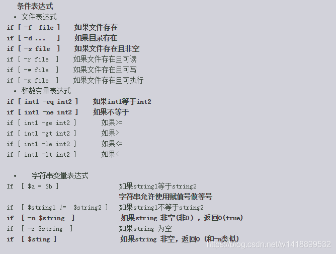

[TOC]

-  [Linux命令大全(手册)](https://www.linuxcool.com/)

# Shell

## #! /bin/shell

- [#!/bin/sh简介](https://www.cnblogs.com/fengliu-/p/9999854.html)

在`shell`中`#`是注释，而`#!`却不是，需要我们当成一个整体来对待。最常见的即:

``` shell
#!/bin/sh
```

这条语句用于定义我们执行`shell`脚本的程序在系统中的位置。如果我们的`shell`脚本中没有这条语句，那么系统默认运行`C shell csh`。

## $?

上一条命令的返回

## if



# 系统

## 系统版本

- 查看Linux系统版本

``` shell
cat /etc/issue
```

- 查看Linux内核版本

``` shell
cat /proc/version
```

## 系统位数

``` shell
$ getconf LONG_BIT
```

# 磁盘

## 查看磁盘IO信息

- iotop
- iostat

## 查看文件空间 du

``` shell
$ du -sk -m ./
```

## 查看磁盘空间 df

``` shell
# 查看磁盘空间大小
# a 所有
# h 以KB, MB, GB格式显示
$ df -ah
# 查看磁盘索引(inode)占用大小
$ df -i
```

# su 切换用户

``` shell
# 切换为root用户
su root
```

# sudo

允许普通用户执行需要系统管理员权限的命令

``` shell
# ubuntu安装图形界面
sudo apt-get install xinit
sudo apt-get isntall gdm
sudo aot-get install Ubuntu-desktop
# 使用图形界面
startx

# 无密码切换root
sudo sudo su
```

# 编码 

``` shell
$ locale

# 临时修改系统编码
$ echo $LANG
```

# 用户

## 查看用户所在用户组

``` shell
$ groups #{username}
```

## 账户被锁

``` shell
# 查询用户被锁次数
pam_tally2 --user admin
# 重置用户被锁次数
pam_tally2 --user=admin --reset
```

# 执行

## source

读取并执行文件，通常使用`.`代替

``` shell
# 与./helloWorld等价, 可以执行二进制程序
source helloWorld.sh
```

# 文件

## 创建文件夹 mkdir

``` shell
$ mkdir #{file}

// 需要时创建上级目录
$ mkdir -P #{file} 
```

## 设置用户或用户组 chown

将指定文件设置用户或用户组

``` shell
$ chown -R #{user}:#{usergroup} #{file}
```

| 参数 | 描述                           |
| ---- | ------------------------------ |
| -R   | 处理指定目录以及子目录下的文件 |
| -c | 显示更改的部份信息 |

## 设置文件权限 chowd

``` shell
chowd -R 777 #{directory}
```

| 权限代号 | 权限描述       |
| -------- | -------------- |
| 777      | 可读可写可执行 |

- [【Linux】chmod、chown命令（600，644，700，755，711，666，777）](http://blog.sina.com.cn/s/blog_8610084f0102xx2k.html)

## 删除文件 rm

<a href='https://blog.csdn.net/chyychfchx/article/details/52687935'>Linux命令-5：rm（Remove）命令</a>

### 参数

- **-r --recursive**	递归
- **-f --force**	强制删除，无需确认

``` shell
$ rm #{file}
# 强制删除，系统无提示
$ rm -f #{file}
# 删除所有.log文件
$ rm -i *.log
# 删除文件夹
$ rm -r #{directory}

# 删除当前文件夹下所有文件及文件夹
$ rm -rf *
# argument list too long
$ find . | xargs -i rm {}
```

## 压缩与解压 tar

- 参考
- [linux 下tar命令详解](https://blog.51cto.com/tonyping/1286345)

``` shell
# 压缩文件：将source文件夹压缩为target.tar.gz
$ tar -zcvf target.tar.gz source
# 解压文件
$ tar -zxvf target.tar.gz
```

## 查找文件

- **参考**
- [linux下快速查找文件](https://blog.csdn.net/xxmonstor/article/details/80507769)

### 查找文件 find

``` shell
# 查找/etc目录下名称为http.conf的文件
$ find /etc -name http.conf
$ find /etc -name '*http*'

# -print 打印
# -exe 执行command命令
# -ok 执行command命令前询问用户
$ find path -option [-print] [-exec -ok command] {} \;
```

### 查找可执行文件 which

只能查找配置了环境变量的可执行程序所在目录。

## 查看文件内容

### cat

`Linux`下最常见的查看命令。

``` shell
cat hello.txt
```

cat也可以快速写入文件：

``` shell
cat << EOF > hello.txt
```

在这种语法中，`<<` 表示输入重定向操作符，`EOF` 是一个特殊的标记，用于指示输入的结束。

这行命令的作用是将后续的输入（直到遇到另一个 `EOF` 标记为止）写入到一个名为 `hello.txt` 的文件中。

### grep

`grep`命令用于查找文件里符合条件的字符串。在`windows`中与`findstr`功能相似。

- **参数**

  | 参数                                           | 作用                         |
  | ---------------------------------------------- | ---------------------------- |
  | `-A <显示行数>`或`--after-context=<显示函数>`  | After,查看符合条件之后的内容 |
  | `-B <显示行数>`或`--before-context=<显示行数>` | Before                       |
  | `-C`或`--context`                              | 符合条件前后的内容           |
  |                                                |                              |

## fuser

用于查询给定文件或目录的相关用户或进程信息

``` shell
# 查询socket和文件系统使用者
fuser -v -n tcp 9999
              USER     PID    ACCESS   COMMAND
9999/tcp:     root     11861   F....    socket

# 查询文件和目录使用者
fuser /root
/root:               17923c 24869c
```

## sed

编辑文件

``` shell
# 将application.yml中的MySQL替换为mysql
sed -i "s|MySQL|mysql|g" application.yml
```

# 文件目录

## dirname

返回文件全路径中的目录部分。

# 文件传输

## lrzsz

通常在`Linux`和`Windows`之间传输工具，我们除了使用`ftp工具`，我们还可以通过以下两个命令实现：

``` shell
# 安装工具
yum install lrzsz

# 下载
sz $filename
sz $filename1 $filename2
sz $directory /*

# 上传
rz $filename
```
## scp

``` shell
$scp local_file remote_username@remote_ip:remote_folder
$scp local_file remote_username@remote_ip:remote_file
$scp local_file remote_ip:remote_folder
$scp local_file remote_ip:remote_file
```

# vi/vim

## 查找

在`vi/vim`中输入`/`开搜索文件中你需要查找的字符串。

## 模式

### 命令模式

用户刚刚启动 vi/vim，便进入了命令模式。
此状态下敲击键盘动作会被Vim识别为命令，而非输入字符。**比如我们此时按下i，并不会输入一个字符，i被当作了一个命令。**

> 以下是常用的几个命令:

- i 切换到输入模式，以输入字符。
- x 删除当前光标所在处的字符。等价`:d`
- : 切换到底线命令模式，以在最底一行输入命令。
- `w` 保存
- `q` 退出

若想要编辑文本：启动Vim，进入了命令模式，按下i，切换到输入模式。

命令模式只有一些最基本的命令，因此仍要依靠底线命令模式输入更多命令。

> `i`命令为进入输入模式
>
> `:i`命令为插入一行

### 输入模式

- ESC，退出输入模式，切换到命令模式

## 参考

- [Linux vi/vim](http://www.runoob.com/linux/linux-vim.html)

# 网络

## route

``` shell
# 查看默认路由
route -n
Kernel IP routing table
Destination Gateway Genmask Flags Metric Ref Use Iface
0.0.0.0 10.80.50.1 0.0.0.0 UG 0 0 0 bond0
10.80.50.0 0.0.0.0 255.255.255.0 U 0 0 0 bond0
169.254.0.0 0.0.0.0 255.255.0.0 U 1003 0 0 bond0
```

> `route -n`返回值中包含Destination 值为 0.0.0.0 且 Flags值为UG，说明默认路由生效；未包含说明默认路由未生效。

## host
## 网络服务

``` shell
# 重启网络服务
$ service network restart
```

## HOST

### 域名解析

`# cat /etc/hosts` 记录hostname对应的ip地址 

`# cat /etc/resolv.conf` 设置DNS服务器的ip地址 

`# cat /etc/host.conf` 指定域名解析顺序

/etc/host.conf ：指定域名解析的顺序（是从本地的hosts文件解析还是从DNS解析） <https://www.cnblogs.com/sunfie/p/5138065.html>

## IP地址

``` shell
# ip addr
```

## 网卡流量

`iptraf-ng`或`iptraf`一般系统默认不安装，需要通过`yum -y install iptraf`安装

``` shell
$ iptraf-ng eth0
```

## 网卡状态

``` shell
$ ethtool eth0
```

## tcpdump

- **-i**	指定网卡

``` shell
# 指定distinction ip
tcpdump ip dst 192.168.56.1
```

## curl

``` shell
# GET请求
curl -X GET http://127.0.0.1:80/student
# POST请求
curl -X POST http:/127.0.0.1:80/student -d '{"name": "Hugo"}'
# -k 跳过SSL校验
curl -k -X POST https:/127.0.0.1:443/student -d '{"name": "Hugo"}'
```

# net-tools

## netstat

- **-a** all
- **-o** 显示ip
- **-t** 只显示TCP端口
- **-u** 只显示UDP端口
- **-l** 仅显示监听套接字(能够读写与收发通讯协议(protocol)的程序)
- **-p** 显示进程标识符和程序名称，每一个套接字/端口都属于一个程序
- **-n** 不进行DNS轮询，显示IP(这样可以加快查询的时间)

``` shell
# 安装
yum install net-tools

# 查看TCP连接
# netstat -tnlp
```

### 根据端口查找进程pid

``` shell
netstat -atlpn | grep 3306
```

### 根据pid/port查看占用port/pid

``` shell
$ netstat -nap | grep #{pid/port}
```

# ss 查看连接 

在查看连接时`ss`比`lsof`输出信息更详细，可以看到`socket`的接收/发送队列、ino号。

``` shell
# 列出所有tcp连接
ss -t
# 列出所有处于监听状态的tcp连接
ss -tl
# 列出所有的udp连接
ss -u
# 列出连接时显示进程名与进程号pid
ss -p
# 统计socket
ss -s
```

# lsof

- 参考
- [Linux 命令神器：lsof](https://www.jianshu.com/p/a3aa6b01b2e1)

> 而有一点要切记，在Unix中一切（包括网络套接口）都是文件。
>
> 对于我，lsof替代了netstat和ps的全部工作。它可以带来那些工具所能带来的一切，而且要比那些工具多得多。

``` shell
# 查看FTP服务端口21
lsof -i:21 

# 查看进程信息(例如: 进程地址)
lsof -p $pid
```

# 内存

## 查看 free

``` shell
# free -h
```

## 查看 top

``` shell
# top
```

​	top命令是Linux下常用的性能分析工具，能够实时显示系统中各个进程的资源占用状况，类似于Windows的任务管理器

- 查看用户进程内存使用情况

``` shell
$ top -u root
```

- 查看端口内存占比

``` shell
$ top -p #{pid}
```

- 字段意义

| name | description |
| ---- | ----------- |
| PID | 进程的ID |
| USER | 进程所有者 |
| PR | 进程的优先级别，越小越优先被执行 |
| NInice | 值 |
| VIRT | 进程占用的虚拟内存 |
| RES | 进程占用的物理内存 |
| SHR | 进程使用的共享内存 |
| S | 进程的状态。S表示休眠，R表示正在运行，Z表示僵死状态，N表示该进程优先值为负数 |
| %CPU | 进程占用CPU的使用率 |
| %MEM | 进程使用的物理内存和总内存的百分比 |
| TIME+ | 该进程启动后占用的总的CPU时间，即占用CPU使用时间的累加值。|
| COMMAND | 进程启动命令名称 |

- 常用命令
  - P 按照CPU占用百分百排序
  - M 按照内存占用百分比排序
  - T 按照MITE+排序

## 查看内存详细内容

``` shell 
$ cat /proc/#{pid}/status
```

## 释放内存

``` shell
# sync
# echo 1 > /proc/sys/vm/drop_caches
```

- sync

将buffer区数据写入磁盘，确保文件系统完整性

- echo #{num} > /proc/sys/vm/drop_caches

| num | 含义 |
| --- | --- |
| 0  | 不释放 |
| 1 |  释放页内存 |
| 2 | 释放dentries 和inodes |
| 3 |  释放所有缓存 |

# 进程

## ps

process status

## 管道符 |

在`shell`，管道符`|`用于将上一条命令的输出作为下一条命令的参数。

``` shell
ps -ef|grep 3306
```

## 后台运行 &

``` shell
java -jar SpringBootPorjectName.jar 2>&1 1>/dev/null &
```

程序在后台运行。

## &&与||

- **&&**	若左边的命令执行成功，则执行右边的命令。
- **||**	若左边的命令执行失败，则执行右边的命令。

## kill

`# kill #{port}`
`# kill -s 9 #{port}`
-s 9 即传递给进程信号为9, 9即强制,尽快结束进程

# pidof

用于查找指定名称的pid

``` shell
$ pidof nginx
```

# 查看主机路由

- `genmask` `子网掩码`

# pidof

用于查找指定名称的pid

``` shell
$ pidof nginx
```

# ssh

## 生成公钥\私钥

``` shell
#ssh-keygen -t rsa
```

并将私钥配置在对应用户`.ssh`目录`authorized_keys`文件夹下。

https://blog.csdn.net/baozijiaruqing/article/details/80645082

## 连接命令

- `# ssh #{address} #{port} -l root`
- `# ssh #{username}@#{address}`

## 查看网络连通性

``` shell
ssh -v -p 3306 127.0.0.1
```

# head 和 tail

分别查看文件头或文件尾

``` shell
# head #{filepath}
# tail #{filepath}
```

## tail

``` shell
# -n 读取行数
# -f 循环读取
tail -n 10 -f hello.log
```

# set

``` shell
# 关闭脚本的冗余输出
set -x
# 显示脚本的冗余输出
set +x
```


# 环境变量

## 变量种类

### 永久

需要修改配置文件

### 临时

使用export命令声明, 变量在关闭shell时失效

## 设置方法

### 对所有用户生效

修改 etc/profile 文件

```
# vi etc/profile
export CLASSPATH=./JAVA_HOME/lib;./JAVA_HOME/bin
```

> 修改后若要立即生效需要运行

```shell
# source /etc/profile
```

### 对单一用户生效

修改 用户目录下 .bash_profile (具体文件看linux版本,比如 ./bashrc)

```shell
# vi /etc/profile
export CLASSPATH=./JAVA_HOME/lib;$JAVA_HOME/jre/lib
```

### 临时变量

```shell
export hello=world
```

## 查看环境变量

- echo命令查看单个环境变量。例如:echo $PATH
- env查看所有环境变量。例如:env
- set查看所有本地定义环境变量

# 时间

## 设置时区

经检验，该方法是设置时区最安全的方法。

``` shell
timedatectl set-timezone Asia/Shanghai
```

## 设置时间

``` shell
date -s '2023-05-11 00:00:00'
```
