[toc]

- [Markdown 入门教程](https://www.wenjiangs.com/docs/markdown-introduction)

# 什么是Markdown

`Markdown`是现下程序员领域非常流行的文档格式。要我总结它的优点有三个：

- 简单
- 快速
- 实用

像`Github`、`码云`、`掘金`等技术网站已支持（并推荐）`Markdown`。

`Markdown`还可以转换成`word`、`PDF`等我们常用的办公软件格式。

# Markdown编辑器

## Typora

- **alt + /**	 查看源码

# 常见语法

## 目录

``` markdown
[toc]
```

> 有的编辑器可能不支持`[toc]`

## 标题

``` markdown
# 大标题
## 标题
### 小标题
```

## 换行

两个空格+回车。但是如果你结合了`Typora`(或者其他好用的编辑器)，你就可以直接换行了。

## 字体

*斜体文本*
_斜体文本_
**粗体文本**
__粗体文本__
***粗斜体文本***
___粗斜体文本___

## 线条

***

* * *

*****

- - -

----------

~~BAIDU.COM~~

<u>带下划线文本</u>

## 批注

大家好，[^小批注]的使用时这样子的。

[^小批注]: 我是批注的内容

# 列表

## 无序列表

* 第一项
  * 嘿嘿
  * 哈哈
* 第二项

> 实际上无序列表可以使用'-'、'*'、'+'

## 区块与代码

> 这是区块

- java

``` java
public class HelloWorld{
	public static void main(String[] args) {
        System.out.println("Hello world");
    }
}
```

- python

``` python
print('Hello world');
```

- sql

``` sql
-- 找出姓侯的学生
SELECT *
FROM student
WHERE name like '侯%'
```

# 插入超链接

- <a href='www.baidu.com'>百度</a>
- [谷歌](www.google.com)

## 业内跳转

[页内跳转](#页内跳转)

# 表格

| 表头   | 表头   |
| ------ | ------ |
| 单元格 | 单元格 |
| 单元格 | 单元格 |


# 绘图

## sequence

``` sequence
participant 老板
participant 员工

老板 - 员工 : 在不在
员工 -- 老板 : 在的怎么了?
Note left of 老板: 是不是又在摸鱼?
老板 - 员工 : 在干嘛?
员工 -- 老板 : 在认真工作!
Note right of 员工 : 怀疑我?
```


## mermaid

- [mermaid 使用 （javascript 流程图 甘特图 序列图）](https://blog.csdn.net/Cribug8080/article/details/88595314)
- [mermaid工具](https://blog.csdn.net/liuxiao723846/article/details/83544588)

中文释义：美人鱼。

`node.js`实现的绘制流程图、甘特图、时序图的工具。且`mermaid`相比`sequence`功能更加丰富。

### 基本图形


### 线条

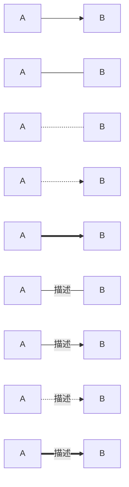

### 流程图

#### 子流程

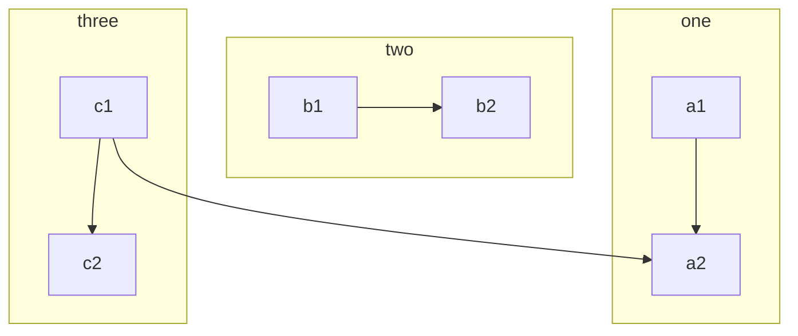


- **参考**

  <a href='https://www.jianshu.com/p/b421cc723da5'>如何在Markdown中画流程图</a>

### 时序图

- **参考**
  - [Markdown 进阶技能：用代码画时序图](https://zhuanlan.zhihu.com/p/70261692)	`mermaid`用法
  - [MarkDown 时序图](https://www.jianshu.com/p/8f8e7fd20054)	`sequence`用法

<hr>

- **实线**	代表请求
- **虚线**	代表返回
- **末尾[X]**	异步消息，无需等待

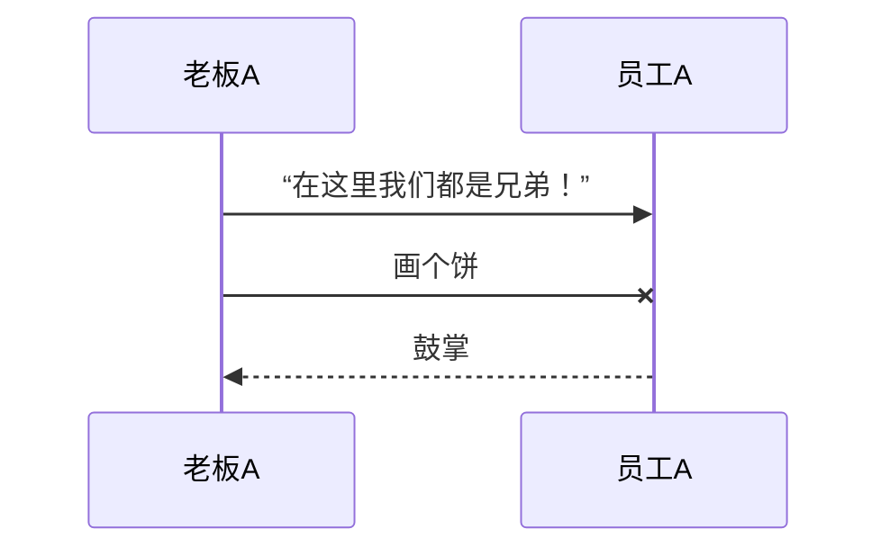

---

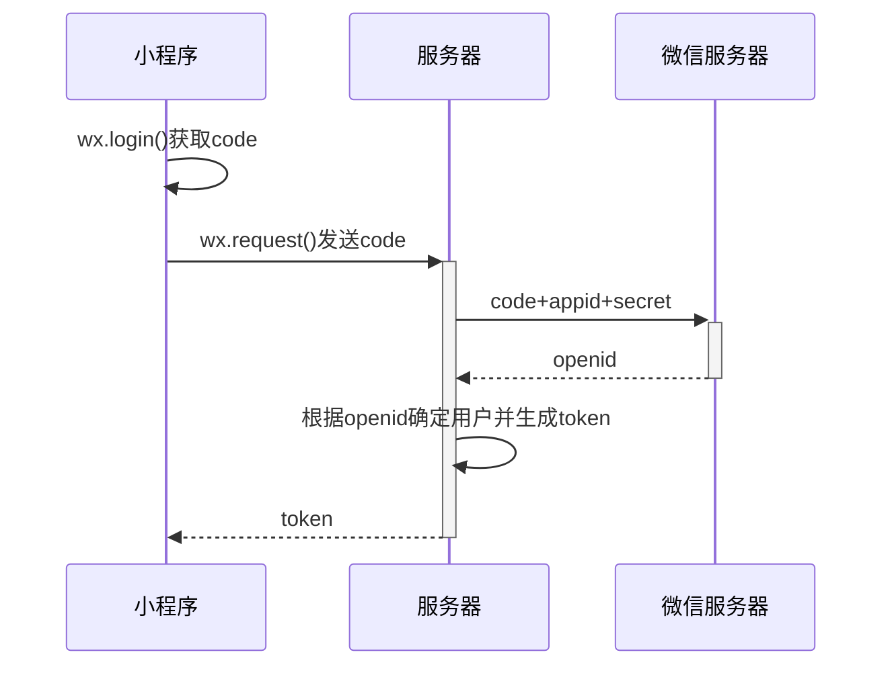

#### 激活框

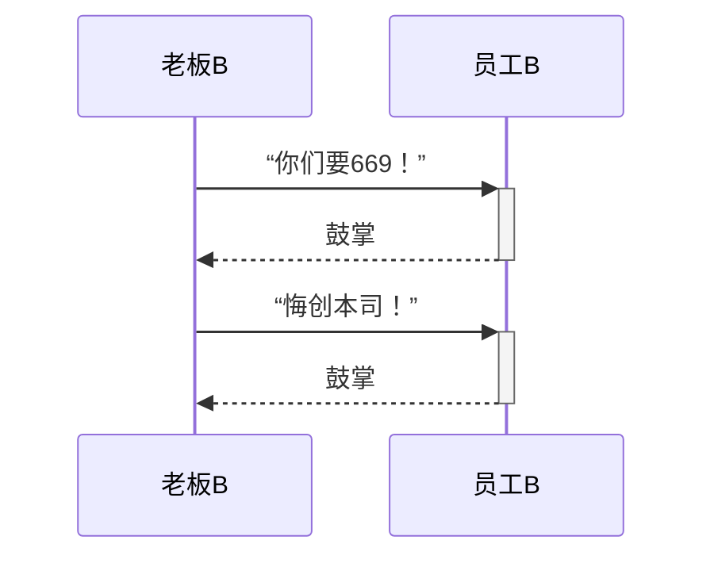

#### 注解

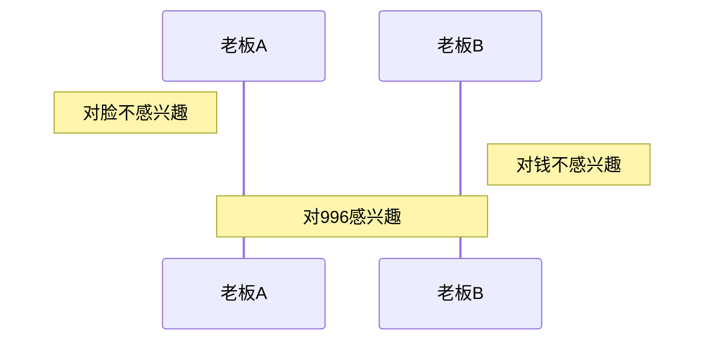

#### 循环

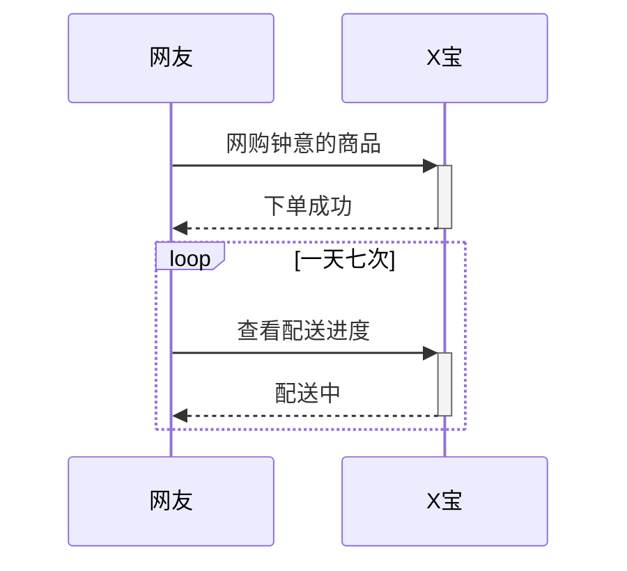

#### 选择

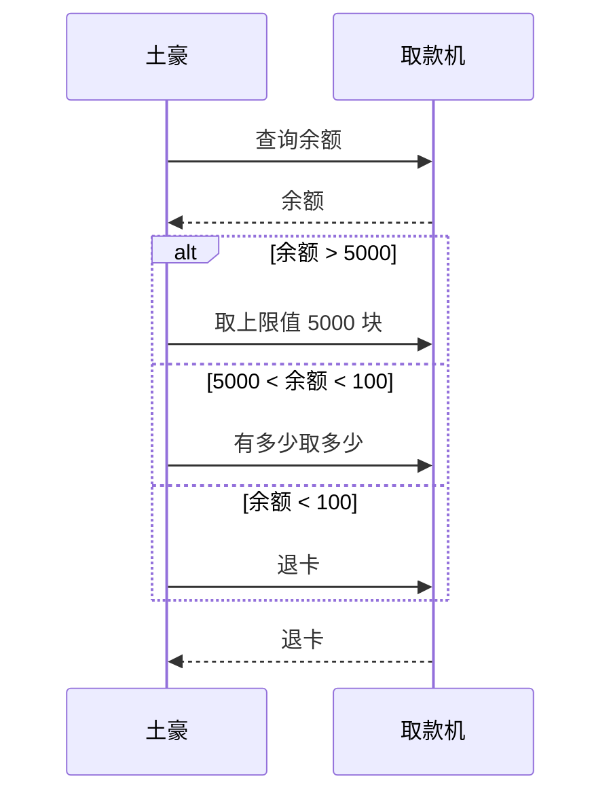

#### 可选

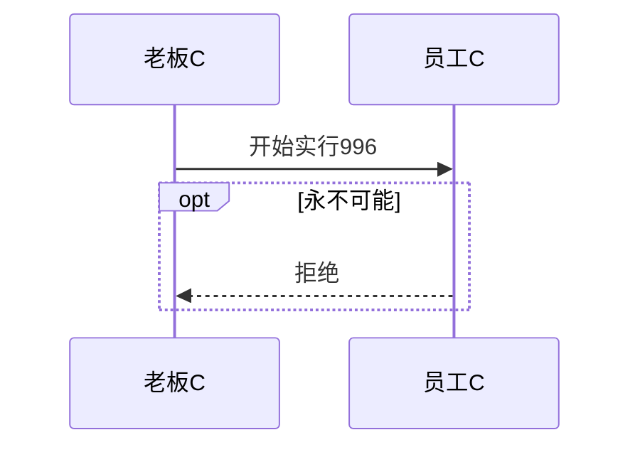

#### 并行

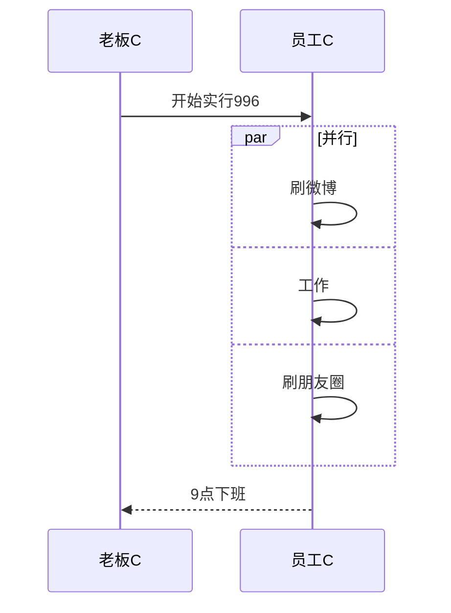

### UML

#### 类图

##### 类图的关系|线条

| Type   | Description |
| :----- | :---------- |
| `<|--` | 继承关系    |
| `*--`  | 组成关系    |
| `o--`  | 集合关系    |
| `-->`  | 关联关系    |
| `--`   | 实现连接    |
| `..>`  | 依赖关系    |
| `..|>` | 实现关系    |
| `..`   | 虚线连接    |

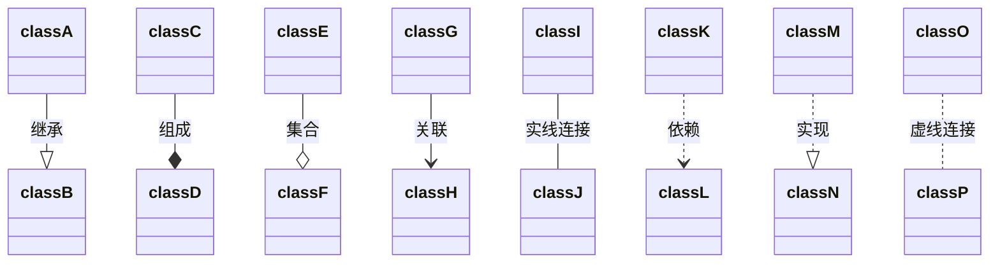

##### 类修饰符

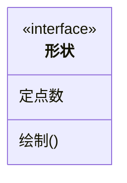

##### 示例

- **示例1**

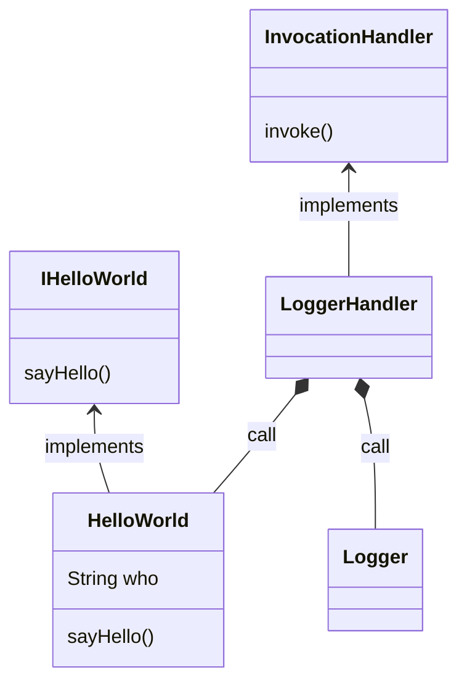

- **示例2**

  ```mermaid
  classDiagram
  	鸟 --|> 动物 : 继承
    翅膀 "2" --> "1" 鸟 : 组合
    动物 ..> 氧气 : 依赖
    动物 ..> 水 : 依赖
    
  	class 动物 {
      <<interface>>
      +有生命
      +新陈代谢(氧气, 水)
      +繁殖()
  	}
  	
  	class 鸟 {
  		+羽毛
  		+有角质喙没有牙齿
  		+下蛋()
  	}
  	class 鸟 {
  		+羽毛
  		+有角质喙没有牙齿
  		+下蛋()
  	}
  ```

### 甘特图

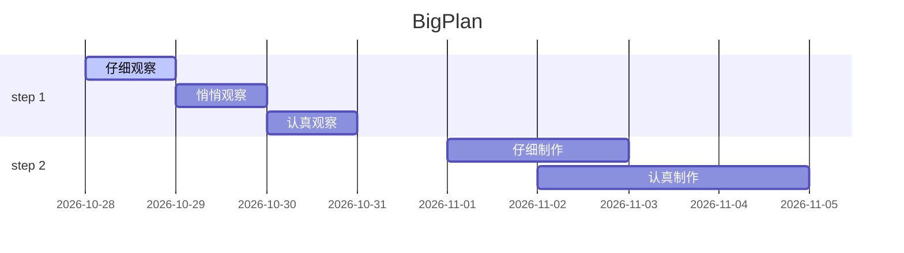


