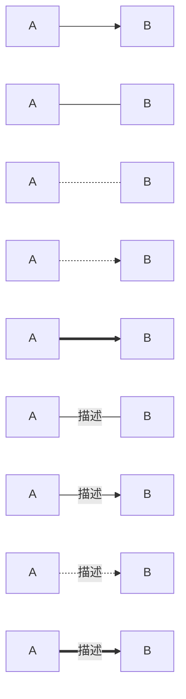
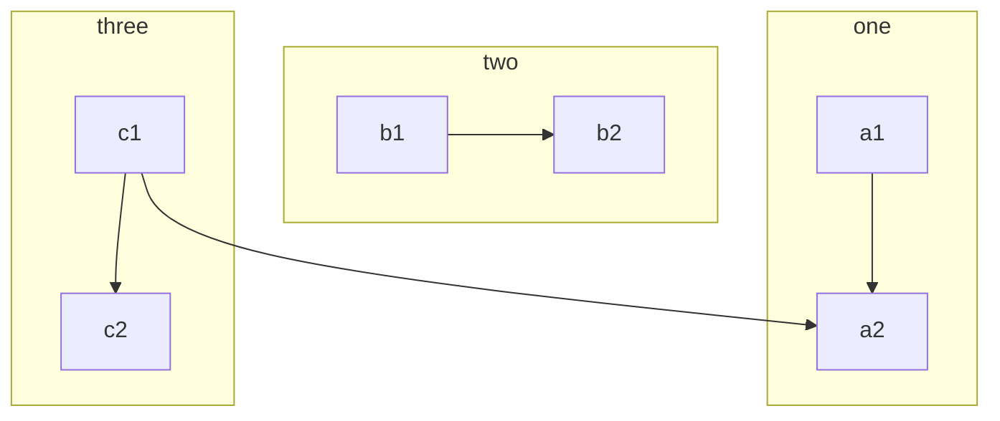

[toc]

# 画图

## 基本图形

```mermaid
graph TD
    id[带文本的矩形]
    id4(带文本的圆角矩形)
    id3>带文本的不对称的矩形]
    id1{带文本的菱形}
    id2((带文本的圆形))
```

## 线条

``` mermaid
graph LR
    A[A] --> B[B] 
    A1[A] --- B1[B] 
    A4[A] -.- B4[B] 
    A5[A] -.-> B5[B] 
    A7[A] ==> B7[B] 
    A2[A] -- 描述 --- B2[B] 
    A3[A] -- 描述 --> B3[B] 
    A6[A] -. 描述 .-> B6[B] 
    A8[A] == 描述 ==> B8[B] 
```

## 子流程

```mermaid
graph TB
    c1-->a2
    subgraph one
    a1-->a2
    end
    subgraph two
    b1-->b2
    end
    subgraph three
    c1-->c2
    end
```

- **参考**

  <a href='https://www.jianshu.com/p/b421cc723da5'>如何在Markdown中画流程图</a>