[toc]

# 画图

## 基本图形

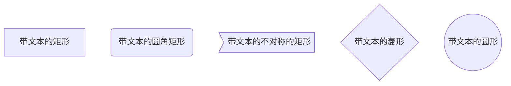


## 线条

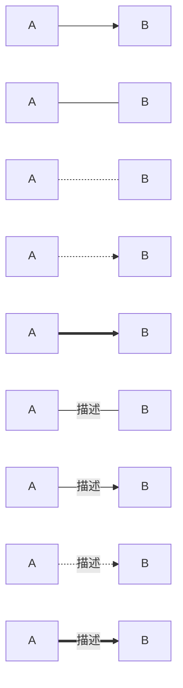

## 子流程

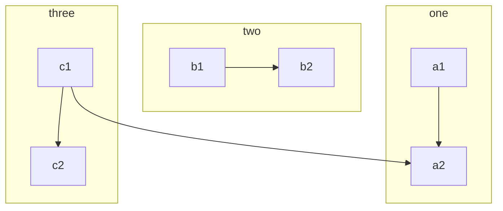


- **参考**

  <a href='https://www.jianshu.com/p/b421cc723da5'>如何在Markdown中画流程图</a>

# 时序图

- **参考**
  - [Markdown 进阶技能：用代码画时序图](https://zhuanlan.zhihu.com/p/70261692)	`mermaid`用法
  - [MarkDown 时序图](https://www.jianshu.com/p/8f8e7fd20054)	`sequence`用法

<hr>

- **实线**	代表请求

- **虚线**	代表返回

- **末尾[X]**	异步消息，无需等待

  ``` mermaid
  sequenceDiagram
      participant 老板A
      participant 员工A
  
      老板A ->> 员工A : “在这里我们都是兄弟！”
      老板A -x 员工A : 画个饼
      员工A -->> 老板A : 鼓掌
  ```

  

## sequence

``` sequence
participant 老板
participant 员工

老板 - 员工 : 在不在
员工 -- 老板 : 在的怎么了?
Note left of 老板: 是不是又在摸鱼?
老板 - 员工 : 在干嘛?
员工 -- 老板 : 在认真工作!
Note right of 员工 : 怀疑我?

```

## mermaid

`mermaid`相比`sequence`功能更加丰富。

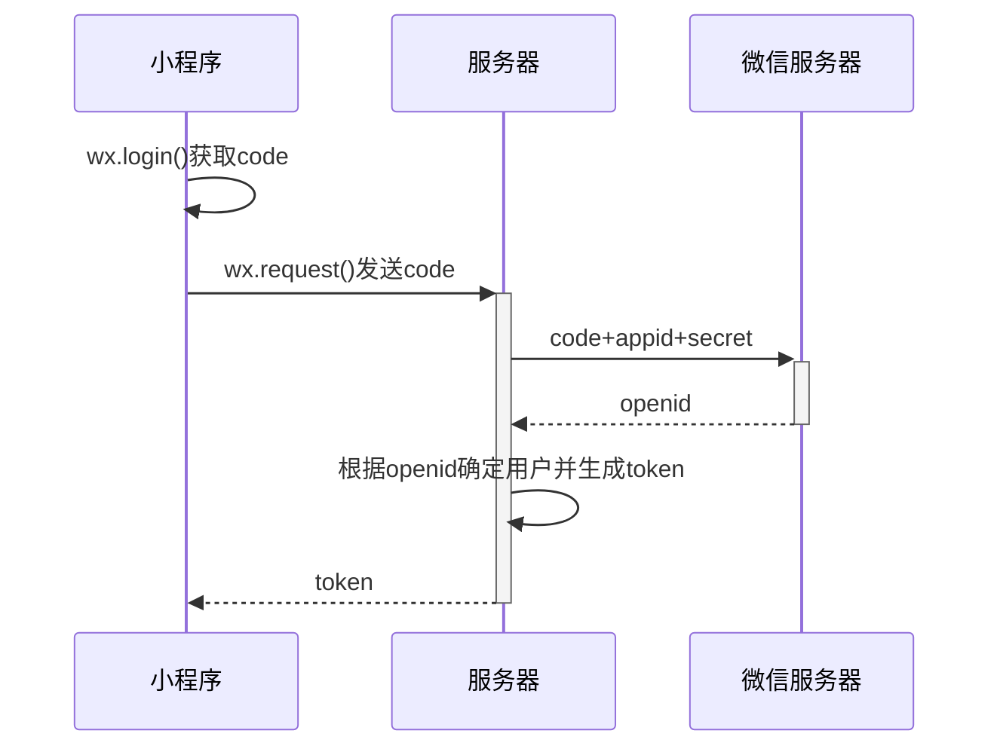

### 激活框

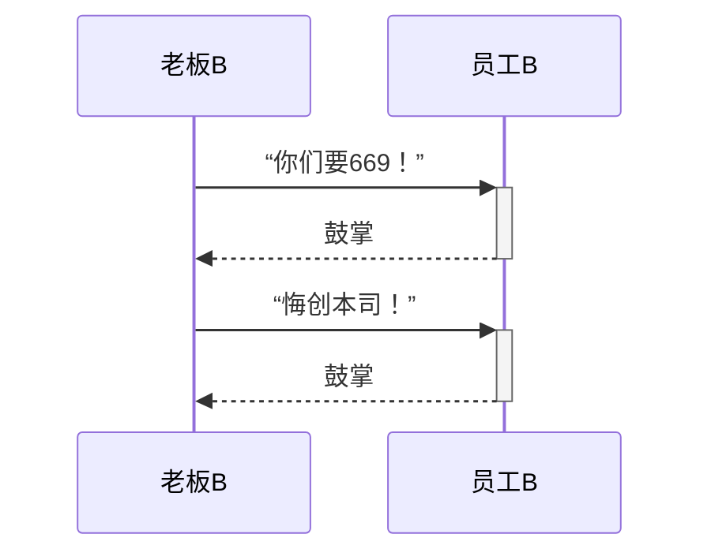

### 注解

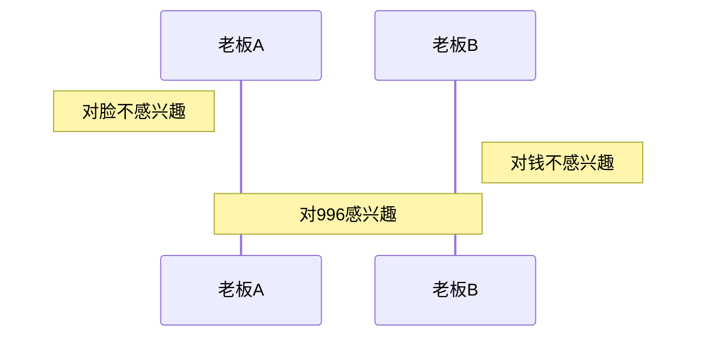

### 循环

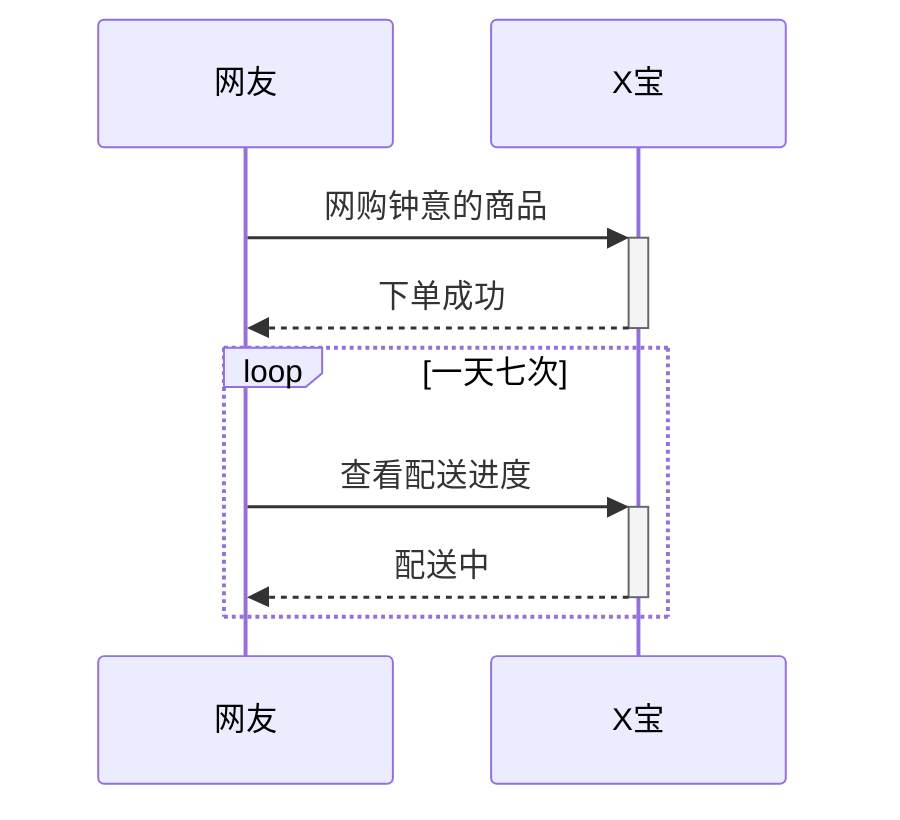

### 选择

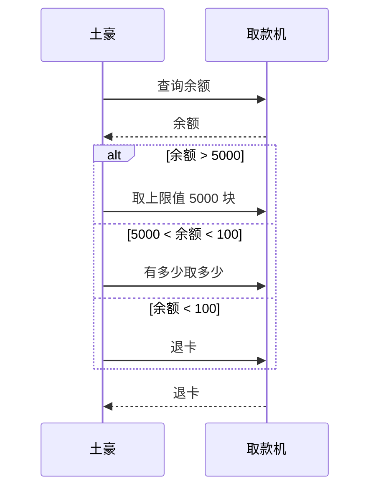

### 可选

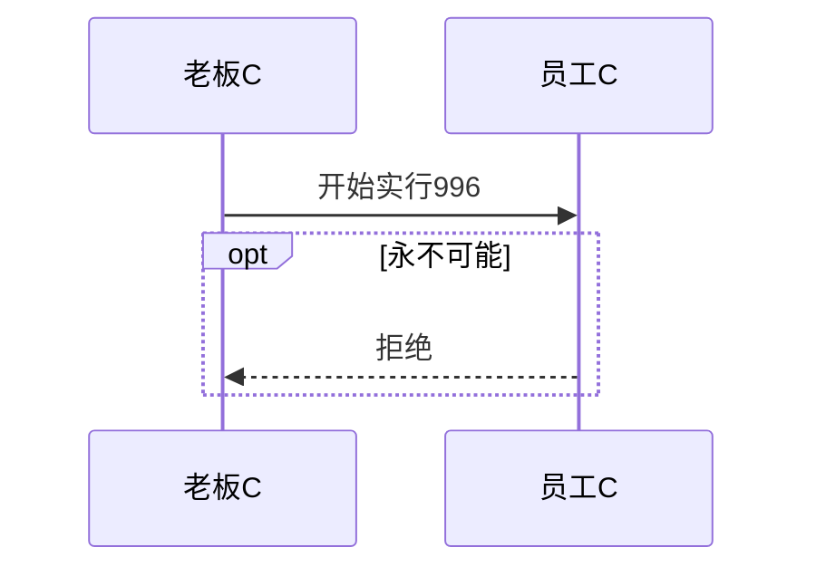

### 并行

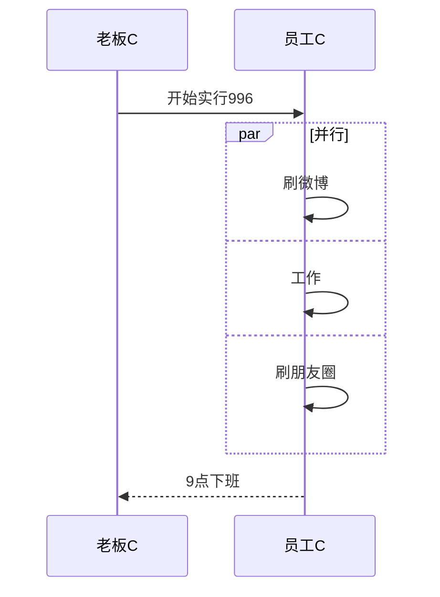

# UML

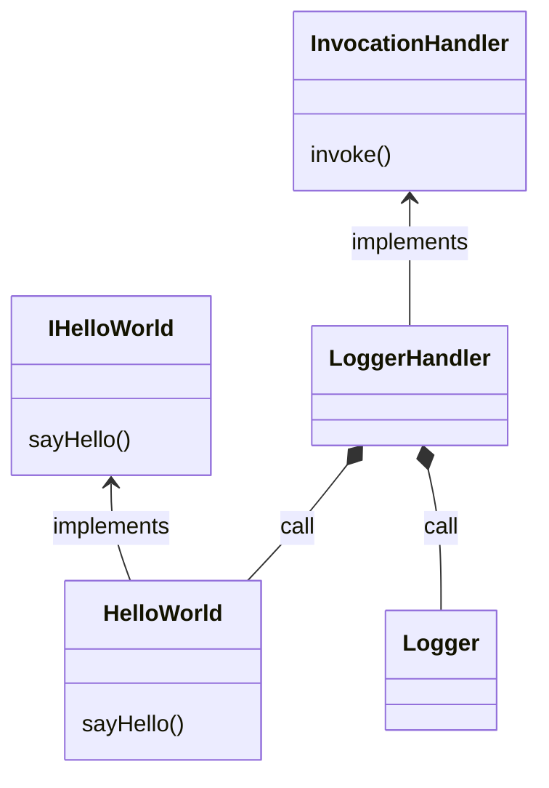

