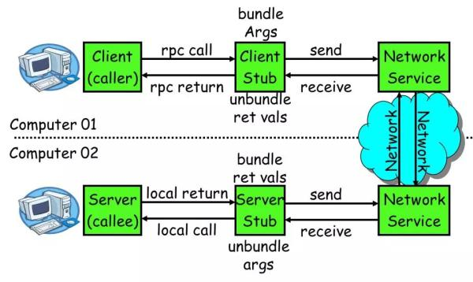

[toc]

# RPC

远程服务调用(Remote Procedure Call，RPC)。

- 目的

  远程通信，为了让计算机调用本地方法一样调用远程方法。

| RPC工具       | 序列化协议                                | 数据交换协议                 | 方法 |
| ------------- | ----------------------------------------- | ---------------------------- | ---- |
| ONE RPC       | External Data Representation              |                              |      |
| CORBA         | Common Data Representation                | Internet Inter ORB Protocol  | OIDL |
| Java RMI      | Java Object Serialization Stream Protocol | Java Remote Message Protocol |      |
| gRPC          | Protocol Buffers                          | Http 2.0                     |      |
| Web Service   | XML Serialization                         | SOAP                         | WSDL |
| 众多轻量级RPC | JSON Serialization                        |                              |      |
| Dubbo         |                                           | TCP                          |      |
| Spring Cloud  |                                           | HTTP                         |      |

> gRPC底层使用netty实现。

RPC与具体网络分层、具体协议没有直接关系，只要实现了远程过程调用都被称为RPC。

## Stub

Sever与Client都有Stub。在Java中实现RPC时，就是我们的定义的Interface。	

# 实现RPC

实现RPC框架需要解决的问题：

- **代理问题**	
  - 屏蔽网络连接细节
- 序列化问题
  - JDK Serializable
- 通信问题
- 登记的服务实例化
  - 反射

## Dubbo Architecture

以上设计仅能实现RPC框架的基本功能。如果要做实现一个比较健壮的RPC框架，我们可以参考一下阿里团队的Dubbo:

在Dubbo中有以下几个角色：

| 角色      | 能力                                                         |
| --------- | ------------------------------------------------------------ |
| Registry  | 注册中心，提供Provider地址列表                               |
| Consumer  | 服务消费者，从注册中心得到Provider列表后，基于软负责均衡算法调用Provider |
| Container | 服务容器，负责启动、加载、运行Provider                       |
| Provider  | 服务提供者，提供服务，在启动时主动注册自己的服务能力         |
| Monitor   | 监视器                                                       |

将我们的设计与Dubbo对比，可以看到：

- 性能欠缺，表现在网络通信机制、序列化机制等待
- 负责均衡、容灾、集群功能弱
- 服务注册与发现机制能力弱

> - Dubbo对比Spring Cloud
>
>   - 协议
>
>     | Spring Cloud | Dubbo |
>     | ------------ | ----- |
>     | Http         | TCP   |
>
>     通常情况下，RPC框架比Http的传输性能更高，如果算上序列化的话，吞吐量是Http的两倍。
>
>   - 服务全面
>
>     Spring Cloud更加全面，意味着其更加重量级；Dubbo专注服务治理这方面，使用上更加轻量。
>
>   总体而言，对外服务推荐使用RESTful，内部调用推荐采用RPC。

# 微服务架构

随着业务发展，单体架构无法满足日益增长的性能要求。在这种情况下，我们不得不对单体应用进行拆分，通过部署在多个机器部署多个应用来分摊压力，而这就是分布式。

在迁移分布式/微服务架构的过程中，引入RPC对现有的代码影响最小。这就是在微服务架构中，RPC始终是占据一席之地的原因。

不过随着微服务越来越多，RPC之间的调用会越来越复杂，这时候还是需要消息队列、缓存、容器技术、DevOps等等，来解决千万级流量的分布式问题。

# WebService

RPC的一种实现。

- **SOAP**

  简单对象访问协议，`Simple Object Access Protocol`。是一种基于XML描述客户端与服务端之间的数据交换格式协议。

- **WSDL**

  WebService定义语言，`WebService Definition Language`。是一种基于[^XSD]描述WebService的语言。[XSD]: XML Schema Definition

- UDDI

  统一发现和集成服务，`Universal Description Discovery and Integration`。是一个用于存放`WebService`服务信息的目录服务。

# 轻量级RPC工具

## Hessian

