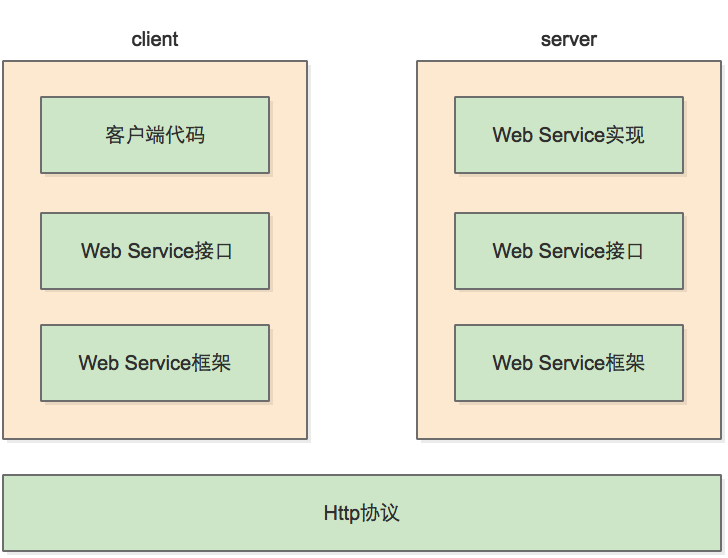

[toc]

# RPC

- **参考**
- [RPC是什么，与WebService有什么异同？](https://zhuanlan.zhihu.com/p/97640202)
- [谁能用通俗的语言解释一下什么是 RPC 框架？](https://www.zhihu.com/question/25536695)
- [RFC1050 - Remote Procedure Call Protocol Specification](https://www.rfc-editor.org/rfc/rfc1050.html)
- [RPC和WebService的区别](https://www.cnblogs.com/aspirant/p/8631089.html)
- [什么是stub?](https://blog.csdn.net/zlpzlpzyd/article/details/44807095)
- [花了一个星期，我终于把RPC框架整明白了](https://developer.51cto.com/art/201906/597963.htm)

`Remote Procedure Call`, 远程过程调用，它是一种技术思想，而不是一种规范或者协议。它是一种通过网络从远程计算机程序上请求服务，而不需要了解底层网络技术的思想。

我们常见的`Web Service`便是`RPC`的一种实现。

## 原理

### 客户端Client

服务调用方

### 客户端存根Client Stub

在`J2EE`中，`stub`的定义是：为屏蔽客户端调用远程主机上的对象，必须提供某种方式来模拟本地对象。这种本地对象，称为存根`stub`。

在`Java`中，`stub`往往是那一系列`Interface`。

> 对客户端来说，有了这个stub，RPC调用过程对client code来说就变成透明的了，客户端代码不需要关心沟通的协议是什么，网络连接是怎么建立的。对客户端来说，它甚至不知道自己调用的是一个远程过程，还是一个本地过程。

存放服务端地址信息，将客户端的请求参数数据信息打包(`序列化`)成网络消息，再通过网络传输发送给服务端。

### 服务端存根Server Stub

接收客户端发送过来的请求消息并进行解包(`反序列化`)，然后再调用本地服务进行处理。

### 服务端Server

真正的服务提供者/发布者。

### Network Service底层传输

网络传输协议。

## 什么是Stub

- [什么是Stub - 一篇09年的博客](http://blog.sina.com.cn/s/blog_6048fb5a0100d4ol.html)

> - **2021-11-19**
>
>   其实`RPC`、`WebService`都是很古老的概念了，这个时代真正了解的程序员应该很少了。几个比我稍微年长的同事甚至没有我了解。（吹捧下自己）
>
>   但我这里描述的是古老的概念，是因为我认为`RPC`的思想依然活跃在今天的编程世界。只是换了一个名字，比如说：RESTFul？

首先回到`RPC`的初心——<u>**使远程调用看起来像本地调用一样，而不需要了解底层网络技术的细节。**</u>

> 划重点。这句话是`RPC`的核心思想。

用更通俗易懂的中国话解释就是——**像使用自己的代码一样。**而作为`WebService`的调用者，我们只需要调用`client stub`。使用时，调用`client stub`就如同自己声明的方法或者函数，但是这个方法我们并没有去实现它，它的具体实现在`server`上。

就如同我们只是有这个存根，当我们的请求发送给`server`后，`server`会根据存根找到具体的实现。借用`Java`中的`interface`，我们在本地声明了接口，但是具体实现却在`server`上。

# Web Service

- **参考**
- [java接口调用——webservice就是一个RPC而已](https://www.cnblogs.com/intsmaze/p/6055684.html)

`Web Service`是一套`RPC规范`，或者说是一种实现。

每个`WebService`使用`SOAP`作为`RPC`的报文。`WSDL`作为服务本身的描述。`UDDI()`作为服务的目录发现机制。

> WebService，顾名思义就是基于Web的服务。它使用Web(HTTP)方式，接收和响应外部系统的某种请求，从而实现远程调用。
>
> 我们可以调用互联网上查询天气信息Web服务，然后将它嵌入到我们的程序(C/S或B/S程序)当中来，用户可以在我们的网点看到天气信息，他会认为我们为他提供了很多的信息服务，但其实我们只是简单调用了一下服务器上的一段代码来调用别人写好的WebService。
>
> **WebService可以将你的服务(一段代码)发布到互联网上让别人去调用,也可以调用别人机器上发布的WebService,就像使用自己的代码一样.**。

以上是一篇博主的见解，从以上我总结了几点：

- **基于`Web`的服务**

  所谓`Web`，即应用层协议使用`http`/`https`。

- **WebService**

  负责发布服务。

- **像使用自己的代码一样**

  实际上，这也是`RPC`思想所描述的，通过`stub`屏蔽了序列化、反序列化、发送请求、接收请求等技术细节，调用第三方服务就像在本地调用一个函数一样。

  而`stub`就是`Java`中定义服务参数的一系列`Interface`。

这些是自己在处理类似功能时，感受最深的体验。

## 要素

### SOAP

简单对象访问协议，`Simple Object Access Protocol`。

是一种基于XML描述客户端与服务端之间的数据交换格式协议。

### WSDL

WebService定义语言，`WebService Definition Language`。

是一种基于[^XSD]描述WebService的语言。

[XSD]: XML Schema Definition

### UDDI

统一发现和集成服务，`Universal Description Discovery and Integration`。

是一个用于存放`WebService`服务信息的目录服务。

## 原理

## 

# 常用RPC框架

- Dubbo
- gRPC
- Hessian