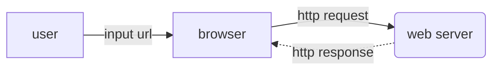
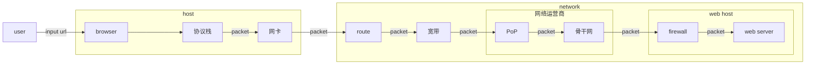
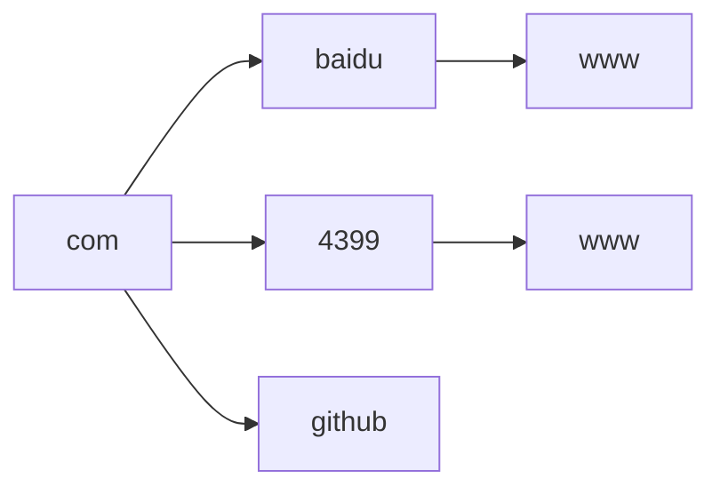
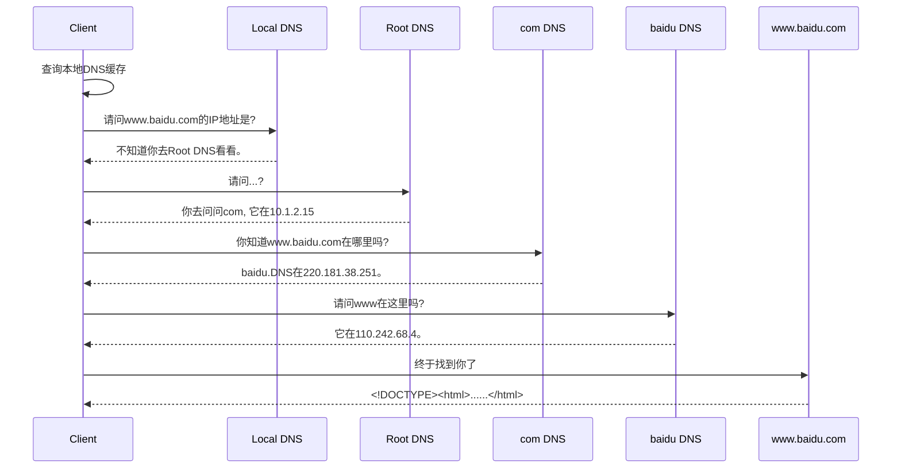

[TOC]

# 写在前面

> - **2021-12-6**
>
>   让玄学不再是玄学——当我们在计算机领域遇到难以理解的现象时，其实是我们基础知识不牢靠而已。

## 学习基础知识的意义

要成为`master`，这些知识是绕不过去的。

- **理解**

​	当我们对所在的领域有一定的了解，才会知道用什么关键字去搜索，否则我们对我们面临的问题一无所知。这些知识是我们分析、定位、解决疑难杂症的最好帮手。

​	在阅读《网络是怎样连接的》这本书的前言时，有一个小时候经常遇到的问题——浏览器无法上网而QQ可以上网？这个问题也常常出现在某电脑管家上呢。其实这是因为QQ使用了IP地址来连接服务器，所以在DNS服务器失效时，QQ依然可以聊天。

- **最佳实践**

​	代码执行效率低，我们去哪里`ctrl c`?实际上，这些问题的最佳实践，已经藏在了这些经历了无数年毒打的计算机科学基础中。为什么你的服务扛不住压力，公用的DNS服务器却能抗住数百倍的压力。

# 网络是如何连接的

## 浏览器到`web server`

- 基本流程



对于大部分程序员来说，工作只要了解到上图就可以了。



但实际情况可能更复杂，如上图。

到达[^web host]后，`packet`仍需要从网卡到协议栈的逆向过程，上图做了省略。此外，还可能经过负载均衡器、缓存服务器等`node`。

> 上图只是初步的了解，可能存在错误。需要日后慢慢修正。

[^协议栈]:网络控制软件
[^broadband]: 宽带线路,  常见有ADSL和FTTH(光纤)
[^PoP]:Point of Presence, 接入点，实体是运营商的路由器
[^骨干网]:
[^web host]: 服务提供者的网络，可能是一台主机、也有可能是一个局域网。

# 工具

## 浏览器

浏览器是一个具备多种功能的综合性客户端软件。通过[^URL]中的协议头来判断使用哪种功能访问`server`。

[^URL]:Uniform Resource Locator，统一资源定位符。

[^URI]:Uniform Resource Identifier，统一资源标识符。

## NETCAT

### 用途

- 端口测试
- 传输测试
- UDP会话测试
- 文件传输
- 网络吞吐量测试
- 系统后门

## 抓包

- wireshark

- fiddler

- tcpdump

抓包工具的原理就是拦截链路层的包。

# OSI


# TCP/IP模型

由于OSI模型比较复杂，实际上我们使用的是`TCP/IP模型`。

TCP/IP模型共分为四层：

- 应用层
- 传输层
- 网络层
- 链路层


# TCP/IP协议簇

互联网的**基础通信架构**，由多个协议组成。


## TCP/IP数据包

统称为包[^Packet]，在各层中有更加专业的称呼：

| 名称 | 层                  |
| ---- | ------------------- |
| 消息 | 应用层              |
| 段   | TCP数据流（传输层） |
| 片   | IP协议（网络层）    |
| 帧   | 链路层              |


# Socket

- [C语言网 - socket编程入门](http://c.biancheng.net/socket/)

> Socket库是在加州大学伯克利分校开发的UNIX操作系统BSD中开发的C语言库，互联网中所使用的大多数功能都是基于Socket库来开发的。

如果没有指定端口，操作系统会临时分配一个端口（大于49152）。

## 通信原理


### TCP缓冲区

每个TCP的Socket的内核中都有一个发送缓冲区和接收缓冲区。

当程序调用Socket的write()时，并非立即向网络传输数据，而是将数据写入缓冲区，再由TCP协议将数据从缓冲区中发送给对方。

TCP协议独立于write()函数，数据有可能刚被写入缓冲区就立即发送，也有可能在缓冲区中挤压，在多次写入后将缓冲区中的数据一次发送。

read()函数也是如此。

# 协议栈 ..TODO

# URL

>  许多应用层的协议都会使用到`URL`

Uniform Resource Locator，统一资源定位符。

- **格式**

  以使用`HTTP`为例子：`http://域名:端口/URI`。

  比如我们要访问：http://www.baidu.com/index.html，则表明我们需要访问这台`www.baidu.com`这台服务器上的`index.html`这个文件。

当`URI`被省略时，比如我们访问http://www.baidu.com，通常服务器可以设置默认文件，例如`index.html`。

# DNS

`Domain Name System`，域名系统。

> - 《凤凰架构》
>
> DNS 也许是全世界最大、使用最频繁的信息查询系统，如果没有适当的分流机制，DNS 将会成为整个网络的瓶颈。

## 域名的层次结构

域名是通过`.`来分隔。以下图为例：



在`com`域下有`baidu`、`4399`、`github`，而在`baidu`、`4399`又有`www`。这既是域的层次结构，最底层(`www`)通常指向某一台主机。

> 最底层`www`并不是硬性要求，只是一种习惯。

在`DNS服务器`中，可以存放一个或多个域的信息，但是不可以将域拆开。

## 使用DNS的原因

我们首先假设没有`DNS`，可以有两种方案：

- 直接使用IP

  但是这个用户体验并不友好，人并不善于记忆一连串无逻辑的数字。

- 直接使用域名

  IP只需要4个字节，但域名可能要十几个字节。所以如果使用域名寻址，那么**运行效率是低下的。**

所以使用`DNS`来解决这个问题——在友好的用户体验与降低网络带宽的压力中抉择出的**最佳实践**。

## DNS Resolution

在浏览器访问`Web Server`前，需要去`DNS`查询实际的IP地址。这个过程我们称之为`域名解析`。

实际上就是浏览器调用`Socket库`中的`gethostbyname()`函数。

``` sequence
participant browser
participant socket
participant 协议栈
participant 网卡
participant DNS

browser - socket:域名
socket - 协议栈:查询请求
协议栈 - 网卡:UDP
网卡 - DNS: packet
DNS -- 网卡: packet
网卡 -- 协议栈:
协议栈 -- socket:响应
socket -- browser: ip


```

在向DNS服务器发送消息时，也需要指定DNS的IP地址，只不过这个IP地址通常作为TCP/IP的预先设置项目，在操作系统中设置好。

[^Local DNS]:这个配置在客户端里的DNS，即Local DNS。

### 查询消息

发送给`DNS`的查询请求包含以下信息：

- **域名**

- **Class**	固定值`IN`，表示互联网。

- **记录类型**

  | 记录类型 | 含义          |
  | -------- | ------------- |
  | MX       | MAIL EXCHANGE |
  | A        | ADRESS        |
  | ...      |               |

## DNS Lookup

- **参考**
- [凤凰架构 - 架构师的视角 - 透明多级分流系统 - 域名解析](https://icyfenix.cn/architect-perspective/general-architecture/diversion-system/dns-lookup.html)
- [站长之家 - DNS查询](http://tool.chinaz.com/dns/)

在互联网中，最上层的`DNS`是`Root DNS`，包含了`com`、`cn`的`DNS`地址。所以在早期的时候，还会在域名的最后增加一个`.`，例如：`www.baidu.com.`。

> 在每一台DNS服务器中，都保存了根DNS服务器的地址。使得每一台DNS都可以找到根服务器。



以上就是一个非常极端的例子，一直找不到`www.baidu.com`的情况。我们可以使用一些域名查询工具做测试。

### DNS Prefetching

> - 《凤凰架构》
>
> 专门有一种被称为“[DNS 预取](https://en.wikipedia.org/wiki/Link_prefetching)”（DNS Prefetching）的前端优化手段用来避免这类问题：如果网站后续要使用来自于其他域的资源，那就在网页加载时生成一个 link 请求，促使浏览器提前对该域名进行预解释

``` html
<link rel="dns-prefetch" href="//domain.not-icyfenx.cn">
```
