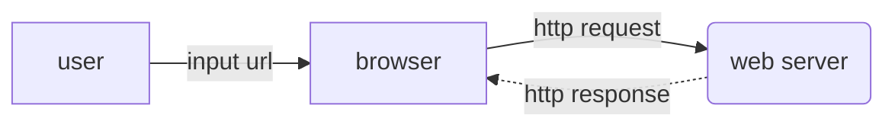
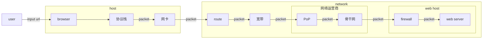
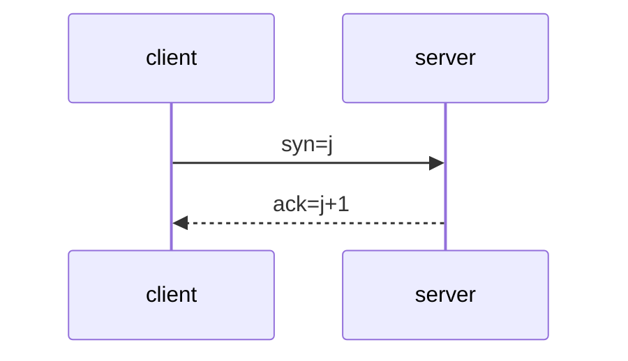

[TOC]

# 写在前面

> - **2021-12-6**
>
>   让玄学不再是玄学——当我们在计算机领域遇到难以理解的现象时，其实是我们基础知识不牢靠而已。

## 学习基础知识的意义

要成为`master`，这些知识是绕不过去的。

### 理解

当我们对所在的领域有一定的了解，才会知道用什么关键字去搜索，否则我们对我们面临的问题一无所知。这些知识是我们分析、定位、解决疑难杂症的最好帮手。

> 我们作为程序员，都遇到过由于不清楚所面临的问题，导致使用搜索引擎时效率低下的情况。

在阅读《网络是怎样连接的》这本书的前言时，有一个小时候经常遇到的问题——浏览器无法上网而QQ可以上网？这个问题也常常出现在某电脑管家上呢。其实这是因为QQ使用了IP地址来连接服务器，所以在DNS服务器失效时，QQ依然可以聊天。

### 优化

我是这样想的，只有了解了这些底层知识后，在优化代码以提升运行效率时，才能对症下药。其次在这些庞大繁杂的体系中，已经包含了很多老前辈们的优化，相当于一系列解决方案的最佳实践，我们学习之后举一反三，应用到自己的领域。

当我们清晰认识到我们的代码如何与网络作用，那种才是`master`对代码应该有的控制力。

# 网络是如何连接的

## 浏览器到`web server`

- 基本流程



对于大部分程序员来说，工作只要了解到上图就可以了。



但实际情况可能更复杂，如上图。

到达[^web host]后，`packet`仍需要从网卡到协议栈的逆向过程，上图做了省略。此外，还可能经过负载均衡器、缓存服务器等`node`。

> 上图只是初步的了解，可能存在错误。需要日后慢慢修正。

[^协议栈]:网络控制软件
[^broadband]: 宽带线路,  常见有ADSL和FTTH(光纤)
[^PoP]:Point of Presence, 接入点，实体是运营商的路由器
[^骨干网]:
[^web host]: 服务提供者的网络，可能是一台主机、也有可能是一个局域网。

# 工具

## 浏览器

浏览器是一个具备多种功能的综合性客户端软件。通过[^URL]中的协议头来判断使用哪种功能访问`server`。

[^URL]:Uniform Resource Locator，统一资源定位符。

## NETCAT

### 用途

- 端口测试
- 传输测试
- UDP会话测试
- 文件传输
- 网络吞吐量测试
- 系统后门

## 抓包

### wireshark

### fiddler

# OSI


## 应用层

### SSH

- **生成公钥/私钥**

  ``` shell
  ssh-keygen -t rsa -b 4096 -C "happyhoucheng@sina.com"
  ```

| 参数   | 释义                 |
| ------ | -------------------- |
| **-t** | 非对称加密算法名称   |
| **-c** | 用于识别该密钥的注释 |
| **-b** | 密钥长度             |

### Telnet

| 命令 | 作用 |
| ---- | ---- |
| quit | 退出 |

## 传输层

### TCP

- **参考**
- [TCP：三次握手、四次握手、backlog及其他](https://www.cnblogs.com/xrq730/p/6910719.html)

#### 三次握手



#### 四次挥手

#### FAQ

##### Connect reset

- [Connection reset原因分析和解决方案](https://my.oschina.net/xionghui/blog/508758)
- [Connection reset原因分析及解决思路](https://www.cnblogs.com/lilinwei340/p/13021864.html)

## 网络层

# URL

>  许多应用层的协议都会使用到`URL`

Uniform Resource Locator，统一资源定位符。

- **格式**

  以使用`HTTP`为例子：`http://域名:端口/URI`。

  比如我们要访问：http://www.baidu.com/index.html，则表明我们需要访问这台`www.baidu.com`这台服务器上的`index.html`这个文件。

当`URI`被省略时，比如我们访问http://www.baidu.com，通常服务器可以设置默认文件，例如`index.html`。

# IP

`Internet Protocol`是网络层协议。

## **IP地址**

IP地址的长度是32bit，我们常见IP地址用十进制表示，例如`172.18.21.79`。

## 子网掩码

用于区分IP地址中的网络号与主机号，它的长度也是32bit。

比如IP地址是`172.18.21.79`，子网掩码是`255.255.255.0`。

那么在IP地址中，`172.18.21`这部分就是网路号，`79`即主机号。

> 子网掩码可以划分在字节的中间位置。

就是说，子网掩码通过1和0来区分网络号与主机号，例如`255.255.255.0`转换为二进制：

`11111111 11111111 11111111 00000000`，其1所在的位置表示网路号，0所在的位置表示主机号。

- 主机号为0

  当IP地址中主机号全为0，表示整个子网。

- 主机号为1

  当IP地址中主机号全为1，表示广播，即向子网上所有设备发送包。

# DNS

`Domain Name System`，域名系统。

## 使用DNS的原因

我们首先假设没有`DNS`，可以有两种方案：

- 直接使用IP

  但是这个用户体验并不友好，人并不善于记忆一连串无逻辑的数字。

- 直接使用域名

  IP只需要4个字节，但域名可能要十几个字节，而且在漫长且众多的网络链路里流转，消耗是十分巨大的。

所以使用`DNS`来解决这个问题——在友好的用户体验与降低网络带宽的压力中抉择出的**最佳实践**。

> 原来`DNS`的设计也运用了上帝的规矩——局部性原理：`DNS`就像是一台缓存服务器一样记录了域名与IP的映射关系。
