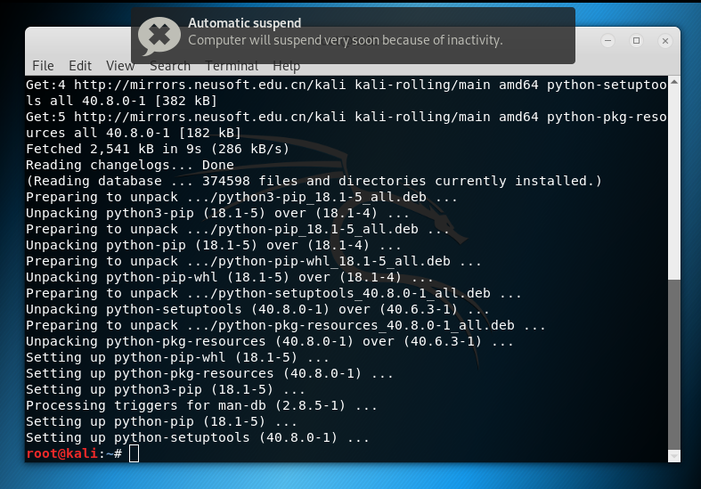

[TOC]

# 安装Kali Linux

- `GRUB` 多操作系统启动程序

- `MBR` 

  > 由硬盘启动时，BIOS通常是转向第一块硬盘的第一个[扇区](https://baike.baidu.com/item/%E6%89%87%E5%8C%BA)，即[主引导记录](https://baike.baidu.com/item/%E4%B8%BB%E5%BC%95%E5%AF%BC%E8%AE%B0%E5%BD%95)(MBR)。

- `Domain` (域)是Windows[网络操作系统](https://baike.baidu.com/item/%E7%BD%91%E7%BB%9C%E6%93%8D%E4%BD%9C%E7%B3%BB%E7%BB%9F)的应用模型

## 安装Python软件包管理工具

- easy_install
- pip

``` shell
apt-get install python-setuptools python-pip
```



### 使用pip

``` shell
# pip install github3.py
```

测试是否安装成功

``` python
import github3
exit()
```

## 参考

[最新超详细虚拟机VMware安装Kali Linux](https://blog.csdn.net/qq_40950957/article/details/80468030)

https://www.kali.org/downloads/

# python网络编程基础

- 参考

  [python的socket编程之udp编程](https://www.cnblogs.com/kellyseeme/p/5525025.html)

  [WinError 10054 with socket module upon exit](https://stackoverflow.com/questions/48070917/winerror-10054-with-socket-module-upon-exit)
  
  [Ask Question](https://stackoverflow.com/questions/ask)

## 基础

> 我们可以在更熟悉的`windows`环境下，编写python代码；之后在放在`kail`环境下测试我们的代码运行结果。

### 创建socket对象

``` python
import socket

client = socket.socket(socket.AF_INET, socket.SOCK_STREAM)
```

- **FAMILY**
  - **AF_INET:**	使用标准`IPV4`地址或主机名
- **TYPE**
  - **SOCK_STREAM:**	表明为`TCP`连接
  - **SOCK_STREAM:**	表明为`UDP`连接

### TCP Client

``` python
import socket
target_host = "www.baidu.com"
target_port = 80

# build a socket object
'''
- AF_INET 标准IPv4地址或主机名
- SOCK_STREAM TCP客户端
'''
client = socket.socket(socket.AF_INET, socket.SOCK_STREAM)

# connect to tcp client
client.connect((target_host, target_port))

# send 2kb message
# 2.7
# client.send("GET / HTTP/1.1\r\nHost: baidu.com\r\n\r\n")
# 3.6
client.send("GET / HTTP/1.1\r\nHost: baidu.com\r\n\r\n".encode())

# accept message
response = client.recv(4096)
# 2.7
# print response
# 3.6
print(response)
```

该代码若作为应用程序，很明显存在以下问题：

- 假设连接总能成功，不会出错或抛出异常
- 服务器总期望客户端发送数据
- 服务器每次能及时响应及返回数据

但渗透测试人员很少对自己编写用于侦察或攻击的工具添加以上细节

- STREAM总代表`TCP`，意味着流
- DGRAM总代表`UDP`，意味着包

### UDP Client

``` python
import socket

target_host = "127.0.0.1"
target_port = 80

# build a socket object
client = socket.socket(socket.AF_INET, socket.SOCK_DGRAM)
# client.bind((target_host, target_port))
client.sendto("helloworld".encode(), (target_host, target_port))
# accept message
data, addr = client.recvfrom(4096)

print(data)
client.close()
```

运行结果如下：

``` txt
b'helloworld'
```

> 这段代码成功几率较小，也是UDP不可靠的体现
>
> 若使用`localhost`，错误往往是
>
> ``` python
> [WinError 10054] 远程主机强迫关闭了一个现有的连接。
> ```
>
> 而使用`127.0.0.1`，错误往往是超时，这可能是因为本人通过手机USB接口共享网络导致。

#### Windows下UDP错误10054

- 参考

  https://blog.csdn.net/weixin_30649641/article/details/97757811

  https://www.cnblogs.com/cnpirate/p/4059137.html

网上有人说明这是`win socket`的一个bug。我曾在安装的`Kail`上成功过，在`windows`上总是返回这个错误。

### TCP Server

``` python
import socket
import threading

bind_ip = "localhost"
bind_port = 9090

server = socket.socket(socket.AF_INET, socket.SOCK_STREAM)
server.bind((bind_ip, bind_port))
# 最大连接数设置为5 即监听5个连接
server.listen(5)

print("[*] Listening on %s:%d" % (bind_ip, bind_port))

# 客户处理线程
def handle_client(client_socket):
    request = client_socket.recv(1024)
    print("[*] Received %s " % request)
    client_socket.send("ACK".encode())
    client_socket.close()
    
while True:
    client,addr = server.accept()
    print("[*] accepted connection from %s:%d" % (addr[0], addr[1]))
    
    # 挂起客户端线程，处理传入数据
    # 类似 java 代码 
    # new Thread(new Runnable(){...});
    client_handler = threading.Thread(target=handle_client, args=(client,))
    client_handler.start()

```

> `ACK`在TCP连接中表示确认字符

## 自己实现`NETCAT`

- 参考

  https://zhuanlan.zhihu.com/p/83959309

### `NETCAT`

网络中的`瑞士军刀`。在大多数`LINUX`发行版本中默认安装。

于1995年“霍比特人”在`UNIX`上以代码形式发布。

> `netcat`是网络界的瑞士军刀，所以聪明的系统管理员都会将它从系统中移除。

而在我短暂的程序员职业生涯中，接触到的大部分服务器，都没有安装这款软件。

#### 用途

- 端口测试
- 传输测试
- UDP会话测试
- 文件传输
- 网络吞吐量测试
- 系统后门

### `cracker`的目的

由于大部分机器将移除`netcat`，但不会移除`python`。

