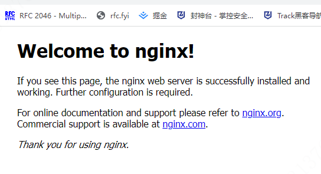

[toc]

# 安装

- **windows**	[nginx:download](http://nginx.org/en/download.html)
- **linux**	[nginx:Linux packages](http://nginx.org/en/linux_packages.html#instructions)
- **仓库**	https://nginx.org/download/

>  除从`nginx`的官网获取程序外，猜想还能从华为、阿里云等仓库获取。

- **参考**
- [linux安装nginx 步骤](https://blog.csdn.net/qq_14926283/article/details/109838952)

# 启动

执行`nginx.exe`即可。启动成功如下图：

> `nginx`启动成功后没有任何提示，可能这就是俄罗斯工程师的浪漫。

# upstream

ngx_http_upstream_module属于http模块，用于定义一组服务器。

# FAQ

## Nginx 错误10013: An attempt was made to access a socket in a way forbidden

- [Nginx 错误10013: An attempt was made to access a socket in a way forbidden](https://blog.csdn.net/qq_40646143/article/details/79593958)

  莫怀疑，就是端口被占用。

