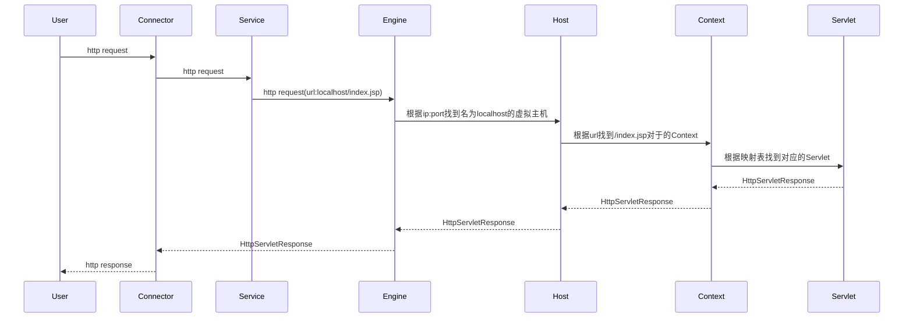
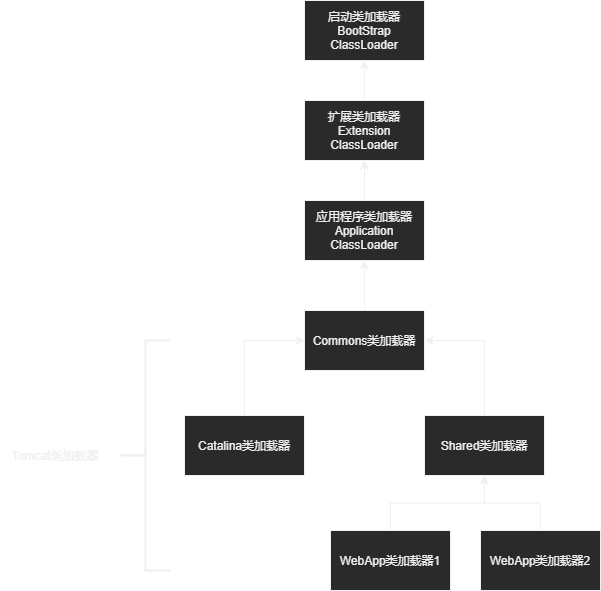

[TOC]

# 部署方式

- 隐式部署
- 显式部署
  - 添加context
  - 创建xml

# 目录结构

## bin

- catalina脚本

- Version

  查看当前tomcat版本号；

- Configtest

  检查Tomcat配置文件server.xml格式、内容是否合法；

## conf

- web.xml

  Tomcat中所有应用默认部署描述文件，定义了基础的Servlet和MIME映射。若应用中不包含web.xml，那么Tomcat将使用此文件初始化部署。

- server.xml

  该文件中，每个Server代表了一个Tomcat实例，包含一个或多个Services，其中每个Service都有自己的Engines和Connectors。

- context.xml

  自定义所有Web应用均需要加载的Context配置，优先使用应用自身的context.xml。

> context.xml与server.xml中配置的context的区别：
>
> server.xml是不可动态重加载的资源，而Tomcat会定时扫描context.xml，一旦发现文件被修改，则重新加载。

- catalina.policy

  相关权限

- tomcat-users.xml

- logging.properties

  设置日志

## webapps

存放 web 项目的目录，其中每个文件夹都是一个项目；如果这个目录下已经存在了目录，那么都是 tomcat 自带的项目。

其中 ROOT 是一个特殊的 项目，在地址栏中没有给出项目目录时，对应的就是 ROOT 项目。http://localhost:8080/examples ，进入示例项目。其中 examples 就是项目名，即文件夹 的名字。

## lib

Tomcat类库，所有的项目都可以共享。

## work

运行时生成的文件，例如:访问JSP时生成的Java文件与class文件。

## logs

- localhost-*.log	Web应用内部的程序日志；
- catalina-*.log	控制台日志；
- host-manager.*.log	Tomcat管理页面host-manager的操作日志，建议关闭；
- localhost_access_log_*.log	用户请求Tomcat的访问日志；

## temp

Tomcat的临时目录。

# 组件

## Server

- 提供监听器机制，代表了Tomcat的运行实例。
- 提供Tomcat容器全局的命名资源实现，JNDI。
- 监听某个端口以接受SHUTDOWN命令，用于关闭Tomcat。

## Service

一个Service维护多个Connector和一个Container。

## Connector组件

链接器，监听转换Socket请求，请求交给Container处理，支持不同协议以及不同的I/O方式。

## Container

表示能够执行客户端请求并返回响应的一类对象，其中有不同级别的容器：Engine、Host、Context、Wrapper。

## Engine

整个Servlet引擎，最高级的容器对象。

## Host

Servlet引擎中的虚拟机，主要与域名有关，一个服务器有多个域名是可以使用多个Host。

> Tomcat诞生时，服务器资源是昂贵的，所以当时一台服务器可以又多个域名映射。

## Context

用于表示ServletContext，一个ServletContext表示一个独立的Web应用。

## Wrapper

用于表示Web应用中定义的Servlet。

## Executor

Tomcat组件间可以共享的线程池。

# 生命周期管理

Tomcat的架构采用了一种树结构，每个节点包含多个子节点，而每个节点又继承了Tomcat的生命周期统一接口——Lifecycle。通过Lifecycle接口完成对Tomcat中所有组件生命周期的管理(启动、停止、关闭)。

# 请求过程



# 责任链模式

Tomcat使用了责任链模式。责任链模式带来了更好的拓展性，，例如添加一个额外的逻辑处理，我们可以增加一个阀门：

``` java
public class PrintIPValve extends ValveBase{
    @Override
    public void invoke(Request request, Response response)throws IOException{
        System.out.println(requset.getRemoteAddr());
        getNext().invoke(request,response); //传递给下一个阀门
    }
}
```

然后在Tomcat的server.xml上将阀门注册到对应Engine容器上。

``` xml
<Valve className="org.apache.catalina.valves.PrintIPValve"/>
```

最后将这个阀门类放在Tomcat的lib目录下。

# Tomcat的类加载过程

Tomcat中类加载考虑因素：

- 隔离性

  同一个Tomcat下不同应用，对于不同版本的依赖互补影响。

- 灵活性

  一个Web应用重新加载类时，不影响其他的应用。

- 性能

  由于每个Web应用都有一个类加载器，所以Web应用加载类时，不会搜索其他的应用的依赖，性能优于只有一个类加载器的情况。

## 基础类加载器

Tomcat提供了三个基础类加载器:

- Commons

  实现类Jar在应用服务器与Web应用之间的共享。

- Catalina

  加载服务器依赖的类

- Shared

  实现Jar在Web应用之间的共享

以及Web应用类加载器。

在Tomcat中，三个基础类加载器的加载路径在catalina.properties配置，默认情况下，三个基础类加载器的实例都是一个。

- **Tomcat的类加载器结构**

​	

# server.xml

## 解压war unpackWARs

``` xml
<Host name="localhost"  appBase="webapps" unpackWARs="true" autoDeploy="true">
```

# 异常

## Invalid character

> Invalid character found in the request target. The valid characters are defined in RFC 7230 and RFC 3986.

`Tomcat`在7.0.73版本以后，添加了对`http head`的验证。

当前端申请的`url`包含一些字符时将出错，比如：`{`、`}`、`<`、`>`等待。

但我们依然有解决方案：

修改`tomcat`的`catalina.properties`文件

找到这一行：

``` properties
tomcat.util.http.parser.HttpParser.requestTargetAllow=|{}?&
```

> spring-boot 2.0.0内置tomcat版本在8.0以上