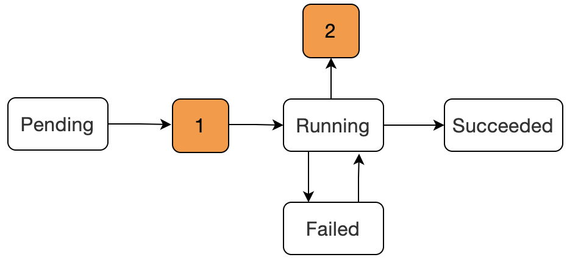
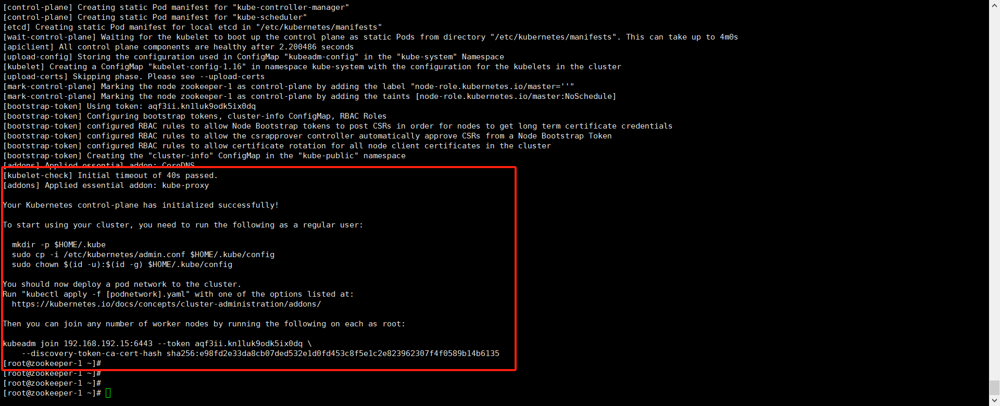

[toc]

- [官网](https://kubernetes.io/zh-cn/docs)


# 目的

kubernets支持在分布式环境下管理容器(Docker)。

> Docker公司的同款产品时swarm，但在功能上不如kubernets。

# 概念

## Namespace

将一个物理Cluster在逻辑上划分成多个虚拟的Cluster，每个Cluster就是一个Namespace。

不同的Namespace里的资源是完全隔离的。

## Master Node

负责管理和控制。

## Worker Node

运行容器应用，Worker由Master管理，负责监控并汇报容器的状态，同时根据Master的要求管理容器的生命周期。

## Pod

Pod是Kubernets的最小工作单元。

每个Pod包含一个或多个容器。Pod中的容器会被作为一个整体被Master调度到一个Node上运行。

- **状态**

  

  | status                     | means                                                        |
  | -------------------------- | ------------------------------------------------------------ |
  | Pending                    | 该阶段表示已经被 Kubernetes 所接受，但是容器还没有被创建，正在被 kube 进行资源调度。 |
  | 1                          | 图中数字 1 是表示在被 kube 资源调度成功后，开始进行容器的创建，但是在这个阶段是会出现容器创建失败的现象 |
  | Waiting或ContainerCreating | 这两个原因就在于容器创建过程中**镜像拉取失败**，或者**网络错误**容器的状态就会发生转变。 |
  | Running                    | 该阶段表示容器已经正常运行。                                 |
  | Failed                     | Pod 中的容器是以非 0 状态（非正常）状态退出的。              |
  | 2                          | 阶段 2 可能出现的状态为`CrashLoopBackOff`，表示容器正常启动但是存在异常退出。 |
  | Succeeded                  | Pod 容器成功终止，并且不会再在重启。                         |

## Controller

管理Pod的工具。

Deployment是最常用的Controller。

## Service

定义外界访问一组特定Pod的方式。

Service拥有自己的IP和端口，并把该IP与后端的Pod运行的服务关联起来。

Service为Pod提供了负载均衡。

# 架构


## kube-apiserver

Kubernetes Cluster的前端接口。

其他客户端工具以及K8S的其他组件可以通过它管理Cluster资源。

## kube-scheduler

调度器，负责决定将Pod放在哪个Node上运行。

## Controller-Manager

监控每个Controller的健康状态，并确保控制器是健康的，而控制器是确保Pod健康的组件。

## etcd

保存K8S Cluster的配置信息和各种资源的状态信息。

## Pod网络

Pod能通信，K8S Cluster必须部署网络。（Flannel是其中一个方案）

## kubelet

是Node的Agent。

当Scheduler却在某个Node上运行Pod后，会将Pod的具体配置信息（image、volume）发送给该节点的kubelet，kubelet根据这些信息创建和运行容器，并向Master报告运行状态。

## kube-proxy

service在逻辑上代表了后端的多个Pod，外部通过service访问Pod。

而kube-proxy负责将service接收到的请求转发到Pod。

> 每个Node都运行kube-proxy。

# 集群搭建

## 安装flannel网络插件

- [network plugin is not ready & cni config uninitialized](https://github.com/kubernetes/kubernetes/issues/103324)

- [failed to find plugin “flannel” in path [/opt/cni/bin]](https://blog.csdn.net/qq_29385297/article/details/127682552)
- [解决k8s安装flannel无法拉取镜像(ImagePullBackOff)](https://blog.csdn.net/sinat_23225111/article/details/125111063)

通过`journalctl -u kubelet -f`查看kubelet的日志。

发现一直在报错`failed to find plugin "flannel" in path [/opt/cni/bin]`。

## 安装

- **关闭selinux**

  Linux安全相关。

    ``` shell
    # 查看
    getenforce 
    # 临时关闭
    setenforce 0
    # 永久关闭
    vi /etc/sysconfig/selinux

    SELINUX=disabled
    ```

- **关闭swap**

    ``` shell
    # 临时
    swapoff -a
    # 永久
    sed -i.bak '/swap/s/^/#/' /etc/fstab
    ```

- **允许ip_forward**

    ``` shell
    # 0 表示禁止
    echo "1" > /proc/sys/net/ipv4/ip_forward
    ```

- **配置centos7、docker源**

    ``` shell
    cd /etc/yum.repos.d/
    rm -rf *
    
    # 下载centos7源和docker源
    wget -O /etc/yum.repos.d/CentOS-Base.repo http://mirrors.aliyun.com/repo/Centos-7.repo
    wget -P /etc/yum.repos.d/ http://mirrors.aliyun.com/repo/epel-7.repo
    wget https://mirrors.aliyun.com/docker-ce/linux/centos/docker-ce.repo
    
    yum clean all && yum makecache fast
    ```

- **配置k8s源**

    ``` shell
    cat <<EOF > /etc/yum.repos.d/kubernetes.repo
    [kubernetes]
    name=Kubernetes
    baseurl=https://mirrors.aliyun.com/kubernetes/yum/repos/kubernetes-el7-x86_64
    enabled=1
    gpgcheck=0
    EOF
    ```

- **安装docker**

    ``` shell
    yum install docker-ce-18.09.9 docker-ce-cli-18.09.9 containerd.io -y
    ```

- **配置docker的`--cgroup-driver=systemd`**

    ``` shell
    tee /etc/docker/daemon.json <<EOF
    {
        "registry-mirrors":["https://v16stybc.mirror.aliyuncs.com"]
        , "exec-opts":["native.cgroupdriver=systemd"]
    }
    EOF
    cat /etc/docker/daemon.json
    
    
    vi /etc/docker/daemon.json
    
    {
        "registry-mirrors":["https://v16stybc.mirror.aliyuncs.com"]
        , "exec-opts":["native.cgroupdriver=systemd"]
    }
    
    ## 执行完这一步之后需要重启docker与kubenet令配置生效
    systemctl daemon-reload
    systemctl restart docker
    systemctl restart kubelet
    ```

    [^cgroup driver]:control group driver是Linux系统内核提供的特性，主要用于限制和隔离一组进程对系统资源的使用。

- **启动docker并配置开机启动**

    ``` shell
    systemctl enable docker && systemctl start docker
    ```

- **安装k8s**

    ``` shell
    yum install -y kubelet-1.16.4 kubeadm-1.16.4 kubectl-1.16.4
    # 卸载
    # yum remove -y kubelet-1.16.4 kubeadm-1.16.4 kubectl-1.16.4
    ```

- **设置开机启动**

    ``` shell
    systemctl enable kubelet && systemctl start kubelet
    ```

- **配置kubectl上下文到环境中**

    ``` shell 
    echo "source <(kubectl completion bash)" >> ~/.bash_profile
    cd ~
    source .bash_profile
    ```

- **内核参数修改**

  k8s网络一般使用flannel，该网络需要设置内核参数bridge-nf-call-iptables=1

    ``` shell
    vi /etc/sysctl.d/k8s.conf
    net.bridge.bridge-nf-call-ip6tables = 1
    net.bridge.bridge-nf-call-iptables = 1
    ```
  执行`sysctl -p /etc/sysctl.d/k8s.conf`

  ``` shell
  sysctl -p /etc/sysctl.d/k8s.conf
  net.bridge.bridge-nf-call-ip6tables = 1
  net.bridge.bridge-nf-call-iptables = 1
  ```


## Master节点配置

- 参考

  [使用 Kubeadm 部署](http://icyfenix.cn/appendix/deployment-env-setup/setup-kubernetes/setup-kubeadm.html)

  [如何解决kubeadm init初始化时dial tcp 127.0.0.1:10248: connect: connection refused](https://www.myfreax.com/how-to-solve-dial-tcp-127-0-0-1-10248-connect-connection-refused-during-kubeadm-init-initialization/)

### 初始化

初始化`kubernet`的`control-pane`。

在执行这一步时总是报错，通过`journalctl -xeu kubelet`发现：存在大量的拒绝连接错误。

搜索一番后，了解到这是因为cgroup驱动问题造成的。kubernet的驱动是systemd，而docker的驱动则是cgroupfs。根据官方建议，使用systemd更加稳定，因此将docker的配置修改为cgroupfs。

重启docker和kubernet生效。

``` shell
# sudo kubeadm reset
# sudo kubeadm init
# 这一步非常耗时, 需要拉去镜像
sudo kubeadm init --image-repository registry.aliyuncs.com/google_containers --kubernetes-version v1.16.4 --pod-network-cidr=10.244.0.0/16

# 在执行完成后, 根据master的提示执行
mkdir -p $HOME/.kube
sudo cp -i /etc/kubernetes/admin.conf $HOME/.kube/config
sudo chown $(id -u):$(id -g) $HOME/.kube/config
```

执行结果如下:



### 添加flannel网络

配置pod network

``` shell
# 执行成功后，会出现/etc/cni/net.d/
kubectl apply -f https://raw.githubusercontent.com/coreos/flannel/2140ac876ef134e0ed5af15c65e414cf26827915/Documentation/kube-flannel.yml
```

### 生成token

``` shell
# 查询token list
kubeadm token list

# 生成join command
kubeadm token create --print-join-command
```

## Work节点配置

- **设置机器名**

  ``` shell 
  hostnamectl set-hostname work1
  ```

- **配置ip**

  ``` shell
  vi /etc/hosts
  
  192.168.192.11 work1
  ```

- **加入集群**

  ``` shell
  kubeadm join 192.168.192.10:6443 --token znygl1.rdkprye9ibg5l27y \
      --discovery-token-ca-cert-hash sha256:ae4b04bbe7aee468b410e5f20cbbbd02b80d9761dd915ecf17f88f42fa57debb 
  ```

## 查看集群

``` shell
kubectl get nodes
```

这一步报错TLS握手异常，问题出现在kubenet的api-sever服务，看了日志之后也确实如此。尽管如此，还是按照网上的说法重新设置了一下虚拟机的内存大小，从1g设置为3g。

重启虚拟机后，问题解决。

> 20240123
>
> 这让我的学习体验十分不好，因为从握手异常真的很难联想到内存不足。
>
> 只能说Google开源的产品是具有其独特文化和环境的，国内这种伸手即来、开箱即用的风气真的是不太好。甚至国内各行各业的IT公司将其作为招聘的硬性条件，变相要求所有从业者去学习kubernet，进而导致国内唯一的解决方案就是k8s，实在是一种缺乏创新精神的表现。

# Pod

Pod是Kubernet的最小工作单元，包含一个或者多个容器。

``` shell
# 创建pod
# replicas 副本
kubectl run nginx-dep --image=nginx:1.7.9 --port=80 --replicas=2 --dry-run
kubectl run nginx-dep --image=nginx:1.7.9 --port=80 --replicas=2

# 
kubectl get deployment

# 查看服务信息
kubectl get pods -o wide

# 查看服务详情
kubectl describe pod nginx-dep-5779c9d6c9-jw5gc
```

- 默认情况下，**Master Node不允许创建Pod**

  否则将出错：`(k8s) 1 node(s) had taints that the pod didn't tolerate`。

  在默认情况下，Master Node不参与工作负载，出于安全方面的考虑。

# Kubernet的使用

## kubectl run

``` shell
# 创建一个应用程序
kubectl run nginx-dep --image=nginx:1.7.9 --port=80 --replicas=2
# 查看服务信息
kubectl get pods -o wide
# 查看pod详情
kubectl describe pod nginx-dep-5779c9d6c9-745b2

# 进入容器查看
kubectl exec -it nginx-dep-5779c9d6c9-745b2 -c nginx-dep /bin/bash
# 退出容器
exit
```

## 暴露服务到外网

``` shell
# 删除pod(模拟pod出现故障)
kubeclt delete nginx-dep-5779c9d6c9-745b2

# 创建service
kubectl expose deployment nginx-dep --name=nginx-service --port=8080 --target-port=80

# 查看service
kubeclt get svc
# 查看service的label配置
kubectl describe svc nginx-service

# 设置windows访问
# 通过以下命令编辑，并将ClusterIP类型修改为NodePort
kubectl edit svc nginx-service

# 查看service绑定端口
kubectl get svc
```

## 服务伸缩

``` shell 
kubectl scale --replicas=4 deployment nginx-dep
```

## 在线升级与回滚

``` shell 
# update
kubectl set image deployment nginx-dep nginx-dep=nginx:1.9.1
# roll back
kubectl rollout undo deployment nginx-dep
```

