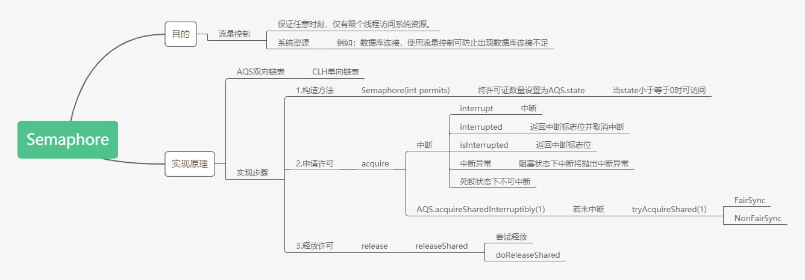

[TOC]

# Fork-Join 分而治之

## 适用场景

- 单任务较耗时
- 任务量比较大

## 原理

 - Fork

   首先将一个大问题分割成一系列无关联**[互相独立]**且与原问题形式相同的小问题，然后[递归地|并行地]解决这些子问题。

- Join
   最后将所有子问题的解合并得到原问题的解。

### 工作密取

现代计算机线程数往往是CPU的1~2倍。

当多条线程并行地执行任务时，可能部分线程先完成自己的Task Queue。这时率先执行完Task Queue的线程就会帮助它的小伙伴，从小伙伴的"书包"**最底下**拿出一本作业，做完这项作业后又塞回“书包”**最底下**。

***通过`工作密取`的方式减少线程阻塞或闲置的时间，提高CPU利用率。***


- 即便通过Fork-Join思想将任务划分成大小相同的小问题，但线程完成速度依然可能存在差异

比如`1+2+3+......+999999`

我们可以将其拆分成`1+2`，`3+4`......，`999998+999999`，很明显我们在计算`1+2`的速度远远快于`999998+999999`，计算机也存在这样的情况。所以采用`工作密取`的方式解决实际问题是有必要的。

## 应用场景

   - 大数据 `MapReduce`
   - 快速排序
   - 归并排序
   - 二分查找

> 十大计算机经典算法：
>
> ​	快速排序、堆排序、归并排序、二分查找、线性查找、深度优先、广度优先、Dijkstra、动态规划、朴素贝叶斯分类

## 使用

> - 20190702 
>
>   也许Fork-Join的本质是`多线程递归`。

- 任务池 

  `public class ForkJoinPool extends AbstractExecutorService`。

  `Task`需要通过ForkJoinPool执行，使用submit或invoke提交。 

  - invoke 同步执行

  - submit/execute 异步执行

    此处的同步与异步控制的是`任务线程`与`启动线程`之间的次序
    
    > `pool.execute()`与`pool.submit()`的差异在于有无返回值

- 任务

  `public abstract class ForkJoinTask<V>`

  - 有返回值的任务 

    ReursiveTask

  - 无返回值的任务 

    ```java
    public abstract class RecursiveAction extends ForkJoinTask<Void>
    ```
  使用`ForkJoinTask`时得到任务完成结果，我们将调用join()或者get()方法。

  - join 将阻塞当前线程

    > `task.get()`方法效果相似，但需要程序员手动捕捉阻塞异常

  - invokeAll

  每个`Task`在调用`invokeAll`方法时又会进入compute方法，查看当前任务是否可继续分割。

  ``` java
  // 两个任务
  public static void invokeAll(ForkJoinTask<?> t1, ForkJoinTask<?> t2)
  // 可变参数
  public static void invokeAll(ForkJoinTask<?>... tasks)
  // 集合
  public static <T extends ForkJoinTask<?>> Collection<T> invokeAll(Collection<T> tasks) 
  public <T> List<Future<T>> invokeAll(Collection<? extends Callable<T>> tasks)
  ```


### 异步RecursiveAction

- 遍历指定目录（含子目录）查找指定类型文件

``` java

import java.io.File;
import java.util.ArrayList;
import java.util.List;
import java.util.concurrent.ForkJoinPool;
import java.util.concurrent.RecursiveAction;

/**
 * 无返回值的分治编程
 * 遍历指定目录（含子目录）查找指定类型文件
 */
public class FindDirsFiles extends RecursiveAction {

    private String fileType;
    private File path;

    public FindDirsFiles(File path, String fileType) {
        this.path = path;
        this.fileType = fileType;
    }

    /**
     * 执行任务
     */
    @Override
    protected void compute() {
        List<FindDirsFiles> subTasks = new ArrayList<>();

        File[] files = path.listFiles();
        if (files != null) {
            for (File file : files) {
                if (file.isDirectory()) {
                    // 对每个子目录都新建一个子任务
                    subTasks.add(new FindDirsFiles(file, fileType));
                } else {
                    // 遇到文件 检查
                    if (file.getAbsolutePath().endsWith(fileType)) {
                        System.out.println("文件:" + file.getAbsolutePath());
                    }
                }
                if (!subTasks.isEmpty()) {
                    // 在当前的 ForkJoinPool 上调度所有的子任务。
                    for (FindDirsFiles subTask : invokeAll(subTasks)) {
                        subTask.join();
                    }
                }
            }
        };
    }

    public static void main(String [] args){
        long timeVar = System.currentTimeMillis();
        // 用一个 ForkJoinPool 实例调度总任务
        ForkJoinPool pool = new ForkJoinPool();
        FindDirsFiles task = new FindDirsFiles(new File("C:\\"), "md");

        /**
         * 异步提交
         * 与主线程中工作并行执行
         */
         pool.execute(task);

        /*主线程做自己的业务工作*/
        System.out.println("Task is Running......");
        try {
            Thread.sleep(1);
        } catch (InterruptedException e) {
            e.printStackTrace();
        }
        int otherWork = 0;

        for(int i=0;i<100;i++){
            otherWork = otherWork+i;
        }
        System.out.println("Main Thread done sth......,otherWork="
                +otherWork);
        
        task.join();//阻塞方法 Fork-Join任务完成后才执行之后代码 sout("Task end")
        System.out.println("Task end");
        System.out.println("任务耗时:" + (System.currentTimeMillis() - timeVar) + "ms");
    }
}
```

尝试注释代码`task.join();`后发现遍历任务未完成，主线程结束时推出程序。可推出

- ForkJoinPool中线程为守护线程

### 同步RecursiveTask

- 产生随机数

``` java
import java.util.Random;

/**
 * 生成随机数队列数组
 */
public class MakeArray {
    // 数组长度
    public static final int ARRAY_LENGTH = 100;
    public static final int THRESHOLD = 47;

    public static int[] makeArray() {
        Random random = new Random(); // 随机数产生器
        int[] result = new int[ARRAY_LENGTH];
        for (int i = 0; i < ARRAY_LENGTH ; i++) {
            result[i] = random.nextInt(ARRAY_LENGTH * 3);
        }
        return result;
    }
}
```
- Fork-Join实现累加
``` java
import java.util.concurrent.RecursiveTask;
import java.util.concurrent.TimeUnit;

public class SumTask extends RecursiveTask<Integer> {
    /**
     * 阈值 即每份任务量的大小
     */
    private final static int THRESHOLD = MakeArray.ARRAY_LENGTH/10;
    private int[] src;
    private int fromIndex;
    private int toIndex;

    public SumTask(int[] src, int fromIndex, int toIndex) {
        this.src = src;
        this.fromIndex = fromIndex;
        this.toIndex = toIndex;
    }

    @Override
    protected Integer compute() {
        /**
         * 任务的大小是否合适
         */
        if (toIndex - fromIndex < THRESHOLD) {
            System.out.println(" from index = " + fromIndex + " toIndex =" + toIndex);
            int count = 0;
            for (int i = fromIndex; i <= toIndex ; i++) {
                /**
                 * 假设每次操作耗时较大时
                 */
                try {
                    TimeUnit.MILLISECONDS.sleep(1);
                } catch (InterruptedException e) {
                    e.printStackTrace();
                }
                count += src[i];
            }
            return count;
        } else {
            int mid = (fromIndex + toIndex)/2;
            SumTask left = new SumTask(src, fromIndex, mid);// 二分
            SumTask right = new SumTask(src, mid + 1, toIndex);
            invokeAll(left, right);
            // 阻塞方法
            return left.join() + right.join();
        }
    }
}
```

- 单线程与Fork-Join对比

``` java
import org.junit.Test;

import java.util.concurrent.ForkJoinPool;
import java.util.concurrent.TimeUnit;

public class SumTest {
    /**
     * 单线程累加
     */
    @Test
    public void singleSum () {
        int count = 0;
        int[] src = MakeArray.makeArray();

        long start = System.currentTimeMillis();
        for (int i : src) {
            try {
                TimeUnit.MILLISECONDS.sleep(1);
            } catch (InterruptedException e) {
                e.printStackTrace();
            }
            count += i;
        }
        System.out.println("The count is " + count);
        System.out.println("spend time:" + (System.currentTimeMillis()-start) + "ms");
    }

    @Test
    public void forkJoinSum () {
        ForkJoinPool pool = new ForkJoinPool();
        int[] src = MakeArray.makeArray();
        SumTask innerFind = new SumTask(src, 0, src.length - 1);

        long start = System.currentTimeMillis();

        // 同步
        pool.invoke(innerFind);
        System.out.println("The count is " + innerFind.join());
        System.out.println("spend time:" + (System.currentTimeMillis() - start) + "ms");
    }
}
```

# CountDownLatch

> 曾使用`CountDownLatch`实现在并发场景下的计时器——开启一个线程A后调用`await`进入阻塞，再通过其他线程调用`countDown()`，线程A唤醒后完成计时。

- countdown 倒数
- latch 门闩；碰锁

`CountDownLatch`能够使一个线程等待其他线程完成各自的工作后再执行。

`CountDownLatch`通过一个计数器实现，计数器的初始值为出师任务的数量。每完成一个任务后，调用`countDown()`方法，计数器的值就会减一。当计数器的值为零时，在闭锁上等待`await()`方法的线程就可以恢复执行任务。

> `countDown()`可在同一线程扣减一次或多次。

## 应用场景

例如，应用程序的主线程希望在负责启动框架服务的线程已经启动所有的框架服务之后再执行。

## 代码

``` java
import java.util.concurrent.CountDownLatch;
import java.util.concurrent.TimeUnit;

/**
 *类说明：演示CountDownLatch用法，
 * 共5个初始化子线程，6个闭锁扣除点，扣除完毕后，主线程和业务线程才能继续执行
 */
public class UseCountDownLatch {

    static CountDownLatch latch = new CountDownLatch(6);

    /*初始化线程*/
    private static class InitThread implements Runnable{

        public void run() {
            System.out.println("Thread_"+Thread.currentThread().getId()
                    +" ready init work......");
            latch.countDown();
            for(int i =0;i<2;i++) {
                System.out.println("Thread_"+Thread.currentThread().getId()
                        +" ........continue do its work");
            }
        }
    }

    /*业务线程等待latch的计数器为0完成*/
    private static class BusiThread implements Runnable{

        public void run() {
            try {
                latch.await();
            } catch (InterruptedException e) {
                e.printStackTrace();
            }
            for(int i =0;i<3;i++) {
                System.out.println("BusiThread_"+Thread.currentThread().getId()
                        +" do business-----");
            }
        }
    }

    public static void main(String[] args) throws InterruptedException {
        new Thread(new Runnable() {
            public void run() {
                try {
                    TimeUnit.MILLISECONDS.sleep(1);
                } catch (InterruptedException e) {
                    e.printStackTrace();
                }
                System.out.println("Thread_"+Thread.currentThread().getId()
                        +" ready init work step 1st......");
                latch.countDown();
                System.out.println("begin step 2nd.......");
                try {
                    TimeUnit.MILLISECONDS.sleep(1);
                } catch (InterruptedException e) {
                    e.printStackTrace();
                }
                System.out.println("Thread_"+Thread.currentThread().getId()
                        +" ready init work step 2nd......");
                latch.countDown();
            }
        }).start();
        new Thread(new BusiThread()).start();
        for(int i=0;i<=3;i++){
            Thread thread = new Thread(new InitThread());
            thread.start();
        }

        latch.await();
        System.out.println("Main do ites work........");
    }
}
```

# CyclicBarrier

- Cyclic 反复利用的

- Barrier 屏障

一组线程到达一个屏障（也可以叫同步点）时被阻塞，直到最后一个线程到达屏障时，屏障才会开门，所有被屏障拦截的线程才会继续运行。

每个线程调用await()告诉CyclicBarrier我已经到达了屏障，然后当前线程被阻塞。

> CyclicBarrier可反复利用，调用完#{parties}次后可重复使用。	

## 构造方法

CyclicBarrier（int parties），其参数表示屏障拦截的线程数量；

CyclicBarrier（int parties，Runnable barrierAction），用于在所有线程到达屏障时，优先执行`barrierAction`，方便处理更复杂的业务场景。

> `barrierAction`可用于汇总操作

## 成员方法

- reset

  可调用`reset`方法回到初始化状态。

## 代码

``` java
/**
 *类说明：演示CyclicBarrier用法,共5个子线程，他们全部完成工作后，交出自己结果，
 *再被统一释放去做自己的事情，而交出的结果被另外的线程拿来拼接字符串
 *
 * 由于PARITES == 4 而启动5个线程故可能出现一次多余的dosomething
 *
 * 注意：由于CyclicBarrier可反复使用，所以调用完4次await后可重复使用
 */
public class UseCyclicBarrier {

    private static int PARITES = 4;
    private static CyclicBarrier barrier = new CyclicBarrier(PARITES, new CollectThread());
    private static ConcurrentHashMap<String,Long> resultMap
            = new ConcurrentHashMap<>();//存放子线程工作结果的容器

    public static void main(String[] args) {
        for(int i=0;i<=PARITES;i++){
            Thread thread = new Thread(new SubThread());
            thread.start();
        }
    }

    /**
     * 汇总工作线程
     */
    private static class CollectThread implements Runnable{

        @Override
        public void run() {
            StringBuilder result = new StringBuilder();
            for(Map.Entry<String,Long> workResult:resultMap.entrySet()){
                result.append("["+workResult.getValue()+"]");
            }
            System.out.println(" the result = "+ result);
            System.out.println("do other business........");
        }
    }

    /**
     * 子任务线程
     */
    private static class SubThread implements Runnable{

        @Override
        public void run() {
            long id = Thread.currentThread().getId();
            resultMap.put(Thread.currentThread().getId()+"",id);
            try {
                Thread.sleep(1000+id);
                System.out.println("Thread_"+id+" ....do something ");
                // 所有线程调用`await`后将唤醒线程
                barrier.await();
                // 唤醒后业务工作
                Thread.sleep(1000+id);
                System.out.println("Thread_"+id+" ....do its business ");
                // barrier.await();
            } catch (Exception e) {
                e.printStackTrace();
            }

        }
    }
}
```

## CountDownLatch和CyclicBarrier辨析

- 使用次数CountDownLatch的计数器只能使用一次，而CyclicBarrier的计数器可以反复使用。

- CountDownLatch.await一般阻塞工作线程，所有的进行预备工作的线程执行countDown；而CyclicBarrier通过工作线程调用await从而自行阻塞，直到所有工作线程达到指定屏障，再大家一起往下走。

- 在控制多个线程同时运行上，CountDownLatch可以不限线程数量，而CyclicBarrier是固定线程数。

- 同时，CyclicBarrier还可以提供一个barrierAction，合并多线程计算结果。

# Semaphore



**流量控制场景**——保证各线程合理利用系统资源，例如TCP连接（数据库连接、FTP连接等）

例如：读取几万个文件（IO密集型），我们将启动几十个线程并发读取，但是读取到内存后，还需要存储到数据库中，而数据库连接可能仅有10个，我们必须控制10个线程同时获取数据库连接保存数据，否则可能报连接数不足错误。

使用`Semaphore`可保证任一时刻保证仅10个线程访问数据库。

## 方法

- 构造方法`Semaphore(int permits)` 

  permits表示许可证数量；

- `intavailablePermits()`

  返回此信号量中当前可用的许可证数

- `int getQueueLength()`

  返回正在等待获取许可证的线程数

- `boolean hasQueuedThreads()`

  是否有线程正在等待获取许可证

- `void reducePermits（int reduction）`

  减少许可证

- `protected Collection getQueuedThreads()`

  返回所有等待获取许可证的线程集合

## 使用步骤

1、线程首先调用`acquire`方法获得许可证；

2、线程调用`release`方法归还许可证；

3、线程调用`tryAcquire`方法再次尝试获取许可证；

> `acquire`与`release`隐含等待通知模式

## 注意事项

- `semaphore`中许可证可增加。构造方法`Semaphore(int permits)` 仅表示初始化数量。

故Mark老师特别实现以下代码警戒程序员增加信号量导致流量限制提高。故在连接池实现中引入`useless`与`userful`共同管理线程池，分别代表不可用与可用连接。

``` java
/**
 *类说明：演示Semaphore用法，一个数据库连接池的实现
 */
public class DBPoolNoUseless {

    private final static int POOL_SIZE = 10;
    private final Semaphore useful;
    //存放数据库连接的容器
    private static LinkedList<Connection> pool = new LinkedList<Connection>();
    //初始化池
    static {
        for (int i = 0; i < POOL_SIZE; i++) {
            pool.addLast(SqlConnectImpl.fetchConnection());
        }
    }
    public DBPoolNoUseless() {
        this.useful = new Semaphore(10);
    }

    /*归还连接*/
    public void returnConnect(Connection connection) throws InterruptedException {
        if(connection!=null) {
            System.out.println("当前有"+useful.getQueueLength()+"个线程等待数据库连接!!"
                    +"可用连接数："+useful.availablePermits());
            synchronized (pool) {
                pool.addLast(connection);
            }
            useful.release();
        }
    }

    /*从池子拿连接*/
    public Connection takeConnect() throws InterruptedException {
        useful.acquire();
        Connection connection;
        synchronized (pool) {
            connection = pool.removeFirst();
        }
        return connection;
    }

    private static DBPoolNoUseless dbPoolNoUseless = new DBPoolNoUseless();

    private static class BusiThread extends Thread{
        @Override
        public void run() {
            Random r = new Random();//让每个线程持有连接的时间不一样
            long start = System.currentTimeMillis();
            try {
                System.out.println("Thread_"+Thread.currentThread().getId()
                        +"_获取数据库连接共耗时【"+(System.currentTimeMillis()-start)+"】ms.");
                TimeUnit.MICROSECONDS.sleep(100+r.nextInt(100));//模拟业务操作，线程持有连接查询数据
                System.out.println("查询数据完成，归还连接！");
                /* 造成问题代码，连接池应当返回原connection 故Mark */
                dbPoolNoUseless.returnConnect(new SqlConnectImpl());
            } catch (InterruptedException e) {
                System.err.println("连接过多");
            }
        }
    }

    public static void main(String[] args) {
        for (int i = 0; i < 50; i++) {
            Thread thread = new BusiThread();
            thread.start();
        }
    }

}
```

其次，即使使用`Semaphore`，在并发写操作时依然要注意线程安全性问题——在`Semaphore`数据库连接池实现中获取与归还数据库连接操作依然加锁。

``` java
/**
 *  Author mark
 * 类说明：演示Semaphore用法，一个数据库连接池的实现
 */
public class DBPoolSemaphore {

    private final static int POOL_SIZE = 10;
    //两个指示器，分别表示池子还有可用连接和已用连接
    private final Semaphore useful,useless;
    //存放数据库连接的容器
    private static LinkedList<Connection> pool = new LinkedList<Connection>();
    //初始化池
    static {
        for (int i = 0; i < POOL_SIZE; i++) {
            pool.addLast(SqlConnectImpl.fetchConnection());
        }
    }
    public DBPoolSemaphore() {
        this.useful = new Semaphore(10);
        this.useless = new Semaphore(0);
    }

    /*归还连接*/
    public void returnConnect(Connection connection) throws InterruptedException {
        if(connection!=null) {
            System.out.println("当前有"+useful.getQueueLength()+"个线程等待数据库连接!!"
                    +"可用连接数："+useful.availablePermits());
            // 防止程序员传入新的连接实例导致连接池增大，加入useless信号量机制防止程序员归还多余连接
            useless.acquire();
            // 数据库连接依然添加对象锁
            synchronized (pool) {
                pool.addLast(connection);
            }
            useful.release();
        }
    }

    /*从池子拿连接*/
    public Connection takeConnect() throws InterruptedException {
        useful.acquire();
        Connection connection;
        synchronized (pool) {
            connection = pool.removeFirst();
        }
        useless.release();
        return connection;
    }

}
```

## 实现原理

- AQS队列

### `Semaphore`为什么是共享锁

`Semaphore`中结点为共享结点（参考共享锁）。

由于`Semaphore`目的是控制访问系统资源线程的数量，而非用于解决线程安全问题。那么使用共享锁来设计，将降低对系统资源的占用。

### 构造方法

``` java
public Semaphore(int permits) {
        sync = new NonfairSync(permits);
}

public Semaphore(int permits, boolean fair) {
        sync = fair ? new FairSync(permits) : new 	NonfairSync(permits);
}
```

默认使用非公平锁，非公平锁往往具有更高的运行效率。

`Semphore`以许可证数量`permits`创建AQS实例，并将`permits`设置为AQS的`state`

- NonfairSync

``` java
static final class NonfairSync extends Sync {
        private static final long serialVersionUID = -2694183684443567898L;

        NonfairSync(int permits) {
            super(permits);
        }

        protected int tryAcquireShared(int acquires) {
            return nonfairTryAcquireShared(acquires);
        }
    }
```

- Sync

``` java
Sync(int permits) {
	setState(permits);
}
```

### 申请许可

`Semaphore`通过`acquire（）`申请许可。`acquire()`中则调用`Sync`的`acquireSharedInterruptibly(1)`方法。

在许可获取成功时，令`Sync`的`state`变量-1。

#### 获取可中断共享锁

`acquireSharedInterruptibly(int args)`

``` java
public final void acquireSharedInterruptibly(int arg)
            throws InterruptedException {
        if (Thread.interrupted())
            throw new InterruptedException();
        if (tryAcquireShared(arg) < 0)
            doAcquireSharedInterruptibly(arg);
}
```

该方法首先调用`tryAcquireShared(arg)`尝试获取许可证。

若获取成功，返回结果大于或等于0。

若获取失败，调用`doAcquireSharedInterruptibly(arg)`

- 中断回顾
  - **interrupt()**：	中断
  - **interrutped()**：	返回中断标志位，并取消中断
  - **isInterrupt()**：	返回中断标志位

> - 线程在阻塞状态下中断将抛出中断异常
> - 线程在死锁状态下不理会中断

##### 尝试获取许可证

通过`tryAcquireShared(arg)`尝试获取许可证。该方法由`FairSync`(公平)或`NonFairSync`(非公平)实现。

在非公平的实现方式中，直接调用`Sync`的`nonfairTryAcquireShared(int acquires)`

- `nonfairTryAcquireShared(int acquires)`

  内部实现自旋，当CAS操作成功时返回结果

在公平的实现方式中，

``` java
protected int tryAcquireShared(int acquires) {
    for (;;) {
        if (hasQueuedPredecessors())
            return -1;
        int available = getState();
        int remaining = available - acquires;
        if (remaining < 0 ||
            compareAndSetState(available, remaining))
            return remaining;
    }
}
```

若存在前驱结点，则返回-1，代表获取失败，以此实现公平。其余与`nonfairTryAcquireShared(int acquires)`相同。

##### 许可证获取失败

当尝试获取许可证失败时，调用AQS的`doAcquireSharedInterruptibly(arg)`。

- `doAcquireSharedInterruptibly(arg)`

  该方法首先创建一个Shared模式的结点，并放在队列尾部`tail`，再进入自旋。

  - 自旋

  ```java
  for (;;) {
      final Node p = node.predecessor();
      if (p == head) {
          int r = tryAcquireShared(arg);
          if (r >= 0) {
              setHeadAndPropagate(node, r);
              p.next = null; // help GC
              failed = false;
              return;
          }
      }
      if (shouldParkAfterFailedAcquire(p, node) &&
          parkAndCheckInterrupt())
          throw new InterruptedException();
  }
  ```

  若当前结点的前驱结点为head，尝试获取锁。

  获取成功时调用AQS的`setHeadAndPropagate(node, r)`方法。

  该方法将node设置为头结点head。

  若node的后继结点为共享结点，调用AQS的`doReleaseShared()`唤醒。

  该方法将进行自旋，直至将head不再变化。

  ``` java
  for (;;) {
      Node h = head;
      if (h != null && h != tail) {
          int ws = h.waitStatus;
          if (ws == Node.SIGNAL) {
              if (!compareAndSetWaitStatus(h, Node.SIGNAL, 0))
                  continue;         
              unparkSuccessor(h);
          }
          else if (ws == 0 &&
                   !compareAndSetWaitStatus(h, 0, Node.PROPAGATE))
              continue;              
      }
      if (h == head)                
          break;
  }
  ```

  当head变化时，说明有线程获取了许可证或者有线程释放了许可证。

  - `h != null && h != tail`

    若队列存在一个以上结点，则先检查结点的等待状态。

    若h结点为等待状态，对h变量状态进行CAS操作，修改为运行状态：

    若修改成功，则唤醒后继结点。

    若h结点为运行状态，对h变量状态进行CAS操作，修改为传播状态。

    >**SIGNAL**: -1 等待信号

  - 当head无变化时，跳出循环。

- `shouldParkAfterFailedAcquire(p, node) &&
          parkAndCheckInterrupt()`

  获取失败后进行阻塞。发生中断时抛出异常，并取消申请。

> 在AQS队列中不存在结点，即tail为空，那么创建一个新结点，并且tail指向head（参考Node中end()方法）。

### 释放许可

##### 尝试释放许可证

``` java
 protected final boolean tryReleaseShared(int releases) {
            for (;;) {
                int current = getState();
                int next = current + releases;
                if (next < current) // overflow
                    throw new Error("Maximum permit count exceeded");
                if (compareAndSetState(current, next))
                    return true;
            }
        }
```

释放成功后调用`doReleaseShared()`以唤醒后继结点。

## 参考

https://blog.csdn.net/carson0408/article/details/79475723

# Exchanger

用于两个线程之间数据交换。

两个线程通过`exchange()`交换数据。如果第一个线程先执行`exchange()`，其将进入阻塞至`other thread`执行`exchange()`。

## 核心算法

``` java
 for (;;) {
            if (slot is empty) { 
                // slot为空时，将item 设置到Node 中                   
                place item in a Node;
                if (can CAS slot from empty to node) {
                    // 当将node通过CAS交换到slot中时，挂起线程等待被唤醒
                    wait for release;
                    // 被唤醒后返回node中匹配到的item
                    return matching item in node;
                }
            } else if (can CAS slot from node to empty) { // release
                // 将slot设置为空
                // 获取node中的item，将需要交换的数据设置到匹配的item
                get the item in node;
                set matching item in node;
                // 唤醒等待的线程
                release waiting thread;
            }
            // else retry on CAS failure
        }
```

## 源码解析

- `participant`

``` java
/* participant:参与者 
	线程私有变量 继承自ThreadLocal<Node> 
	调用构造方法时实例化
*/
private final Participant participant; 

/** The corresponding thread local class */
static final class Participant extends ThreadLocal<Node> {...}
```

- `Node`

  ``` java
  /**
       * Nodes hold partially exchanged data, plus other per-thread
       * bookkeeping. Padded via @sun.misc.Contended to reduce memory
       * contention.
       */
      @sun.misc.Contended static final class Node {
          int index;              // Arena index
          int bound;              // Last recorded value of Exchanger.bound
          int collides;           // Number of CAS failures at current bound
          int hash;               // Pseudo-random for spins
          Object item;            // This thread's current item
          volatile Object match;  // Item provided by releasing thread
          volatile Thread parked; // Set to this thread when parked, else null
      }
  ```

  | var   | explain                  |
  | ----- | ------------------------ |
  | item  | 当前线程需要交互的变量   |
  | match | `other thread`交换的数据 |

- `arena` 

  arena：活动场所

  淘汰数组；在`slotExchange()`方法调用时，一直为`null`至可用；

  访问时类似`volatile`和`CAS`

``` java
/**
* Elimination array; null until enabled (within slotExchange).
* Element accesses use emulation of volatile gets and CAS.
*/
private volatile Node[] arena;
```

- `exchange()`

  slot: 投放

  该方法在`arena == null` 或 `slotExchange(item, false, 0L) == null` 且

  ​	（**线程中断** 或者 `arenaExchange(item, false, OL) == null`）

  抛出中断异常。

``` java
/**
@return 返回other thread交换的元素
*/
public V exchange(V x) throws InterruptedException {
        Object v;
        Object item = (x == null) ? NULL_ITEM : x; // translate null args
        if ((arena != null ||
             (v = slotExchange(item, false, 0L)) == null) &&
            // 常规情况下, 以下检查较少执行
            ((Thread.interrupted() || // disambiguates null return
              (v = arenaExchange(item, false, 0L)) == null)))
            throw new InterruptedException();
        return (v == NULL_ITEM) ? null : (V)v;
}
```

- `slotExchange()`

  先看`slotExchange`注释

  ```text
  Exchange function used until arenas enabled. See above for explanation.
  ```

  在`arena`可用前使用的交换方法。个人理解是`Exchanger`交换的核心工作由`slotExchange`与`areanaExchange`完成。

  而`slotExchange`在`areana`不可用时交换；`arenaExchange`则在`areana`可用时交换。

  其实我看这段代码感到有些吃力，故参考了<a href='https://www.cnblogs.com/d-homme/p/9387948.html'>还是搬砖踏实</a>的解析。

  `slotExchange`首先获取当前线程的`Node`(通过`participant.get()`获取，`participant`线为线程私有)。

  再进行自旋。

  ``` java
  for (Node q;;) {
              if ((q = slot) != null) {
                  // 通过CAS将slot设置成null
                  if (U.compareAndSwapObject(this, SLOT, q, null)) {
                      Object v = q.item;
                      q.match = item;
                      // 获取被挂起的线程
                      Thread w = q.parked;
                      if (w != null)
                          // 唤醒线程w
                          U.unpark(w);
                      return v;
                  }
                  // create arena on contention, but continue until slot null
                  if (NCPU > 1 && bound == 0 &&
                      U.compareAndSwapInt(this, BOUND, 0, SEQ))
                      arena = new Node[(FULL + 2) << ASHIFT];
              }
      		// arena可用以回调arenaExchange
              else if (arena != null)
                  return null; // caller must reroute to arenaExchange
              else {
                  // 第一个线程进来交换数据
                  p.item = item;
                  // 将第一个线程的item交换给slot
                  if (U.compareAndSwapObject(this, SLOT, null, p))
                      // 交换成功跳出自旋
                      break;
                  // CAS操作失败:由其他线程先于当前线程将数据设置到交换区slot
                  // 将当前线程变量中的item设置为null,然后自旋获取其他线程存放在交换区
                  p.item = null;
              }
          }
  ```

  当通过以上代码执行完毕，即当前线程已将数据放置于交换区`slot`，则等待other thread交换数据然后唤醒当前线程

  ``` java
  // await release
          int h = p.hash;
          long end = timed ? System.nanoTime() + ns : 0L;
  		// 自旋次数
          int spins = (NCPU > 1) ? SPINS : 1;
          Object v;
          while ((v = p.match) == null) {
              // 自旋等待
              if (spins > 0) {
                  h ^= h << 1; h ^= h >>> 3; h ^= h << 10;
                  if (h == 0)
                      h = SPINS | (int)t.getId();
                  else if (h < 0 && (--spins & ((SPINS >>> 1) - 1)) == 0)
                      Thread.yield();
              }
              else if (slot != p)
                  spins = SPINS;
              else if (!t.isInterrupted() && arena == null &&
                       (!timed || (ns = end - System.nanoTime()) > 0L)) {
                  // 设置线程t被当前对象阻塞
                  U.putObject(t, BLOCKER, this);
                  p.parked = t;
                  if (slot == p)
                      U.park(false, ns);
                  p.parked = null;
                  // 设置线程t未被任何对象阻塞
                  U.putObject(t, BLOCKER, null);
              }
              else if (U.compareAndSwapObject(this, SLOT, p, null)) {
                  v = timed && ns <= 0L && !t.isInterrupted() ? TIMED_OUT : null;
                  break;
              }
          }
          U.putOrderedObject(p, MATCH, null);
          p.item = null;
          p.hash = h;
          return v;
  ```

  

- 参考

  https://www.cnblogs.com/d-homme/p/9387948.html

## 代码

``` java

import java.util.concurrent.Exchanger;

public class UseExchage {

    static Exchanger<String> exchanger = new Exchanger<>();

    public static void main(String[] args) {
        new Thread(new Runnable() {
            @Override
            public void run() {
                String message = "AAA";
                try {
                    message = exchanger.exchange(message);
                } catch (InterruptedException e) {
                    e.printStackTrace();
                }
                System.out.println(Thread.currentThread().getName() + " receive message:"+ message);
            }
        }, "A").start();


        new Thread(new Runnable() {
            @Override
            public void run() {
                String message = "BBB";
                try {
                    message = exchanger.exchange(message);
                } catch (InterruptedException e) {
                    e.printStackTrace();
                }
                System.out.println(Thread.currentThread().getName() + " receive message:"+ message);
            }
        }, "B").start();

    }
}
```

# Callable、Future和FutureTask 

## Callable

Callable 位于 java.util.concurrent 包下，它也是一个接口，在它里面也只声明 了一个方法，只不过这个方法叫做 call()，这是一个泛型接口，call()函数返回的 类型就是传递进来的 V 类型。 

## Future 

Future 就是对于具体的 Runnable 或者 Callable 任务的执行结果进行**取消**、**查询是否完成**、**获取结果**。必要时可以通过 get 方法获取执行结果，该方法会阻塞 直到任务返回结果。

## FutureTask

FutureTask 类实现了 RunnableFuture 接口，**RunnableFuture 继承了 Runnable 接口和 Future 接口**，而 FutureTask 实现了 RunnableFuture 接口。所以它既可以 作为 Runnable 被线程执行，又可以作为 Future 得到 Callable 的返回值。


