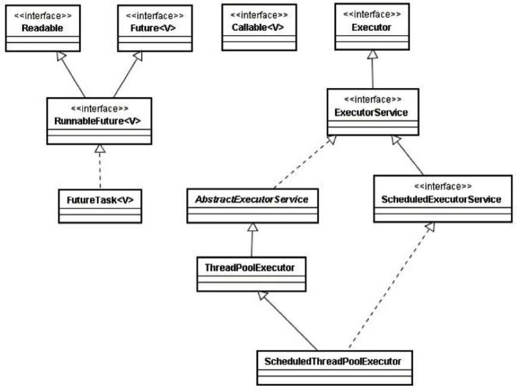

[toc]

# 使用线程池的原因

- **降低资源消耗**	通过重复利用已创建的线程池，降低线程创建和销毁造成的消耗。

- **提高响应速度**	

  服务器完成一项任务的耗时：T1创建线程时间 + T2执行任务时间 + T3销毁线程时间。

  如果T1 + T3 >> T2，则可以使用线程池，减少(T1 + T3)，以提高服务器性能。

  我们可以将T1与T3安排在服务器启动和结束的时间段或者一些空闲的时间，这样服务器程序处理客户请求时就不会有T1与T3的开销了。

- **提高线程的可管理性**	

  线程是一种稀缺资源，如果无限制地创建，不仅会消耗（操作）系统资源，还会降低（操作）系统的稳定性。

  使用线程池可以进行`统一分配`、`调优`和`监控`。
  
  > - 进程是操作系统分配资源的最小单位
  > - 线程是CPU执行与调度的最小单位
  > - Java进程将向操作系统申请线程资源

# ThreadPoolExecutor



## Executor

`Executor`框架基础。其中只有一个`execute`方法，负责将任务交给线程池中的线程执行。

``` java
void execute(Runnable command);
```

## ExecutorService

接口继承了`Executor`。在其基础上添加管理线程池的方法。

- **shutdown()**	中断已经执行完任务的线程，且并不再接受新任务

- **shutdownNow()**	试图中断所有线程，不论是否在执行任务

- **isShutdown()**	当调用`shutdown()|shutdownNow()`后，返回`true`

- **isTerminated()**	

  线程池成功停止后返回`true`

- **awaitTermination(Long, TimeUnit)**

  阻塞调用线程池的线程，有以下三种情况将唤醒当前线程：

  1. 等待超时
  2. 线程池中所有任务执行完毕
  3. 当前线程被中断

- **submit(Callable)**

- **submit(Runnable, T)**

- **submit(Runnable)**

- **invokeAll(Collection<? extends Callable<T>>)**

  执行任务集合，等待所有任务完成后同一返回（阻塞）。

- **invokeAny(Collection<? extends Callable<T>>)**

  执行任务集合，将第一个完成的任务作为结果返回，并停止其他任务的执行。

### AbstractExecutorService

其实现了`ExecutorService`的大部分方法。

#### ThreadPoolExecutor

线程池核心实现类

### ScheduledExecutorService

该接口继承了`ExecutorService`，用于实现**定时**功能的线程池。

#### ScheduledThreadPoolExecutor

`ScheduledExecutorService`的实现类。

##### 与`Timer`相比

- `Timer`对调度的支持是基于绝对时间的；`ScheduledThreadPoolExecutor`支持相对时间。
- `Timer`使用单线程执行所有的`TimerTask`，如果某个`TimerTask`很耗时将会影响其他`TimerTask`的执行；而`ScheduledThreadPoolExecutor`则可以构造一个固定大小的线程池来执行任务。
- `Timer`不会捕获由`TimerTask`抛出的异常，所以抛出异常时，`Timer`将会终止，影响其他`TimerTask`的执行；而`ScheduledThreadPoolExecutor`对这个问题进行了妥善的处理，不会影响其他任务的执行。

# 线程池创建参数

## 核心线程数 corePoolSize

线程池的核心线程数，当提交一个任务时，线程池创建一个新线程执行任务，直到当前线程数等于`corePoolSize`。

如果当前线程数为`corePoolSize`，继续提交的任务将被保存到阻塞队列，等待被执行。

当调用了线程池的`prestartAllCoreThreads()`，线程池会提前创建并启动所有核心线程。

## 最大线程数 maximumPoolSize

线程池中允许的最大线程池。

如果阻塞队列满了，且继续提交任务，则创建新的线程执行任务。

前提时当前线程小于`maximumPoolSize`。

## 存活时间 keepAliveTime

线程空闲时的存活时间，即当线程没有任务执行时，继续存活的时间。默认情况下，该参数只在线程数大于`corePoolSize`时才有用。

- **TimeUnit**	`keepAliveTime`的时间单位

## 工作队列 workQueue

用于保存等待执行的任务的阻塞队列。

一半来说，我们应该尽量使用有界队列，因为使用无界队列作为工作队列会对线程池带来如下影响：

1. 当线程池中的线程数达到`corePoolSize`后，新任务将在无界队列中等待，因此线程池中的线程数不会超过`corePoolSize`。

2. 由于1，使用无界队列时`maximumPoolSize`将是一个无效参数。
3. 由于1和2，使用无界队列时`keepAliveTime`僵尸一个无效参数。
4. 最重要的时，使用无界队列可能会耗尽系统资源，有界队列则有助于防止资源耗尽，即使使用有界队列，也要尽量控制队列的大小在一个合适的范围。

## 线程工厂 threadFactory

创建线程的工程，通过自定义的线程工程可以给每个新建的线程设置一个具有识别度的线程名。

此外，还能对更加自由的对线程做更多的设置，比如设置所有的线程为守护线程。

## 拒绝策略 RejectedExecutionHandler

线程池的饱和策略，当阻塞队列满了，且没有空闲的工作线程，如果继续提交任务，必须采取一种策略处理任务，JDK提供了四种策略：

- **AbortPolicy**	直接抛出异常，默认策略
- **CallerRunPolicy**	用调用者所在的线程来执行任务
- **DiscardOldestPolicy**	丢弃阻塞队列中靠最前的任务，并执行当前任务
- **DiscardPolicy**	直接丢弃任务

除此之外，我们也可以根据应用场景实现`RejectedExecutionHandler**接口，自定义饱和策略，如记录日志或持久化存储不能处理的任务。

> JDK的线程池如何检测空闲线程?
>
> 循环CAS。

# 线程池的工作机制


1. 当允许的线程少于`corePoolSize`，则创建新线程来执行任务（执行这一步骤需要获取全局锁）
2. 如果运行的线程等于或多于`corePoolSize`，则将任务加入`BlockingQueue`
3. 如果无法将任务加入工作队列，则创建新的线程来处理任务
4. 如果步骤3导致当前运行的线程数超出`maximumPoolSize`，任务将被拒绝，并调用`RejectedExecutionHandler.rejectedExecution()`。

# 线程池的使用


## 提交任务

- `execute()`方法用于提交不需要返回值的任务，所以**无法判断任务是否被线程池成功执行**。

- `submit()`方法用于提交需要返回值的任务，线程池会返回一个`future`类型的对象，通过这个`future`对象可以判断任务是否执行成功，并且可以通过`future`的`get()`来获取返回值。**`get()`会阻塞当前线程直到任务完成**，而使用`get(long, TimeUnit)`则会阻塞一段时间后立即返回，这时候有可能任务没有执行完。

## 关闭线程池

可以调用`shutdown()`或者`shutdownNow()`来关闭线程池。它们的原理时遍历线程池中的工作线程，然后逐个调用线程的`interrupt`方法来中断线程。

## 合理地配置线程池

## 扩展线程池

## 线程池工厂

