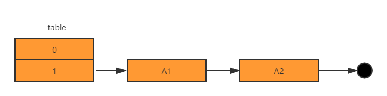
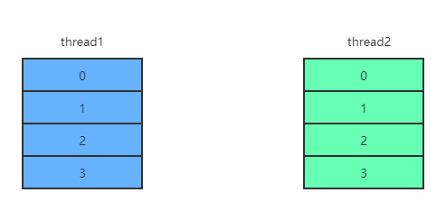
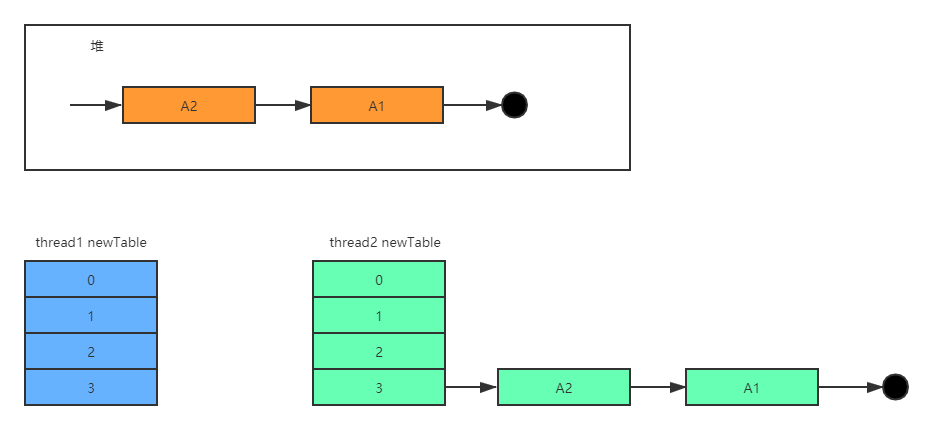

[toc]

# ConcurrentHashMap

## 原因

在`JDK1.7`版本中，并发场景下使用`HashMap`，调用`put()`触发扩容时，可能导致死循环。致使CPU使用率接近100%。

这是因为在并发场景下，可能导致`HashMap`的`Entry`形成环形数据结构，则`Entry`的`next`结点永远不为空，就会产生死循环。

## 1.7中HashMap死循环分析

### 扩容流程

`put()`触发扩容过程如下

``` java 
public V put(K key, V value) {
    if (table == EMPTY_TABLE) {
        inflateTable(threshold);
    }
    if (key == null)
        return putForNullKey(value);
    int hash = hash(key);
    int i = indexFor(hash, table.length); // return hash & (table.length - 1)
	// 遍历链表，如果hash相同则覆盖
    for (Entry<K,V> e = table[i]; e != null; e = e.next) {
        Object k;
        if (e.hash == hash && ((k = e.key) == key || key.equals(k))) {
            V oldValue = e.value;
            e.value = value;
            e.recordAccess(this);
            return oldValue; // 返回旧值
        }
    }

    modCount++;
    addEntry(hash, key, value, i);
    return null;
}
```


1. 调用`addEntry()`

   如果`size`超过`threshold(临界值)`且`bucketIndex(桶序号)`不为空，将调用`resize()`方法生成一个长度为原来两倍的`newTable`对象。

   ``` java
   void addEntry(int hash, K key, V value, int bucketIndex) {
       if ((size >= threshold) && (null != table[bucketIndex])) {
           // 扩容
           resize(2 * table.length);
           hash = (null != key) ? hash(key) : 0;
           bucketIndex = indexFor(hash, table.length);
       }
   
       createEntry(hash, key, value, bucketIndex);
   }
   ```

   

2. 调用`transfer()`

   在`transfer()`中，轮询`table`数组每个位置，将其各个元素算出新位置后放到`newTable`上。

   ``` java
    void transfer(Entry[] newTable) {
        Entry[] src = table;                   //src引用了旧的Entry数组
        int newCapacity = newTable.length;
        for (int j = 0; j < src.length; j++) { //遍历旧的Entry数组
            Entry<K,V> e = src[j];             //取得旧Entry数组的每个元素
            if (e != null) {
                src[j] = null;//释放旧Entry数组的对象引用（for循环后，旧的Entry数组不再引用任何对象）
                do {
                    Entry<K,V> next = e.next;
                    int i = indexFor(e.hash, newCapacity); //！！重新计算每个元素在数组中的位置
                    e.next = newTable[i]; //标记[1]
                    newTable[i] = e;      //将元素放在数组上
                    e = next;             //访问下一个Entry链上的元素
                } while (e != null);
            }
        }
    }
   ```

> JDK1.7中HashMap在扩容时采用`头插法`。

在单线程环境下，这段代码能成功扩容。但如果在并发环境下呢？

假设存在一个`HashMap`对象，其内部`table`如下图所示：



在并发场景下进行扩容时，首先生成一个长度为`2*table.length`的`newTable`对象。假设有两个线程`thread1`和`thread2`，那么在各自的栈帧中将生成两个`newTable`。



**这时`thread1`执行到`Entry<K, V> next = e.next;`后挂起**，轮到`thread2`执行。当`thread2`完成扩容后，结果如下：



由于`thread1`与`thread2`中引用的在堆中`table`对象为同一个。当`thread2`完成扩容后，`A1结点`和`A2结点`在堆中分布如上图所示。这时`thread1`获得时间片重新执行。这时在`thread1`的内存栈中：

`e = A1; next = A2`

在第一次迭代后，`newTable`为：`-> A1 -> null`，`e = A2`

在第二次迭代时，由于`thread2`更新了`A2.next`，`next = e.next = A2.next = A1 `

根据`头插法`，`newTable`结构为：`-> A2 -> A1 -> null`，`e = A1`

在第三次迭代时，`e = A1, next = null`，

最终导致`thread1`扩容后的`table`为：


循环列表产生后，一旦线程查找`A3`、`A4`......等结点无法找到时，则会进入死循环，将CPU

到100%。

## TODO 1.8中HashMap并发场景问题

## 实现

### JDK1.7

#### 原理

分段锁(先获取锁，再获取数据)。

在`ConcurrentHashMap`中，声明了一个`Segment[] segments`中则有类似`HashMap`中的**散列链表**数据结构——`HashEntry[] table`。`Segment`的中文意思是分段，片段。`segments对象`就是我们所说的**分段锁**。

> `Segment`是`ReentrantLock`(可重入锁)的子类。
>
> 此外，在`JDK1.7`中，`Segments数组是不可扩容的`，可扩容的是`Segments`中的`table数组`。

#### 常用方法

- **构造函数**

``` java
public ConcurrentHashMap(
	int initialCapacity, // 初始化容量
    float loadFactor, // 负载因子用于扩容，缺省0.75f(0.75f是一个较为合理的经验值)	
    /*
    并发级别，缺省 DEFAULT_CONCURRENCY_LEVEL = 16。
    
    这个参数是用户估计的并发级别，即有多少个线程共同修改这个`ConcurrentHashMap`。实际是`ConcurrentHashMap`的分段锁个数。当用户设置并发度时，`ConcurrentHashMap`将使用大于等于该值的2的最小幂指数作为实际并发度。

如果并发度设置过小，可能带来严重的锁竞争问题；如果设置过大，原本对同一个`Segment`的访问可能扩散到多个`Segment`上。
    */
    int concurrencyLevel;
    ...
)
```

​	`ConcurrentHashMap`将根据以上三个参数来初始化**segment数组**、**segmentShift段偏移量**、**segmentMask段掩码**。

``` java
long u = ((h >>> segmentShift) & segmentMask) << SSHIFT) + SBASE;
```

> - `segmentShift`与`segmentMask`
>
> 这两个全局变量需要在定位`segment`时的散列算法中使用。

``` java
int cap = MIN_SEGMENT_TABLE_CAPACITY;
while (cap < c)
    cap <<= 1;
Segment<K,V> s0 = new Segment<K, V>(loadFactor, (int)(cap * loadFactor), (HashEntry<K, V>[]) new HashEntry[cap]);
Segment<K,V> ss = (Segment<K,V>[])new Segment[ssize];
UNSAFE.putOrderedObject(ss, SBASE, s0);
this.segments = ss;
```

`ConcurrentHashMap`会首先使用`Wang/Jenkins hash算法`对元素的`hashCode`进行再一次散列以令分布更均匀。


- **get操作**

由于`ConcurrentHashMap`使用分段锁`Segment`来保护不同段的数据，那么在插入和获取元素的时候，需要进行以下步骤：

1. 定位`Segment`

   ``` java
   int h = hash(key);
   long u = ((h >>> segmentShift) & segmentMask) << SSHIFT) +SBASE; // 使用hash高位进行定位
   ```

2. 定位`HashEntry`，使用`hash`的全部位数进行定位

3. 对链表进行遍历

`ConcurrentHashMap`允许多个读操作并发进行，读操作并不需要加锁。`ConcurrentHashMap`的`get()`通过`volatile关键字`与`final关键字`保证读取到最新的数据：

``` java
static final class HashEntry<K,V> {
    final int hash;
    final K key;
    volatile V value;
    volatile HashEntry<K, V> next;
    ......
}
```


- **put操作**

`put()`主要通过以下步骤：

1. 定位`Segment`

2. 定位`HashEntry`

3. `ensureSegment()`：初始化槽(`Segment`)

   在`ensureSegment()中,在并发场景下通过循环CAS操作保证仅有一个线程可以被初始化成功`

   ``` java
   public V put(K key, V value) {
       Segment<K, V> s;
       if (value == null) 
           throw new NullPointerException();
       int hash = hash(key);
       int j = (hash >>> segmentShift) & segmentMask;
       if (( s= (Segment<K, V>)UNSAFE.getObject(segments, (j << SSHIFT) + SBASE)) == null)
           s = ensureSegment(j);
       return s.put(key, hash, value, false);
   }
   ```

4. 调用`Segment`的`put()`

   首先通过`tryLock()`尝试获取锁，获取失败时调用`scanAndLockForPut()`。在这个方法中，首先通过循环CAS获取锁，在重试超过一定次数后(依CPU核心数而定)，则阻塞式获取锁。

   > 在等待锁的过程中可能已经将`HashEntry`创建好，所以在拿到锁后首先对`HashEntry`进行判空操作。

   ``` java 
   // Segment.put(...)
   while (!tryLock()) {
       HashEntry<K, V> f;
       if (retries < 0) {
           if (e == null) {
               if (node == null)
                   node = new HashEntry<K, V>(hash, key, value, retries = 0);
           }
           else if (key.equals(e.key))
               retries = 0;
           else
               e = e.next;
       }
       else if (++retries > MAX_SCAN_RETRIES) {
           lock();
           break;
       }
       else if ((retries & 1) == 0 && (f = entryForHash(this, hash)) != first) {
           e = firest = f;
           retries = -1;
       }
   }
   return node;
   ```


- **扩容`rehash()`**

为了避免让所有的结点进行复制操作，故扩容时基于2的幂指数进行扩容。

假设扩容前某结点`index = i，容量 = capacity`。

则扩容后该结点的`index`为`i`或`i+capacity`。

> 在JDK1.7中HashMap的散列函数为`hashCode & (length - 1)`，这个函数等价于`hashCode % length`。

由上可见，部分结点扩容前后顺序不变，可以快速定位与重排。


- **弱一致性**

由于在遍历过程中其他线程可能对链表结构做了调整，因此`get()`和`containsKey()`返回的可能是过时的数据。

这是`ConcurrentHashMap`在**弱一致性**上的体现。如果要求**强一致性**，那么必须使用`Collections.synchronizedMap()`。


- **`size()`与`containsValue()`**

这两个方法是基于整个`ConcurrentHashMap`来进行操作的，他们的原理也基本类似：首先不加锁遍历所有的`Segment`，获得所有对应的值以及所有`Segment`的`modcount`之和。

在put，remove和clean方法里操作元素前都会将变量`modCount`进行变动。如果连续两次所有`Segment`的`modCount`和相等，且过程中没有其他线程修改`ConcurrentHashMap`，则返回结果。

当循环次数超过预定义的值时，**需要对所有的`Segment`依次进行加锁**，获取返回值后再依次解锁。

所以应该避免在多线程环境下使用`size()`和`containsValue()`。

> 故当对元素判空时，应该使用`isEmpty()`。

### JDK1.8

#### 参考

- https://www.cnblogs.com/kobebyrant/p/11296309.html

#### 改进

- 取消`segments`字段，以`transient volatile HashEntry<K, V>[] table`数组为锁

  从而实现锁粒度的减小，进一步减少并发冲突的概率。

  摒弃`分段锁`的设计原理，把`put操作`的控制粒度更加细化，细化的粒度降低到某个`HashEntry`。

  那么在整个表需要扩容时不会阻塞任何一个线程。

  比如在`JDK1.7`中，锁住一个`segment对象`则锁住一个散列链表，而`JDK1.8`中仅锁住一个`HashEntry`对象。

- 数据结构`散列链表`调整为`散列链表+红黑树`

- 并发扩容的机制

  

#### 数据结构和其他属性

- **Node**

  ``` java
  static class Node<K, V> implements Map.Entry<K, V> {
      final int hash;
      final K key;
      volatile V val;
      volatile Node<K, V> next;
      ...
  }
  ```

  定义与`JDK1.7`中的`HashEntry`基本相同。

- **TreeNode**

  树（红黑树）节点类，继承`Node`。

  与`JDK1.8`中的`HashMap`相似，当`threshold`超过`TREEIFY_THRESHOLD`时，链表节点将转换为红黑树节点；当`threshold`少于`UNTREEIFY_THRESHOLD`时，红黑树节点将转换为链表节点。

  ``` java
  static final int TREEIFY_THRESHOLD = 8;
  static final int UNTREEIFY_THRESHOLD = 6;
  ```

  与`JDK1.8`中的`HashMap`不同的是，`Node`并不是直接转换成红黑树的，而是将这些节点放在`TreeBin`对象中，由`TreeBin`完成对红黑树的包装。

  其次，`ConcurrentHashMap`中的`TreeNode`继承`Node`，而`HashMap`中的`TreeNode`继承`LinkedHashMap.Entry<K, V>`。

- **TreeBin**

  作为红黑树的**根节点**。

  ``` java
  static final class TreeBin<K, V> extends Node<K,V> {
      TreeNode<K, V> root;
      volatile TreeNode<K, V> first;
      volatile Thread waiter;
      // 具有读写锁性质
      volatile int lockState;
      static final int WRITER = 1; // set while holding write lock
      static final int WAITER = 2; // set when waiting for write lock
      static final int READER = 4; // increment value for setting read lock
      ...
  }
  ```

- **ForwardingNode**

  一个特殊的`Node`结点，`hash`值为`-1`，其中存储`nextTable`（扩容时新生成的`table`）的引用。当`table`发送扩容时，作为占位符放在`table`中表示当前结点为`null`或者已经被移动。

  ``` java
  static final class ForwardingNode<K,V> extends Node<K,V> {
      // 使用final关键字声明令其不可变
      final Node<K,V>[] nextTable;
      ForwardingNode(Node<K,V>[] tab) {
          super(MOVED, null, null, null);
          // 通过构造参数传入引用
          this.nextTable = tab;
      }
      ...
  }
  ```

- **sizeCtrl**

  用于控制`table`的初始化和扩容操作

  | value | mean                                            |
  | ----- | ----------------------------------------------- |
  | -1    | 正在初始化                                      |
  | -N    | 有N-1个线程正在扩容操作                         |
  | 0     | 默认值，代表table仍未初始化                     |
  | 正数  | 初始化大小或***Map元素达到这个数量时需要扩容*** |

#### 常用方法

- 静态方法

  ``` java
  /**
  * 利用硬件级别的原子操作，获得i位置上的Node节点
  * Unsafe.getObjectVolatile可以直接获取指定内存的数据
  * 保证了每次拿到数据都是最新的
  */
  static final <K,V> Node<K,V> tabAt(Node<K,V>[] tab, int i) {
          return (Node<K,V>)U.getObjectVolatile(tab, ((long)i << ASHIFT) + ABASE);
  }
  
  /**
  * 利用CAS操作设置i位置上的Node节点
  */
  static final <K,V> boolean casTabAt(Node<K,V>[] tab, int i,
                                      Node<K,V> c, Node<K,V> v) {
      return U.compareAndSwapObject(tab, ((long)i << ASHIFT) + ABASE, c, v);
  }
  
  /**
  * 利用硬件级别的原子操作，设置在i位置上的Node节点
  * Unsafe.putObjectVolatile可以直接设定指定内存的数据
  * 保证了其他线程访问这个节点时一定可以看到最新的数据
  */
  static final <K,V> void setTabAt(Node<K,V>[] tab, int i, Node<K,V> v) {
      U.putObjectVolatile(tab, ((long)i << ASHIFT) + ABASE, v);
  }
  ```


- **构造方法**

  ``` java
  public ConcurrentHashMap(int initialCapacity,
                               float loadFactor, int concurrencyLevel) {
          if (!(loadFactor > 0.0f) || initialCapacity < 0 || concurrencyLevel <= 0)
              throw new IllegalArgumentException();
          if (initialCapacity < concurrencyLevel)   // Use at least as many bins
              initialCapacity = concurrencyLevel;   // as estimated threads
      long size = (long)(1.0 + (long)initialCapacity / loadFactor);
  	/* tableSizeFor返回的一定是2的n次方 */
      int cap = (size >= (long)MAXIMUM_CAPACITY) ?
              MAXIMUM_CAPACITY : tableSizeFor((int)size);
          this.sizeCtl = cap;
      }
  ```

  在`JDK1.8`的`ConcurrentHashMap`的构造方法中，仅`new`出了一个map的实例和设置一些基本属性，并没有实例化其内部的`table`。

  对`table`的实例化放在了插入元素的时候。

  

- **get操作**

  ``` java
  public V get(Object key) {
      Node<K,V>[] tab; Node<K,V> e, p; int n, eh; K ek;
      int h = spread(key.hashCode()); // 计算 hash值
      // 根据hash值确定节点位置
      if ((tab = table) != null && (n = tab.length) > 0 &&
          /* 通过 tabAt() 直接获取内存`(n-1)& h`位置上的Node节点
          * (n-1) & h <===> h % n , n为2的幂指数
          */
          (e = tabAt(tab, (n - 1) & h)) != null) {
          if ((eh = e.hash) == h) { // 如果链表首结点就是要寻找的结点
              if ((ek = e.key) == key || (ek != null && key.equals(ek)))
                  return e.val;
          }
          /* eh<0 说明这个结点在树上 调用树的find()寻找 */
          else if (eh < 0)
              return (p = e.find(h, key)) != null ? p.val : null;
          // 遍历链表
          while ((e = e.next) != null) {
              if (e.hash == h &&
                  ((ek = e.key) == key || (ek != null && key.equals(ek))))
                  return e.val;
          }
      }
      return null;
  }
  ```

  

- **put操作**

  ``` java
  /** Implementation for put and putIfAbsent */
  final V putVal(K key, V value, boolean onlyIfAbsent) {
      if (key == null || value == null) throw new NullPointerException();
      /* 计算hash */
      int hash = spread(key.hashCode());
      int binCount = 0;
      /* 死循环 插入成功时跳出 */
      for (Node<K,V>[] tab = table;;) {
          Node<K,V> f; int n, i, fh;
          if (tab == null || (n = tab.length) == 0)
              tab = initTable(); /* 初始化table */
          else if ((f = tabAt(tab, i = (n - 1) & hash)) == null) {
              /* Node数组中的元素，如果这个位置为空，通过CAS操作放进去 */
              if (casTabAt(tab, i, null,
                           new Node<K,V>(hash, key, value, null)))
                  break;                   // no lock when adding to empty bin
          }
          /* 相当于该结点为 Forward结点，意味着该结点正在扩容 */
          else if ((fh = f.hash) == MOVED)
              tab = helpTransfer(tab, f); // 当前线程帮助扩容
          else {
              V oldVal = null;
              /*
              * 锁住当前Node,这个位置是Hash冲突组成的链表的头结点或红黑树根节点
              */
              synchronized (f) {
                  if (tabAt(tab, i) == f) {
                      // fh>0:说明这个结点是链表节点
                      if (fh >= 0) {
                          binCount = 1;
                          for (Node<K,V> e = f;; ++binCount) {
                              K ek;
                              if (e.hash == hash &&
                                  ((ek = e.key) == key ||
                                   (ek != null && key.equals(ek)))) {
                                  oldVal = e.val;
                                  if (!onlyIfAbsent)
                                      e.val = value;
                                  break;
                              }
                              Node<K,V> pred = e;
                              // 尾插法:放到链表尾部
                              if ((e = e.next) == null) {
                                  pred.next = new Node<K,V>(hash, key,
                                                            value, null);
                                  break;
                              }
                          }
                      }
                      // 树节点
                      else if (f instanceof TreeBin) {
                          Node<K,V> p;
                          binCount = 2;
                          if ((p = ((TreeBin<K,V>)f).putTreeVal(hash, key,
                                                                value)) != null) {
                              oldVal = p.val;
                              if (!onlyIfAbsent)
                                  p.val = value;
                          }
                      }
                  }
              }
              if (binCount != 0) {
                  // 达到阈值:将链表转换为红黑树
                  if (binCount >= TREEIFY_THRESHOLD)
                      treeifyBin(tab, i);
                  if (oldVal != null)
                      return oldVal;
                  break;
              }
          }
      }
      // Map元素数量+1，并检查是否需要扩容
      addCount(1L, binCount);
      return null;
  }
  ```

  

- **初始化`initTable()`**

  构造方法中并没有真正初始化，真正的初始化在放在了是在向`ConcurrentHashMap`中插入元素的时候发生的。具体实现的方法就是`initTable`。

  ``` java
  private final Node<K,V>[] initTable() {
      Node<K,V>[] tab; int sc;
      // 由于在并发场景下，所以需要判断table是否初始化完成
      while ((tab = table) == null || tab.length == 0) {
          if ((sc = sizeCtl) < 0) // 有其他线程正在初始化, 当前线程让步
              Thread.yield(); // lost initialization race; just spin
          // CAS操作将 sizeCtrl设置为-1, 表示当前线程正在初始化
          else if (U.compareAndSwapInt(this, SIZECTL, sc, -1)) {
              try {
                  if ((tab = table) == null || tab.length == 0) {
                      int n = (sc > 0) ? sc : DEFAULT_CAPACITY;
                      @SuppressWarnings("unchecked")
                      Node<K,V>[] nt = (Node<K,V>[])new Node<?,?>[n];
                      table = tab = nt;
                      sc = n - (n >>> 2);
                  }
              } finally {
                  // 设置成扩容的阈值
                  sizeCtl = sc;
              }
              break;
          }
      }
      return tab;
  }
  ```

  

- **transfer()**

  该方法用于(并发)扩容。

  1. 第一部分构建一个`nextTable`，容量为原来的两倍。

  2. 第二部分就是将原`table`中的数据复制到`nextTable`中

     `table`中为空或者已经处理过的节点会被设置为`forwardNode`。当线程扩容时，发现当前节点是`forwardNode`，则跳过该结点，继续寻找未处理的节点。找到节点时对节点上锁。

  3. 扩容完成后，设置为新容量的0.75倍。

  > **并发扩容**
  >
  > 将数据迁移任务拆分成多个小迁移的任务，每个线程负责迁移其中的一部分。在实现上使用了变量`stride`作为步长控制。

  

- **remove操作**

  与`put操作`类似。

  

- **treeifyBin()**

  将过长的链表转换为`TreeBin对象`

- **size()**

  在`JDK1.8`中，在扩容和`addCount()`方法中有对**size**进行处理，在调用`size()`时直接返回结果。具体实现在`sumCount()`中。

  ``` java
  final long sumCount() {
      // CounterCell用于记录在并发场景下对baseCount进行CAS操作失败的数据
      CounterCell[] as = counterCells; CounterCell a;
      long sum = baseCount;
      if (as != null) {
          for (int i = 0; i < as.length; ++i) {
              if ((a = as[i]) != null)
                  sum += a.value;
          }
      }
      return sum;
  }
  ```

  `baseCount`与`countCells`在`addCount()`方法中体现：

  1. 对`baseCount`做`CAS操作`；
  2. 如果并发操作失中`CAS操作`失败，则使用`counterCells`；
  3. 如果`counterCells`同样进行`CAS操作`失败了，则在`fullAddCount`方法中，继续死循环至成功。

  而`JDK1.7`中在调用`size()`时才去计算。

#### TODO 1.8中ConcurrentHashMap扩容时机

## 使用

- **putIfAbsent(K key, V value):**	如果不存在则插入

# HashTable

`HashTable`容器使用`synchronized`来保证线程安全，但在线程竞争激烈的情况下效率非常低。因为在并发场景下，一个线程访问同步方法时，其他线程进入轮询或阻塞状态。

`C3P0`连接池使用类似方法保证线程安全，同样效率低下。

# 跳表 SkipList

## 起源

为了提高查询效率，我们可以使用`二分查找`。而`二分查找`需要保证元素的有序性，为了保证元素有序，那么就会频繁地移动元素。

为了减少频繁移动元素带来地性能消耗，我们可以以空间换时间的方式，用二叉查找树来代替链表结构。

同时，为了避免二叉查找树在最坏的情况下可能变成一个链表，又衍生了平衡二叉树、`B-Tree`、`B+Tree`、红黑树等。但是`AVL-Tree`实现较复杂，平衡操作较难理解，我们可以使用`SkipList`。

## 跳表

- **基本思想**	以空间换时间
- **实现思想**	首先大步查找大致范围，再逐步缩小迫近。


跳表是一种随机化的数据结构。

其首先将随机的构建索引(上图)，通过以上的数据结构快速的寻找到查找结点的大概位置，达到`以空间换时间`的目的。

**跳表在算法效率上等同于红黑树，且实现比红黑树更简单。**

- **应用**
  - Redis
  - **Lucence**  Java信息检索程序，搜索领域

## JDK实现

- **ConcurrentSkipListMap**:	相当于线程安全的`TreeMap`
- **ConcurrentSkipListSet**:	相当于线程安全的`TreeSet`

`TreeMap`是一种由红黑树实现的**有序**的`Map`，而在并发场景其替代品为`ConcurrentSkipListMap`。

而`TreeSet`的内部则构造了一个`TreeMap`，作为并发场景下的替代品——`ConcurrentSkipListSet`，它的内部也同样构造了一个`ConccurrentSkipListMap`。

- `TreeSet`是`TreeMap`的包装
- `ConcurrentSkipListSet`是对`ConcurrentSkipListMap`的包装
- `ConcurrentSkipListMap`是`TreeMap`在并发场景下的替代品
- `ConcurrentSkipListSet`是`TreeSet`在并发场景下的替代品

与`ConcurrentHashMap`比较，`ConcurrentHashMap`的性能和存储空间要优于`ConcurrentSkipListMap`，但是`ConcurrentSkipListMap`会按照健的顺序进行排序。

# ConcurrentLinkedQueue

无解非阻塞队列，其基于链表的无界线程安全队列。盖队列的元素是遵循先进先出原则的。

相当于`LinkedList`的并发版本。

## 常用方法

- **add()**：	插入队列头部
- **offer()**：	插入队列尾部
- **peek()**：	返回头部元素并不移除
- **poll()**：	返回头部元素并移除

# 写时复制容器

- **CopyOnWriteArrayList**
- **CopyOnWriteArraySet**

## 思想

当我们往一个容器中添加元素时，不直接往当前容器添加，而是首先复制一个新的容器，再往新容器里添加元素。

这里有点想`HashMap`中的扩容。

