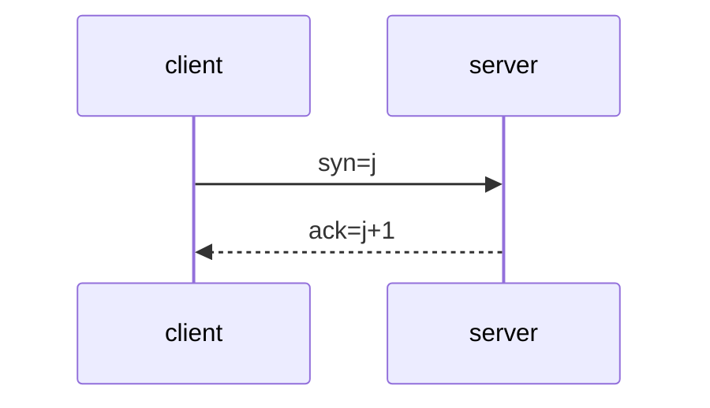
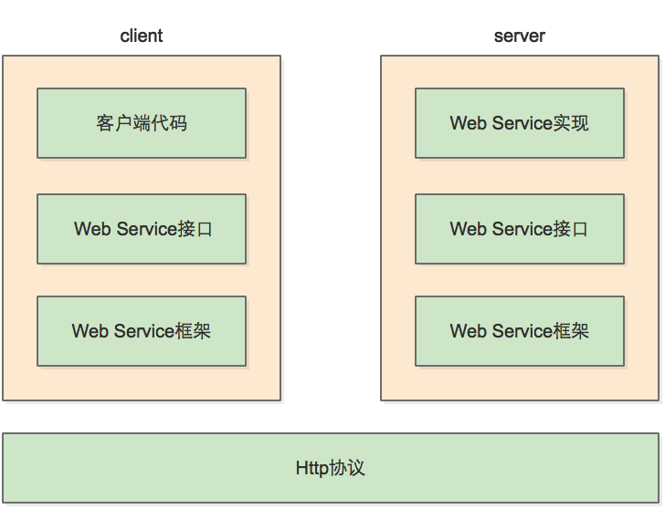

[TOC]

# 写在前面

> - **2021-12-6**
>
>   让玄学不再是玄学——当我们在计算机领域遇到难以理解的现象时，其实是我们基础知识不牢靠而已。

## 学习基础知识的意义

要成为`master`，这些知识是绕不过去的。

### 理解

当我们对所在的领域有一定的了解，才会知道用什么关键字去搜索，否则我们对我们面临的问题一无所知。这些知识是我们分析、定位、解决疑难杂症的最好帮手。

> 我们作为程序员，都遇到过由于不清楚所面临的问题，导致使用搜索引擎时效率低下的情况。

在阅读《网络是怎样连接的》这本书的前言时，有一个小时候经常遇到的问题——浏览器无法上网而QQ可以上网？这个问题也常常出现在某电脑管家上呢。其实这是因为QQ使用了IP地址来连接服务器，所以在DNS服务器失效时，QQ依然可以聊天。

### 优化

我是这样想的，只有了解了这些底层知识后，在优化代码以提升运行效率时，才能对症下药。其次在这些庞大繁杂的体系中，已经包含了很多老前辈们的优化，相当于一系列解决方案的最佳实践，我们学习之后举一反三，应用到自己的领域。

当我们清晰认识到我们的代码如何与网络作用，那种才是`master`对代码应该有的控制力。

# 工具

## NETCAT

### 用途

- 端口测试
- 传输测试
- UDP会话测试
- 文件传输
- 网络吞吐量测试
- 系统后门

## 抓包

### wireshark

### fiddler

# OSI


## 传输层

### TCP

- **参考**
- [TCP：三次握手、四次握手、backlog及其他](https://www.cnblogs.com/xrq730/p/6910719.html)

#### 三次握手



#### 四次挥手

#### FAQ

##### Connect reset

- [Connection reset原因分析和解决方案](https://my.oschina.net/xionghui/blog/508758)
- [Connection reset原因分析及解决思路](https://www.cnblogs.com/lilinwei340/p/13021864.html)

## 应用层

### HTTP

#### 长短连接

- [最近学习了Http连接池 - 五月的仓颉 - 博客园 (cnblogs.com)](https://www.cnblogs.com/xrq730/p/10963689.html)

> 首先，我们要明确一下，**长短连接是通信层（TCP）的概念**，HTTP是应用层协议，它只能说告诉通信层我打算一段时间内复用TCP通道而没有自己去建立、释放TCP通道的能力。

| 协议 | keep-alive的作用                                       |
| ---- | ------------------------------------------------------ |
| http | 复用已有连接。                                         |
| tcp  | 保活。实现方式是隔一段时间发送一个心跳包到对端服务器。 |

#### 状态码

| code | explain                                                      |
| ---- | ------------------------------------------------------------ |
| 301  | 永久重定向，表明所请求的资源已经被永久转移。                 |
| 302  | 临时重定向，表示旧地址的资源仍然可以访问，这个重定向只是临时从旧地址跳转到新地址。 |
| 401  | 无权限                                                       |
| 403  | 403 Forbidden                                                |

> '301'在通过http请求访问https站点时出现，访问失败。

- 参考
- <a href='https://blog.csdn.net/zhuyiquan/article/details/78712332'>POST请求慎用301 Moved Permanently</a>
- [HTTP-Http状态码301和302的区别](https://www.cnblogs.com/lanqiu5ge/p/9457074.html)

##### 3xx 重定向

当服务端返回状态码为**3xx**时，说明需要客户端**重定向**。

- **重定向的原理**

  修改http协议的`location`来实现。例如在`javascript`中：

  ``` html
  <script type='text/javascript'>
      windows.location = 'www.baidu.com';
  </script>
  ```

当`Response`的状态为**3xx**时，我们可以在`Response Header`中看到有一个`Location`属性，其值是重定向的地址。

#### 超时时间

在开发过程中，网络数据的读取是阻塞的，所以我们有必要设置超时时间。而在使用`HttpClient`实现一个接口的调用时，我们会遇到两个参数：

- **CONNECTION_TIMEOUT**
- **SO_TIMEOUT**

在`HttpClient`的源码中，两个参数的值实际是：

``` java
public static final String CONNECTION_TIMEOUT = "http.connection.timeout";
public static final String SO_TIMEOUT = "http.socket.timeout";
```

这两个参数的意义分别为请求超时和响应超时。出现问题时报错也是不一样的，分别为`connect time out`与`read time out`。

而响应超时，**则是指`HTTP`连接成功后**，读取数据的超时时间超时。

### HTTPS

### FTP

#### 主动模式和被动模式

##### 主动模式（PORT）

- 首先，客户端和服务端建立控制连接
- 通过控制连接，客户端监听`N+1`端口并发送`PORT N+1`给服务端。`N+1`为大于1024的端口。
- 服务端将从`数据端口20`发起`TCP请求`连接到客户端的`N+1`建立数据连接

> 端口N表示客户端的控制连接端口，端口N+1表示客户端的数据连接端口。

##### 被动模式（PASV）

- 通过控制连接，客户端发送`PASV`命令给服务端
- 服务端收到`PASV`命令后，将开启一个`非特权端口P`(P>1024)
- 服务端发送`PORT P`给客户端
- 客户端从本地端口`N+1`发起`TCP请求`到服务端`端口P`

>个人理解，主动模式就像是谈恋爱，男生发微信给女生：我在你家楼下等你。
>
>其中微信就好比控制连接，楼下就相当于端口号，女生下楼这个过程就相当于服务端发起TCP请求连接客户端的过程。
>
>而被动模式则是男生在微信上发“有空吗？”女生回“有，来我家楼下等我”。
>
>“有空”相当于`PASV`命令，女生回复男生“来我家楼下”相当于`PORT P`，其中`楼下`好比服务端开启的`P`端口。

#### 使用

鉴于不管是`windows`还是`linux`，`ftp`作为一种大众、标准的网络协议，想来对基本的使用命令或方法亦有所定义，所以本人猜测不管是在哪个环境下的实现，`command`都是一样的。

##### 登录

``` shell
# 1
$ ftp 127.0.0.1

# 2
# 输入ftp
$ ftp
# open
$ open 127.0.0.1
```

##### 下载

- **type:**	查看当前的传输方式

- **ascii:**	设置传输方式为`ascii`

- **binary:**	设置传输方式为二进制方式

- **get:** 	下载

  ``` shell
  $ get filename [newname]
  ```

##### 上传

- **put:**	上传指定文件
- **send:**	上传指定文件

``` shell
$ put filename [newname]
$ send filename [newname]
```

`send`和`put`用法相同，但上传速度却更快。

从`IIS`的`FTP日志`来看，`send`首先创建`数据通道`，等待客户端发送`PORT`命令；而`put`则等到服务器收到客户端的`PORT`命令后，才建立`数据通道`。

##### 设置UTF8

``` sh
# FTP Server开启UTF8
$ QUOTE OPTS UTF8 ON
```

注意，部分`FTP服务`实现并不支持`UTF8`编码，这个时候服务器将返回”无效信息“

> `QUOTE`的作用是将参数逐个发给FTP服务器。

##### 文件名称乱码

首先在`FTP协议`中，规定文件名称的编码为`ISO-8859-1`。

在我们从`FTP Server`读取数据时，服务器可以通过我们设置的控制连接编码对文件进行转码。

``` shell
# 服务器设置开启UTF-8编码
$ OPTS UTF8 ON
```

- `Java`实现`Apache Ftp Client`

  ``` java
  ftpClient.sendCommand("OPTS UTF8", "ON");
  // 设置控制连接的编码
  ftpClient.setControlEncoding("UTF-8");
  ```

  但我们下载数据时，首先告诉`FTP Server`我们需要下载的文件名，如果这个时候采用了其他编码，`FTP Server`往往会找不到，我们往往需要对我们提供的文件名进行转码后再进行下载。

  ``` java
  // 由于这里的文件名是通过控制端口获取的，所以在getBytes设置控制连接的编码
  client.retrieveFileStream(new String(path.getBytes(client.getControlEncoding(), "ISO8859-1")));
  ```

关于`FTP协议`文件名称使用编码为`ISO-8859-1`这一点我认为还有待商榷。因为在<a href='https://rfc.fyi/'>RFC文档</a>中我并没有找到强制要求文件名称使用`ISO 8859-1/Latin 1`编码。但是在<a href='https://tools.ietf.org/html/rfc2640#page-5'>RFC2640</a>中**A.1 通用注意事项**中提及：

> ```
>  - Client developers should be aware that it will be possible for
>      pathnames to contain mixed characters (e.g.
>      //Latin1DirectoryName/HebrewFileName). They should be prepared to
>      handle the Bi-directional (BIDI) display of these character sets
>      (i.e. right to left display for the directory and left to right
>      display for the filename). While bi-directional display is outside
>      the scope of this document and more complicated than the above
>      example, an algorithm for bi-directional display can be found in
>      the UNICODE 2.0 [UNICODE] standard. Also note that pathnames can
>      have different byte ordering yet be logically and display-wise
>      equivalent due to the insertion of BIDI control characters at
>      different points during composition. Also note that mixed character
>      sets may also present problems with font swapping.
> 
>    - A server that copies pathnames transparently from a local
>      filesystem may continue to do so. It is then up to the local file
>      creators to use UTF-8 pathnames.
> 
>    - Servers can supports charset labeling of files and/or directories,
>      such that different pathnames may have different charsets. The
>      server should attempt to convert all pathnames to UTF-8, but if it
>      can't then it should leave that name in its raw form.
> 
>    - Some server's OS do not mandate character sets, but allow
>      administrators to configure it in the FTP server. These servers
>      should be configured to use a particular mapping table (either
> 
> 
> 
> Curtin                     Proposed Standard                   [Page 16]
> ```
>
> ------
>
> ```
> RFC 2640                  FTP Internalization                  July 1999
> 
> 
>      external or built-in). This will allow the flexibility of defining
>      different charsets for different directories.
> 
>    - If the server's OS does not mandate the character set and the FTP
>      server cannot be configured, the server should simply use the raw
>      bytes in the file name.  They might be ASCII or UTF-8.
> 
>    - If the server is a mirror, and wants to look just like the site it
>      is mirroring, it should store the exact file name bytes that it
>      received from the main server.
> ```

总体而言，在FTP服务器不支持`UTF8`编码时，应当保留`pathname`的`RAW BYTE[原生字节]`。

由于现场情况十分复杂，在开发过程中我们需要把得到的文件名称与控制连接编码打印出来。

``` java
ftpClient.getControlEncoding();
```

#### OS提供FTP工具

- 注意

  在Windows与Linux使用` cd /`符号效果不同：

  - Windows

    始终在FTP根目录

  - Linux

    进入系统根目录

##### Microsoft FTP service

Windows系统自带FTP服务。

- 开启Windows FTP service

  [Windows7上开启ftp服务器功能](https://www.cnblogs.com/liangxuru/p/6148212.html)

###### FAQ

- 无法添加类型为“add”的重复集合项

- 参考

  [在组合的密钥属性“users，roles，permissions”分别设置为“*，Read，Write”时，无法添加类型为“add”的重复集合项_半角丶的博客-CSDN博客_在组合的密钥属性users](https://blog.csdn.net/qq_27476581/article/details/88595242)
  
  [在组合的密钥属性“users，roles，permissions”分别设置为“*，Read，Write”时，无法添加类型为“add”的重复集合项](https://blog.csdn.net/qq_27476581/article/details/88595242)

在配置文件`applicationHost.config`中添加了重复的授权规则。我们需要找到这个文件中重复的授权规则并删除。

这个文件的目录为`C:\\Windows\system32\inetsrv\config\applicationHost.config`

#### vsFTPd

- **参考**

[Linux安装vsftpd及配置详解_运维笔录 美玲的技术博客_51CTO博客](https://blog.51cto.com/meiling/2071122)

[Linux下使用vsftp搭建FTP_燕点轻波的博客-CSDN博客_vsftp](https://blog.csdn.net/sy1084462993/article/details/80571349)

`very secure FTP daemon`。

- 该工具分为服务端`vsftpd`与客户端`vsftp`

##### 安装

``` shell
# yum -y install vsftpd
```

安装成功后，生成`/etc/vsftpd.conf`配置文件

##### 使用

可通过`lsnf -i:21`查看`vsftpd`使用情况。

- 防火墙开启21端口

  因为ftp默认的端口为21，而centos默认是没有开启的，所以要修改iptables文件

  ```shell
  [root@bogon ~]# vim /etc/sysconfig/iptables
  -A INPUT -m state --state NEW -m tcp -p tcp --dport 21 -j ACCEPT
  
  在行上面有22 -j ACCEPT 下面另起一行输入跟那行差不多的，只是把22换成21，然后：wq保存。
  
  还要运行下,重启iptables
  [root@bogon ~]# service iptables restart
  ```

##### command

``` shell
# 启动
$ service vsftpd start
# 停止
$ service vsftpd stop
# 重启
$ service vsftpd restart
# 检查状态
$ servcie vsftpd status
```

##### 设置TCP最大连接数与单IP最大限制

`vsftp`分为`standalone`与`xinetd`模式：

`standalone`适用于高并发环境；

`xinetd`适用于小并发环境；

> 前段时间生产环境使用FTP协议上传文件出现`421`错误。
>
> 由于难以获取生产环境机器数据，我们依靠网上对`421`错误描述与本地环境模拟重现，认为是并发量过大引起问题产生的。

- 修改`/etc/vsftod.conf`

  - `standalone`模式

    检查`max_clients`与`max_per_ip`，默认为无限制，仅在`standalone`模式下有效。

  - `xinetd`模式

    检查`instances`与`cps`参数。

    - `instances`

      接受一个大于或等于1的整数或`UNLIMITED`，设置可以同时运行的最大进程数。

    - `cps`

      设置连接速率。它有两个参数，第一个参数表示每秒可以处理的连接数；第二个参数表示处理停止处理多少秒后，继续处理*暂停处理*的连接。

- 查看运行模式

``` shell
chkconfig -A|grep vsftpd
```

##### 会话闲置时间 idle_session_timeout

若`idle_session_timeout`时间内连接闲置，则连接断开。

- 默认值300秒

#### FAQ

##### `windows`不关闭防火墙通过`FTP协议`

- `FTP协议`通过防火墙

``` shell
$ netsh advfirewall set global Statefulftp disable
```

- `Java`应用程序

``` java
System.setProperty("java.net.preferIPv4Stack", "true");
```

- **参考**

  [Java 7 下使用 ftp4j 等时出现java.net.SocketException: Connection reset 的解决方法_iteye_9130的博客-CSDN博客](https://blog.csdn.net/iteye_9130/article/details/82325170)

### SSH

- **生成公钥/私钥**

  ``` shell
  ssh-keygen -t rsa -b 4096 -C "happyhoucheng@sina.com"
  ```

| 参数 | 释义               |
| ---- | ------------------ |
| **-t** | 非对称加密算法名称 |
| **-c** | 用于识别该密钥的注释 |
| **-b** | 密钥长度 |

### Telnet

| 命令 | 作用 |
| ---- | ---- |
| quit | 退出 |

### RPC

- **参考**
- [RPC是什么，与WebService有什么异同？](https://zhuanlan.zhihu.com/p/97640202)
- [谁能用通俗的语言解释一下什么是 RPC 框架？](https://www.zhihu.com/question/25536695)
- [RFC1050 - Remote Procedure Call Protocol Specification](https://www.rfc-editor.org/rfc/rfc1050.html)
- [RPC和WebService的区别](https://www.cnblogs.com/aspirant/p/8631089.html)
- [什么是stub?](https://blog.csdn.net/zlpzlpzyd/article/details/44807095)
- [花了一个星期，我终于把RPC框架整明白了](https://developer.51cto.com/art/201906/597963.htm)

`Remote Procedure Call`, 远程过程调用，它是一种技术思想，而不是一种规范或者协议。它是一种通过网络从远程计算机程序上请求服务，而不需要了解底层网络技术的思想。

我们常见的`Web Service`便是`RPC`的一种实现。

#### 原理


##### 客户端Client

服务调用方

##### 客户端存根Client Stub

在`J2EE`中，`stub`的定义是：为屏蔽客户端调用远程主机上的对象，必须提供某种方式来模拟本地对象。这种本地对象，称为存根`stub`。

在`Java`中，`stub`往往是那一系列`Interface`。

> 对客户端来说，有了这个stub，RPC调用过程对client code来说就变成透明的了，客户端代码不需要关心沟通的协议是什么，网络连接是怎么建立的。对客户端来说，它甚至不知道自己调用的是一个远程过程，还是一个本地过程。

存放服务端地址信息，将客户端的请求参数数据信息打包(`序列化`)成网络消息，再通过网络传输发送给服务端。

##### 服务端存根Server Stub

接收客户端发送过来的请求消息并进行解包(`反序列化`)，然后再调用本地服务进行处理。

##### 服务端Server

真正的服务提供者/发布者。

##### Network Service底层传输

网络传输协议。

#### 什么是Stub

- [什么是Stub - 一篇09年的博客](http://blog.sina.com.cn/s/blog_6048fb5a0100d4ol.html)

> - **2021-11-19**
>
>   其实`RPC`、`WebService`都是很古老的概念了，这个时代真正了解的程序员应该很少了。几个比我稍微年长的同事甚至没有我了解。（吹捧下自己）
>
>   但我这里描述的是古老的概念，是因为我认为`RPC`的思想依然活跃在今天的编程世界。只是换了一个名字，比如说：RESTFul？

首先回到`RPC`的初心——<u>**使远程调用看起来像本地调用一样，而不需要了解底层网络技术的细节。**</u>

> 划重点。这句话是`RPC`的核心思想。

用更通俗易懂的中国话解释就是——**<font style='color:red;'>像使用自己的代码一样。</font>**而作为`WebService`的调用者，我们只需要调用`client stub`。使用时，调用`client stub`就如同自己声明的方法或者函数，但是这个方法我们并没有去实现它，它的具体实现在`server`上。

就如同我们只是有这个存根，当我们的请求发送给`server`后，`server`会根据存根找到具体的实现。借用`Java`中的`interface`，我们在本地声明了接口，但是具体实现却在`server`上。

#### 常用RPC框架

- Dubbo
- gRPC
- Hessian

### Web Service

- **参考**
- [java接口调用——webservice就是一个RPC而已](https://www.cnblogs.com/intsmaze/p/6055684.html)

`Web Service`是一套`RPC规范`，或者说是一种实现。

每个`WebService`使用`SOAP`作为`RPC`的报文。`WSDL`作为服务本身的描述。`UDDI()`作为服务的目录发现机制。

> WebService，顾名思义就是基于Web的服务。它使用Web(HTTP)方式，接收和响应外部系统的某种请求，从而实现远程调用。
>
> 我们可以调用互联网上查询天气信息Web服务，然后将它嵌入到我们的程序(C/S或B/S程序)当中来，用户可以在我们的网点看到天气信息，他会认为我们为他提供了很多的信息服务，但其实我们只是简单调用了一下服务器上的一段代码来调用别人写好的WebService。
>
> **WebService可以将你的服务(一段代码)发布到互联网上让别人去调用,也可以调用别人机器上发布的WebService,就像使用自己的代码一样.**。

以上是一篇博主的见解，从以上我总结了几点：

- **基于`Web`的服务**

  所谓`Web`，即应用层协议使用`http`/`https`。

- **WebService**

  负责发布服务。

- **<font style='color:red;'>像使用自己的代码一样</font>**

  实际上，这也是`RPC`思想所描述的，通过`stub`屏蔽了序列化、反序列化、发送请求、接收请求等技术细节，调用第三方服务就像在本地调用一个函数一样。

  而`stub`就是`Java`中定义服务参数的一系列`Interface`。

这些是自己在处理类似功能时，感受最深的体验。

#### 原理



## 
