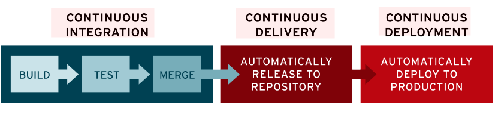

[toc]

# 基本概念

- 参考
- [what-is-ci-cd](https://www.redhat.com/zh/topics/devops/what-is-ci-cd)

## CI

`Continuous Integration`，持续集成。

`CI`指开发人员对代码的修改会自动测试并上传到远程仓库中，然后由交付团队(运维团队)部署到生产环境中。

旨在解决开发团队与运维团队直接可见性及沟通较差的问题——持续交付的目的就是减少系统更新时的工作量。

## CD

- **持续交付** `Continuous Delivery`
- **持续部署** `Continuous Deployment`

`CI/CD`中的`CD`将指向以下两种意思：

### 持续交付

完成`CI`中构建、单元测试、集成测试等自动化流程后，**持续交付**可自动将已验证的代码发布到远程仓库。

### 持续部署

自动将应用的更新部署到生产环境。

